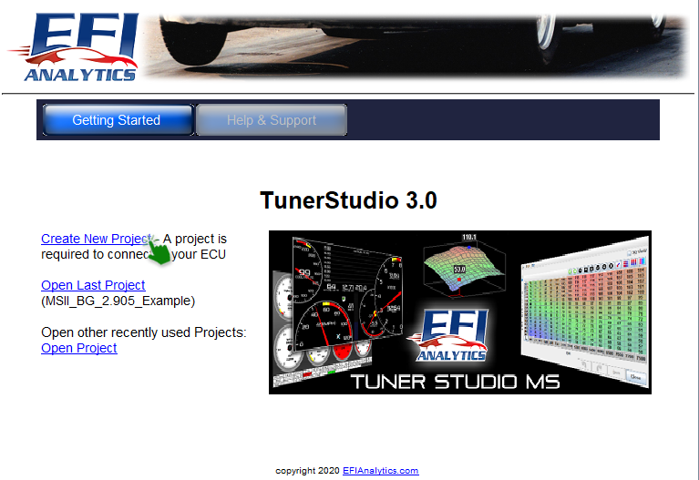
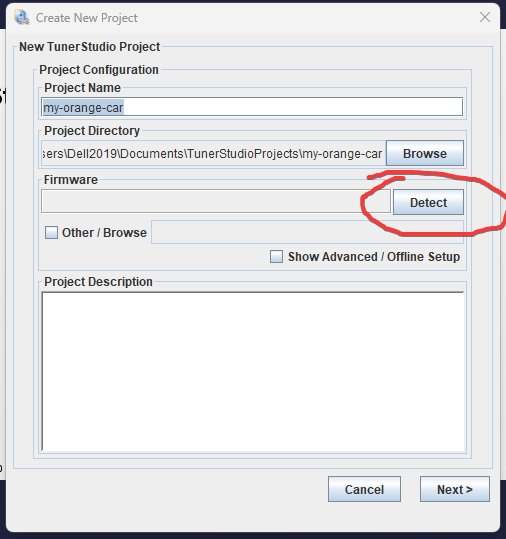
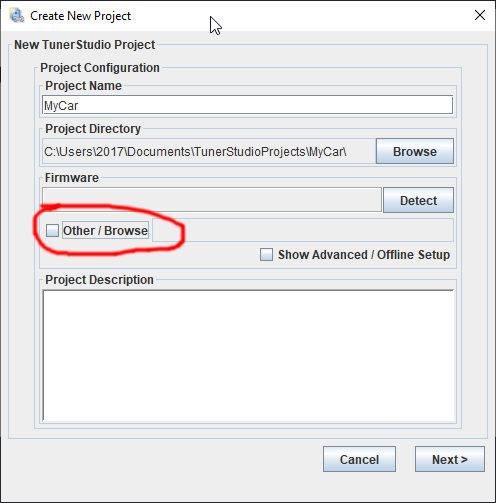
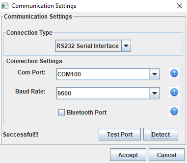

# How To Create a TunerStudio Project

[EFI Analytics TunerStudio](https://www.tunerstudio.com/index.php/tuner-studio) is a third party commercial tuning application used to configure and tune your rusEFI ECU. TunerStudio is available on Windows, Mac and Linux.

Most rusEFI ECUs can be powered through the USB port, so you can set it up in the comfort of your living room and have it communicate with Tunerstudio before it is installed in the car. This approach is highly recommended.

## Download and Install

[TunerStudio](https://www.efianalytics.com/TunerStudio/)

[MegaLog Viewer](https://www.efianalytics.com/MegaLogViewer/download/)

The paid versions of both programs are recommended.

## Creating a Project

Connect TunerStudio to your ECU. You will need a USB cable to establish communication between your computer and the rusEFI unit. Most rusEFI units feature a USB port. microRusEFI requires an externally-wired USB port.

Your laptop should give you an audible notification when you plug in the ECU. This indicates that it sees a new device connected to a USB port.

Open TunerStudio and click *"Create New Project"*.

TunerStudio needs an ECU Definition file (usually with .ini extension) in order to start communicating with rusEFI.

### Auto-detect Mode

All official rusEFI boards support automatic ECU definition file download if connected via USB, serial port or Bluetooth. Just hit 'Detect' and wait for the name of your ECU to appear.

### Manual Definition Selection

If the definition for your unit wasn't detected automatically, select the file from your [rusEFI bundle](Download).

Your rusEFI board should also present itself as a USB storage device to your computer, containing the .ini file you need. This is the most foolproof method of making sure you have the correct .ini file.

After clicking on the link you'll see this:

See [Tunerstudio Connectivity](Tunerstudio-Connectivity) if you need detailed instructions on these settings.

With this your TunerStudio screen should come to life! You should see sensor inputs and some output values like ignition timing and dwell. If your ECU isn't connected to a car, the values displayed might not make any sense, but at least you can see that TunerStudio and your computer are communicating.
