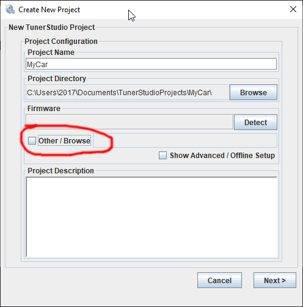

Tunerstudio is a tuning application needed while working with rusEFI. Here is how you create your first project in Tunerstudio:

In order to create a rusEFI project you need a rusefiSOMETHING.ini file from your [rusEFI bundle](Download).

Your rusEFI board should also present itself as a USB storage device to your computer, containing the .ini file you need. This is the most foolproof method of making sure you have the correct .ini file.

After clicking on the link you'll see this:

You have successfully created your first Tunerstudio project.
