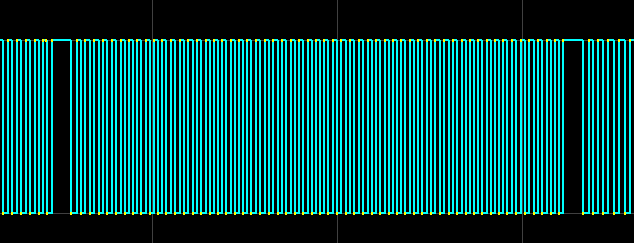
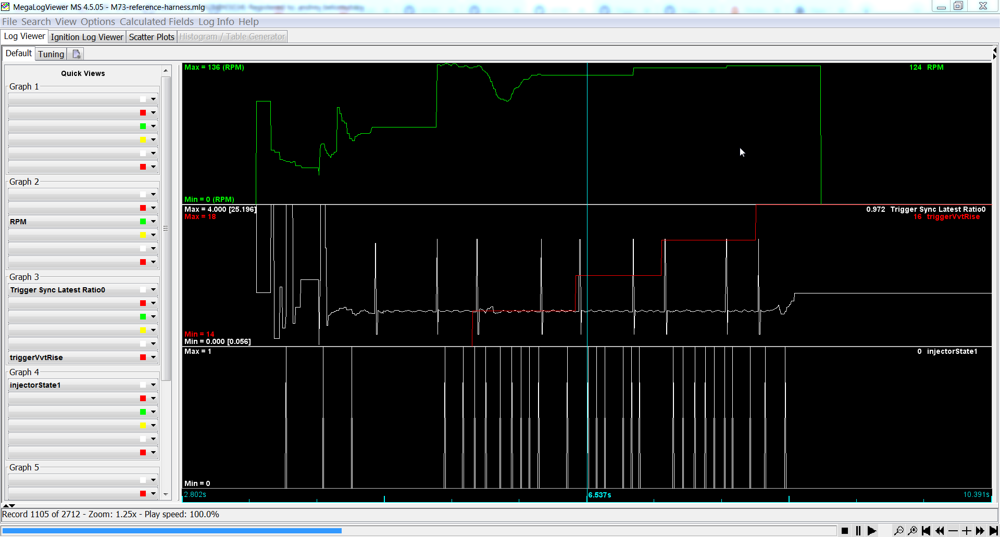
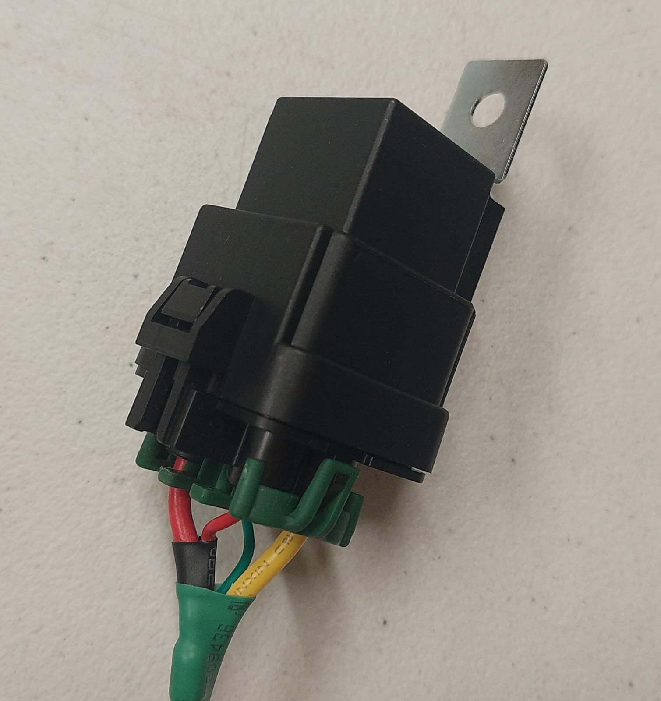
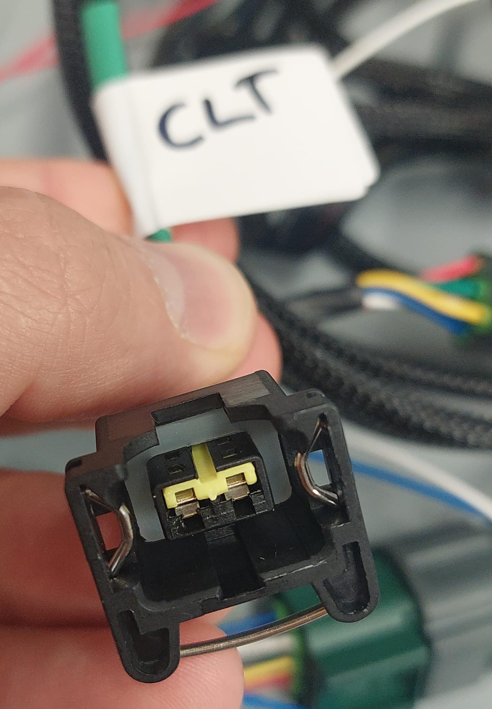
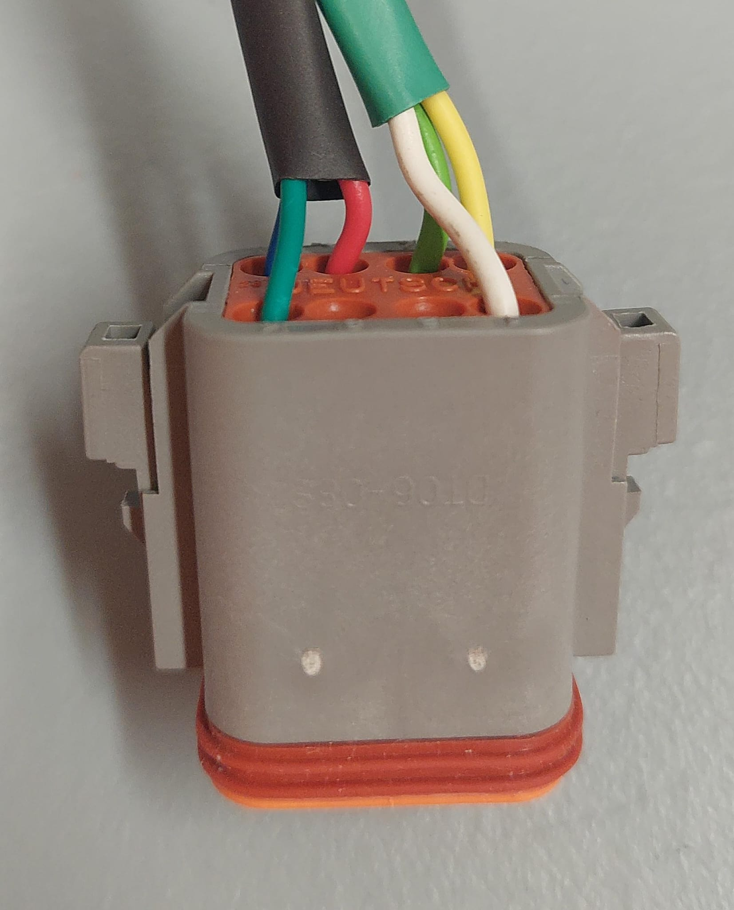

# BMW M73 full PnP harness

See also [rusEFI Quick Start](HOWTO-quick-start)

Expected VR shape see [Trigger-Configuration-Guide](Trigger-Configuration-Guide#determine-correct-polarity)

[Reference cranking trigger decoding log](https://github.com/rusefi/rusefi/files/15050786/M73-lazyharness.zip)

https://youtube.com/shorts/lppFagGm2OU

## Main Relay

https://rusefi.com/docs/pinouts/proteus/?connector=black35&pin=10

## Fuel Pump Relay

https://rusefi.com/docs/pinouts/proteus/?connector=black35&pin=23

## Nissan ETBs

Hitachi SERA576-01 60mm diameter for instance 2003 infinity g35

https://rusefi.com/docs/pinouts/proteus/?connector=black23&pin=6

First ETB cable has orange mark.

green https://rusefi.com/docs/pinouts/proteus/?connector=white35&pin=24

yellow https://rusefi.com/docs/pinouts/proteus/?connector=white35&pin=14

TPS #2

green https://rusefi.com/docs/pinouts/proteus/?connector=white35&pin=25

yellow https://rusefi.com/docs/pinouts/proteus/?connector=white35&pin=15

## Cam

Uses +12v power

## TMAP

BOSCH 0261230217

IAT white, MAP blue

## Crank

M70 style three pin

## CLT

## Fuel Pressure Sensor

100 psi https://www.amazon.com/gp/product/B09FXDNHPG/

## WBO

[Sensor Part Numbers](Vault-Of-Sensors#wide-band-sensors)

## 8 pin plug

Yellow Tachometer Output HS2

White Aux Low Side LS14

Green Fan LS15

## Pedal

Many pedals would work if you wire, one popular sensor mounted on many different Toyota and Nissan vehicles see [Nissan Pedal](Vault-Of-Electronic-Throttle-Bodies-ETB#nissan-pedal)

## Integration

Green: Fan Relay

White: auxiliary low side

Yellow: tachometer

