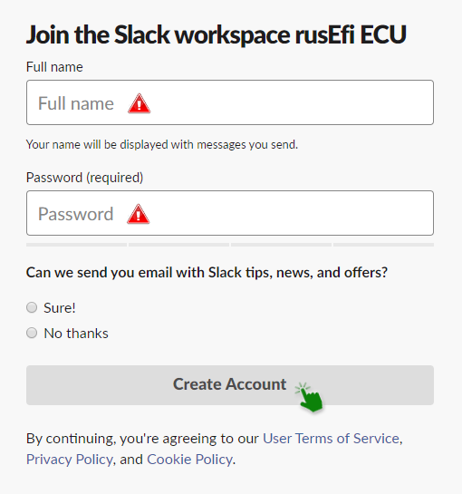
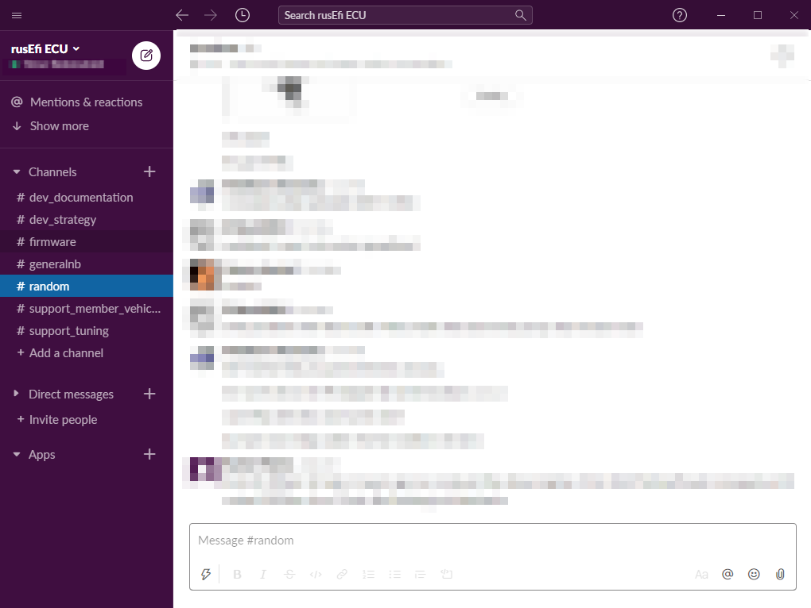

# Joining the rusEFI slack channel

#### What is slack and why should I be there?

Slack in a group messenger that can be accessed through your browser or as an application on your PC.

Before joining slack please read the section on [asking questions.](HOWTO-ask-questions.md)  
Please also read the topic on [distraction.](D-is-for-DISTRACTION). And maybe even [Knowledge-best-practices-and-Channels](Knowledge-best-practices-and-Channels)

#### Joining the channel

NEW LINK [https://join.slack.com/t/rusefi/shared_invite/zt-1jay59c0l-idseNjIRg~gU1GNQuimYQw](https://join.slack.com/t/rusefi/shared_invite/zt-1jay59c0l-idseNjIRg~gU1GNQuimYQw)

To get started you'll have to get the invite to our channel, you can do that using the link above.

After entering, you'll receive an invitation in your E-mail of choice.

You'll need to open the invite e-mail and click on the link inside

After opening the link you'll be directed to the sigh-up page.

You'll need to fill out the specified spaces and create your then account.

After creating your account you'll enter the rusEFI slack channel.

Welcome!

If you already have a slack account you can just use our workspace url - rusefi.slack.com , you'll know what to do.
