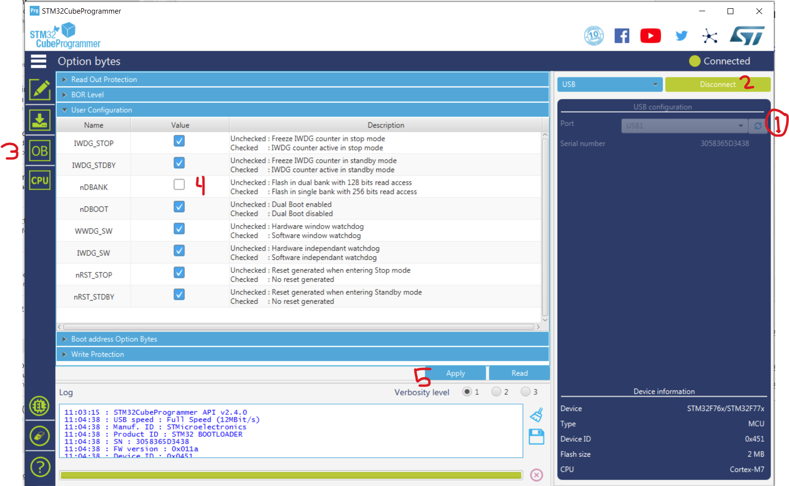
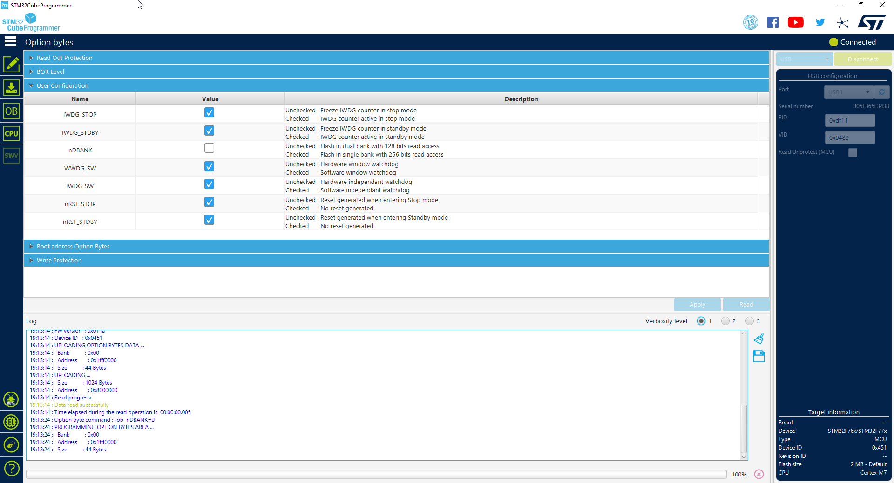

Some chips like STM32F767 are bringing nDBANK drama into our life.

# New way, Windows command line DFU scripts

We have Windows batch scripts in ``console\STM32_Programmer_CLI\bin`` folder

step 1) switch to DFU mode with button or rusefi_console.exe or TS "reboot to DFU"

step 2) invoke ``stm32-reset-nDBANK.bat``

step 3) ``stm32-full-erase.bat``

step 4) ``stm32-flash-dfu.bat``

# Old way - GUI application via DFU or SWD

TODO: try [https://github.com/danielinux/stm32f7-dualbank-tool](https://github.com/danielinux/stm32f7-dualbank-tool)

At the moment we only know how to deal with it via Stm32CubeProgrammer

[https://github.com/rusefi/rusefi_external_utils/](https://github.com/rusefi/rusefi_external_utils/) has a backup copy of en.stm32cubeprg-win64_v2-7-0.zip
