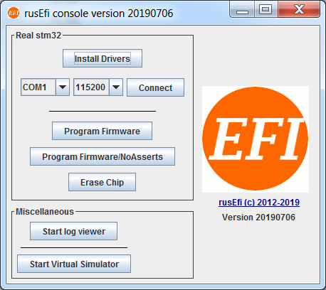

## What to do while you wait for your hardware:

1. [Download the rusEFI bundle](Download) for your hardware. 

2. Uncompress the bundle and launch the rusEFI console. Hit the "Install Drivers" button to install the Virtual Com Port and ST-Link drivers. If necessary the bundle will also help you install java run-time.



3. **IF you have a Frankenso or Frankenstein board with the FT232 Chip, Download and install [FTDI's usb VCP driver on your PC](http://www.ftdichip.com/Drivers/VCP.htm).** 

4. Get friendly on the [rusEFI forums](https://rusefi.com/forum) Introduce yourself, start a build thread, and ask questions.

5. [Install TunerStudio (version 3.0.24 or newer is needed)](http://www.tunerstudio.com/index.php/downloads)

6. Start a new project, save to a folder that you specify, and choose the rusefi.ini file from the bundle.


## Once you get your hardware:


1. Connect the stm32f4discovery ('brain board') to the IO board, place jumpers like XYZ, then connect to a PC with a mini-USB cable. Mini-USB cable is used to power and to program the brain board. See below procedure found [here](http://rusefi.com/forum/viewtopic.php?f=5&t=210&start=23)

2. Before loading rusEFI firmware - if you have one of the newer Rev D STM32 discovery boards - you need to update discovery's firmware. That's in the "Firmware" dialog of ST Link utility, as shown in this picture. 


* To upload the binary image into the microcontroller you will need to download & install [http://www.st.com/st-web-ui/static/active/en/st_prod_software_internet/resource/technical/software/utility/stsw-link004.zip STM32 ST-LINK utility]. (this is both the utility and the driver) Once installed it will look like this.

* You should click '''Target --> Program...''' , browse to the rusefi.bin you have downloaded and hit Start button like this

* After you have programmed the chip, you should click '''Target --> Disconnect''' and hit the '''black button''' on the discovery board '''to reset''' the firmware. After you hit the reset button, you should expect all four LEDs to blink once and then you should see just the '''blue LED blinking'''. If all is good, proceed to the Dev Console below.

## rusEfi Console

[Console](Console)

We have rusEfi console which is a handy development and debugging tool. The dev console is written in java and it talks to the ECU firmware. The console allows firmware monitoring and configuration. Here are some pictures of what it looks like when it operating correctly. 


To get the console working follow the below procedure, which assumes you have loaded the rusEFI firmware. 

* Either power externally, or connect the "programming" USB cable as shown below. This will provide power to the Discovery board.
* Connect the micro USB cable, see "console" cable shown below. When you do this for the first time, on a Windows PC, you will be prompted for drivers. You should download & install the drivers from here http://www.st.com/web/en/catalog/tools/PF257938. #: 
* When the driver is installed & the board is connected via the micro USB cable, you can verify serial connectivity by 
  * '''Windows''' - opening your Device Manager - we are expecting to see a Virtual COM Port 
    * http://rusefi.com/images/forum_posts/device_manager.png
  * '''Linux''' 
    * ''Ubuntu (11.10)'' - plug in the "console" USB cable, then check the message log with this command.
      ```
      $ dmesg
      ...
      [10572.620088] usb 5-1: new full speed USB device number 5 using uhci_hcd
      [10572.797239] cdc_acm 5-1:1.0: This device cannot do calls on its own. It is not a modem.
      [10572.797285] cdc_acm 5-1:1.0: ttyACM0: USB ACM device
      ```
     *  In this case, the newly plugged in USB is register to ttyACM0, which you can find on /dev/ttyACM0
* If you don't already have the Dev Console, get it http://rusefi.com/build_server/rusefi_bundle.zip (part of the same bundle) Take note rusEfi dev console required java 1.7+
* When you launch the Dev Console, it will ask you to select which serial address it should use. However you can specify that when you launch it by specifying a command line parameter as noted below.
  * Windows
    `java -jar rusefi_console.jar COM15`
  * Linux (ubuntu 11.10)
    `java -jar rusefi_console.jar /dev/ttyACM0`
* You got it to open, great! Now install gray jumper wire as noted above between pins PD1 and PC6. 
* Select "digital sniffer" in the dev console and you should see the simulated signal. 
* Install the blue jumper wire as noted between pins PD2 and PA5.

* You should see the crank signals as noted in the "sniffer" tab.


Update: there is also a lazier way to self-stimulate now, you would not need the jumper wires. That's the "enable self_stimulation" command you invoke via the dev console. The downside? Do not forget to undo it at some point with "disable self_stimulation"

At this point, the Dev Console should be up and running. Play around with it and see what you can learn. Also note, it as some functionality as noted below. 

* If used together with the build-in position sensor emulator, the console allows some level of testing on the bench, without a real engine or any additional hardware. The most useful feature is the plain signal sniffer - both real inputs and generated signals can go into it and this is actually quite handy. Another useful feature is the text log.
* You can use the console to invoke rusEfi commands and control the internal flow using the 'Messages Central' tab


## Tuner Studio

[HOWTO create TunerStudio project](HOWTO-create-tunerstudio-project)

See also [Tunerstudio Connectivity](Tunerstudio-Connectivity)

## Power via 12V supply

* Verify the LED TODO is bright, this indicates the STM is being powered.
* Verify you can still connect via Java console program
* Verify with Tunerstudio that you can connect, then set the simulation blah to blah and your STM should start generating a signal on pin Blah. 
* Install jumper TODO, this will connect the simulated crank angle signals to the input decoding signal. At this point you should the the RPM varying on the Java Console.
* Take your best stab at making look up tables and such via TS.

## Prepare engine wiring

* Connect TPS, MAP, IAT, and other such analog signals to the IO board. 
* Connect 12V system / battery to the IO board connector. 
* Calibrate the sensors using TS and Java console as required.
* Crank engine and see RPM's are registering correctly on the Java Console.
* Connect LED to pins TODO, which will blink at TDC. Verify that TDC is correct by shining on a crank wheel like a timing light. PS: actually right now we do not have this - see https://sourceforge.net/p/rusefi/tickets/291/
* Connect injectors and ignition as required and see if it will start.

## Tuning the engine

[Get Running](HOWTO-Get-Running)

[Get Tuning](Get-tuning-with-TunerStudio-and-your-rusEFI)

[Error Codes](Error-Codes)

## Prerequisites
This section assumes 
* You have hardware connected to an engine.
* You can connect to the rusEFI board with a USB cable, or some communications stream.
* You have a PC which is running Tuner Studio, and can connect it to the board
* You have calibrated the sensors like TPS, MAP, crank decoder, etc
* WO2 or tail pipe probe to measure your AFR or HP. 
* This tutorial assumes that you want speed density, which is good for peak power applications and it's assumed you are tuning the load tables. 

## Fuel tuning 
### Some quick theory
Most people who do the after market ECU are looking to get around the track faster. This section assumes you are looking for fast track times. This commonly means you are looking for minimal fuel consumption when you are maintaining speed or decreasing speed, then max power when you are at higher engine loads. Every person will be differ in what RPM and loads they want power vs fuel efficiency. The below graphic shows how you vary horse power as you change AFR. 


If you have a V8 in a Miata, and you need a lite load perhaps like when approaching a turn, you might have a load around 20%. At this point you have enough power and you want to minimize fuel consumption. Such that you get the most out of the fuel in the tank. Then when you are say 80% or 100% load you want maximum power, as you do not have enough power and you want every Hp you can get. So your tuning table around the 20% would be tuned to have an AFR around 16, while when at 100% load your tune will be tuned for something closer to 11.5 to 12.5, and a variety of AFRs based on your driving habits, race event, personal preferences etc. You will take your best stab to guess what is the most optimal way to get to the finish line fastest. 

However if you have a 4 cyl Miata, then your load under the same conditions as noted above would be about 40% instead of 20%, which means your tuning table will be adjusted differently at different points. As well if you have a 4 cyl Miata with a turbo, you might be at around 30% under these same conditions. 

The tuning tables are mostly for tuning the steady state conditions. There is also a bunch of tuning to deal with the short term dynamic conditions, as well there is tuning for cold engine conditions, etc. Every one has a different tuning preference for a variety of reasons, some good some not so good. This tutorial is going to make some suggestions and keep in mind there are going to be lots of different opinions and different reasons for doing things differently. This tutorial is just a suggestions, and will suggest you first start with a warm engine and tune the load table such that you get the AFR's that you are looking for. Then tune the wall wetting, then tune the cold start conditions. 

## Quick version 
### Manual tuning via TS
Open TS, and guess at your fuel table, it will probably look similar to the below. 


Guess at your spark table it will look something similar to this

[insert picture]

Once you have a guess that seems to keep things running, tune 100% by running TS and looking at your WO2 AFR, find a long hill put it in high gear and put your foot the the floor. Keep adjusting the cell to keep your AFT at about 11.5 to 12.5. Doing this on a dyno is better as you don't really care about this range of AFR you care about max HP which is at an unknown AFR. Some how adjust this for full load and keep an eye on your AFT. If you can't get the AFT in the 11.5 to 12.5 range, it likely means your fuel pump is not providing enough fuel. Once you know full load, do this for medium load, low load, etc, until you have a fuel table that you are happy with. 

Once fuel is good, then do the same with spark, again adjust for max power and if possible tune with a knock sensor. If you detect knock stop advancing, and back away by perhaps 2 to 4 degrees. Don't get to close to the absolute limit, as variations in temperature, pressure, carbon build up, etc could change this limit. Once spark is adjusted, go back and re-do fuel, then again back to spark, keep doing this until they are both perfect. 

### Auto tuning via TS

This requires a resisted version of TS. The general procedure here is similar to the manual tune method, but you set the desired AFR in a table drive it around and TS will adjust the cells to get the AFR that it's commanded to get to. While is is effective, peak power can be obtained via dyno, not by AFR measurements, so this is great for those that don't have a dyno, but if you are looking for peak power, you really need a dyno. 

### Wall wetting tuning
Once it's operational, you now want to tune the dynamic such that you get faster throttle response. 
TBD

### Cold temperature
Once it's working well and reacts well to quick changes in the long pedal, you'll want cold temperature enrichments such that it starts nice and easy. 
TBD

see also [Fuel Overview](Fuel-Overview)
see also [Ignition](Ignition)
see also [Idle Control](Idle-Control)
see also http://rusefi.com/forum/viewtopic.php?f=2&t=1124&p=21278

## Share your tune

### Take notes and collect information

We all benefit from from sharing the tune, so we would like to suggest you share it. By sharing it others may notice issues with your tune, as well it can function as a starting point for other which you have likely used when you did your tune. By sharing your tune, we can better help people when they are doing their initial configurations. After all it's not like your tune is something you need to protect and can't share, so we would find it nice if you were to share your tune.

Take notes about your setup, preferably including what ever parameters you can provide, like what you have for intake components, exhaust, CAM, pistons, geographical location, ect. We hope to have a web page form that can be used to simplify the process. For now, we hare hoping you can post it in the forum, or e-mail it to a developer. 

### Post on forum or e-mail the tune

Find the forum sub section where people are sharing tunes, then fill out your posting the with the suggested XYZ format. At the time of writing this most of this tuning sharing stuff new and pre-alpha. 


## Communications

### USB TTL cable

**Question:** found [here](http://rusefi.com/forum/viewtopic.php?f=5&t=210&start=29)

I'd like to try to connect to Tuner Studio and see what happens. I have a USB/TTL device which looks the same as the photo that Andrey posted. What do I connect to what and what is the procedure?

**Answer:**


1. Verify pin assignments for your USB TTL cable.  Colors might be slightly different from what is shown above and there maybe additional wires which are not needed.  Before connecting the TTL to the brain board, connect it to your desktop and install the drivers if required.

2. Once the USB TTL Serial device and drivers are installed, connect GND wire to GND on the brain board

  * connect RX wire of the TTL to pin PC10

  * connect TX wire of the TTL to pin PC11

3. Set up the new serial port @ 38400 with 8/N/1 no flow control using your favorite terminal

4. Hit button 't' on the keyboard. You should get something like this:

 `4073 Alive`


This UART/real serial is just another way to connect either TunerStudio or rusEfi console to the firmware. By combining both microUsb virtual serial and TTL real serial one can connect to rusEfi with both TunerStudio and rusEfi console simultaneously.

See also [Tunerstudio Connectivity](Tunerstudio-Connectivity)

## rusEfi firmware

[Trigger](Trigger)

## LEDs

blue LED: communication status. This LED blinks constantly. Slower blinking if you use serial console or USB is disconnected, faster blinking if USB console is connected

green LED: blinking while engine is running, constant ON while cranking and OFF if engine is stopped

red LED: constant ON in case of firmware FATAL error. Many people confuse red LED with orange LED. The red LED is located closer to the black reset button.

orange LED: warning: blinking in case of trigger input decoding warning or other firmware warning, or in case of serial bus exchange. Orange LED is located closer to the main chip.


## Jumpers

### Communication mode
microUSB channel is more sensitive to noise but it's faster

See also [Tunerstudio Connectivity](Tunerstudio-Connectivity)

### Configuration reset
Grounding PD6 resets saved configuration to default state - see http://rusefi.com/forum/viewtopic.php?f=5&t=373&p=9571&hilit=PD6#p9571

### Board Testing mode

Grounding PB0 enables board testing mode. See [Hardware Test Mode](Hardware-Test-Mode)

## FAQ
Q: How do I change settings? Would I need to compile source code?

A: No, a majority of members use the rusEFI bundle for any TunerStudio or Firmware changes needed.

Q: Low side, high side... Too complicated! Where do I hook my coils?!

A: There is some variation between vehicles and components. Please use [rusEFI forums](https://rusefi.com/forum) for custom installation help!

Q: I've made some changes in Tuner Studio & hit Burn. 'Need Burn' has appeared but the values are not there after rusEfi reset?

A: rusEfi does not write to internal flash memory while your engine is running. In order to really write the values into the permanent memory you would need to stop the engine (or disconnect your stimulator). Online tuning is not affected by this issue - you can still tune and the new values would be applied right away, they just would not be saved until you stop the engine.

Q: I've remapped some analog inputs and outputs but nothing has changed, looks like the old pins are still used for output?

A: For most of the pinout changes to be applied you need to reset rusEfi. Do not forget to stop the engine so that the new config is saved into internal memory!
