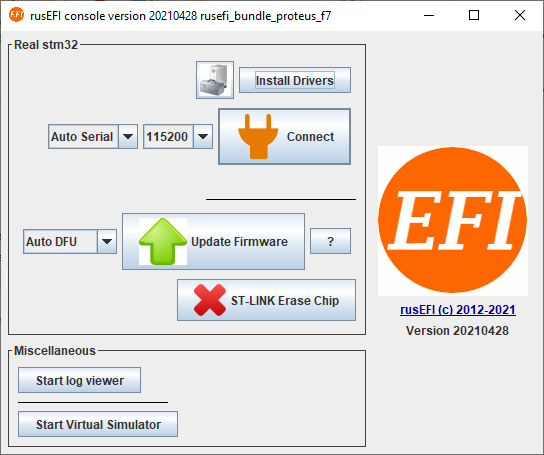

# Quick Start

## Minimal Setup

All official units are shipped with firmware installed. Modern Windows comes with USB CDC drivers.

1. [Download and Install TunerStudio](HOWTO-create-tunerstudio-project#download-and-install).

2. Click the 'Detect' button and let TunerStudio automatically find and download the correct definition file from the internet.

You are ready to go control boost!

Continue reading for more detailed setup steps.

## Waiting for your ECU to arrive?

1. [Download the rusEFI bundle](Download) for your ECU.

2. Extract the bundle and launch the rusEFI console. Hit the "Install Drivers" button to install the Virtual Com Port and DFU drivers. If necessary the bundle will also help you install the Java runtime.

   

3. Get friendly on the [rusEFI forums](https://rusefi.com/forum). Introduce yourself, start a build thread, and ask questions.

4. [Download and Install TunerStudio](HOWTO-create-tunerstudio-project#download-and-install)
5. [Create a project in TunerStudio](HOWTO-create-tunerstudio-project#creating-a-project)

## Once your ECU has arrived

Your board comes with rusEFI firmware installed on it, but it should be updated.

[How to update your firmware](HOWTO-Update-Firmware)

## Getting Your Car Running

### Wire-in ECUs

Follow the [Get Running With a Wire-in ECU](HOWTO-Get-Running) guide.

### Plug & Play ECUs

Follow the [Get Running With a Plug & Play ECU](HOWTO-Get-Running-PnP) guide.

## Tuning

[Get Tuning](Get-tuning-with-TunerStudio-and-your-rusEFI)

## Logging

Any troubleshooting begins with logs. One of rusEFI's powers is the amount of data points available for logging!

Shaky videos will not do. Even high-resolution screen shots wil not do—*it has to be a proper log file*.

TunerStudio's built in logging utility is the preferred method for producing logs. For more information and instrucions, see the [Logging Guide](Logging-Guide).

## Analyzing Logs

[EFI Analytics MegaLogViewer](https://www.efianalytics.com/MegaLogViewer/) is an industry leading log charting application.

## Share Your Tunes and Logs

You will definitely need your tune and log online for any community discussion.

[rusEFI Online](Online) is the platform to share and compare your tune with other tunes!

## Get Support

See [Support & Community](Support)

## FAQ

*__Q:__ How do I change settings?*  
__A:__ You can change settings and your engine tune using [TunerStudio](HOWTO-create-tunerstudio-project).

*__Q:__ Do I need to compile source code myself?*  
__A:__ Nope, not at all. Prebuilt bundles are available on the [Download Page](Download).

*__Q:__ I've made some changes in TunerStudio & hit Burn. 'Need Burn' has appeared but the values are not there after rusEFI reset?*  
__A:__ rusEFI does not write to internal flash memory while your engine is running. In order to really write the values into the permanent memory you would need to stop the engine (or disconnect your stimulator). Online tuning is not affected by this issue; you can tune and the new values will be applied right away, but they will not be saved until you stop the engine.

*__Q:__ I've remapped some analog inputs and outputs but nothing has changed, looks like the old pins are still used for output?*  
__A:__ For most of the pinout changes to be applied you need to reset rusEFI. Do not forget to stop the engine so that the new config is saved into internal memory!

*__Q:__ What does this error code mean?*  
__A:__ See [Error Codes](Error-Codes)
