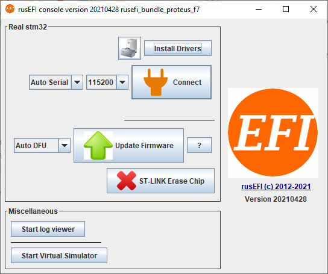

# Quick Start

## What to do while you wait for your hardware

1. [Download the rusEFI bundle](Download) for your hardware.

2. Extract the bundle and launch the rusEFI console. Hit the "Install Drivers" button to install the Virtual Com Port and ST-Link drivers. If necessary the bundle will also help you install java run-time.

   

3. **IF you have a Frankenso or Frankenstein board with the FT232 Chip, Download and install [FTDI's usb VCP driver on your PC](http://www.ftdichip.com/Drivers/VCP.htm).**

4. Get friendly on the [rusEFI forums](https://rusefi.com/forum) Introduce yourself, start a build thread, and ask questions.

5. [Install TunerStudio (version 3.1.04 or newer is needed)](http://www.tunerstudio.com/index.php/downloads)

6. Start a new project, save to a folder that you specify, and choose the rusefi.ini file from the bundle.

   

## Once you get your hardware

### Update Firmware

Your board comes with rusEFI firmware installed on it, but it should be updated.

[How to update your firmware](HOWTO-Update-Firmware)

If you have a Frankenso, Frankenstein, or are just messing with a Discovery, you will need to install firmware first. See [these instructions.](Discovery-Based-Board-Setup)

## Plug and Play (PNP) Initial Setup

This guide is written for the firmware released August 6th 2020. The further away from this date your FW is, the less agreement you will have in specific locations of items in TunerStudio and terms used etc. HOWEVER, the basic principles should still apply.

1. [Download the rusEFI Bundle](Download) to get your rusefiXXX.ini (:ToDo) file and serial port drivers.

2. Install [TunerStudio](http://www.tunerstudio.com/index.php/downloads) and [MegaLog Viewer](https://www.efianalytics.com/MegaLogViewer/download/) (the payed versions are highly recommended).

3. Create a new project in TunerStudio.
   *This is not a TunerStudio manual.
   *Most PnP rusEFI units can be powered through the USB port. So you can set it up in the comfort of your living room and have it communicate with Tunerstudio before it is installed in the car. It is highly recommended to try this approach.

4. Connect TunerStudio to your ECU. You will need a USB cable to establish communication between your tuning laptop and the rusEFI unit. There will typically be only one micro-USB port on a PnP unit.

   **Your laptop should give you an audible notification when you plug in the ECU with the ignition turned on. That means that it "sees" a new device connected to a USB port.**

5. In TunerStudio apply correct "Communication Settings" [for detailed instructions see here.](Tunerstudio-Connectivity.md)
   **Note: If your computer is running Linux, you might have to [fix issues with ModemManager](Linux-Connectivity).**

6. With this your TunerStudio screen should come to life! You should see sensor inputs and some output values like ignition timing and dwell. Of course the values displayed might not make a lot of sense, since your ECU is lacking a car, but at least you can see that TunerStudio and your computer are communicating.

## Getting your car running

### Step 1: (Optional)

Run your car on your stock ECU to warm it up. This may make it easier to start, especially when it's cold outside

### Step 2

Unplug your stock ECU and plug in your rusEFI PnP. You probably don't want to close the lid just yet, so you can observe blinking lights etc.

### Step 3

Turn on the ignition. DO NOT START THE CAR

### Step 4

Connect TunerStudio to your ECU.
Assuming the pre-requisites for sensors as [outlined here](HOWTO-Start-An-Engine#sensor-requirements) are met,
your TunerStudio screen should come to life!

You should see sensor inputs and some output values like ignition timing and dwell.

If things are set up properly, you should see reasonable values for:

* Coolant temperature (CLT)
* Intake Air temperature (IAT)
* Battery Voltage (BV)
* Manifold Air Pressure (MAP/MAF) (should be near 100kpa if you're using a MAP sensor)
* Throttle Position Sensor (TPS)

 The values may show some jitters. RPMs should be 0. Push your throttle pedal and see if you get a response. Congratulations- your rusEFI can "see" your car.

### Step 5

Calibrate your throttle pedal. Go to "Tools" -> "Calibrate TPS". Don't touch the throttle and click on "Get Current" next to "Closed Throttle ADC count". Now step on the throttle pedal (full-throttle/pedal fully depressed) **and** do the same for no-throttle (pedal fully released).

**Save (Burn) calibration to ECU.**

### Step 6

Test your outputs. Under "Controller" -> "Bench Test & Commands" you can see a lot of options for outputs you can test. Let's focus on the basic ones for now. Spark and Fuel. First, if your car's fuel pump is controlled by the ECU, test "Fuel Pump". You should hear the fuel pump running.

Then move on to spark. Here it depends on how your car is set up. If you have a 4-cylinder with wasted spark (which is likely the majority of users), you will likely be using "Spark #1" and "Spark #3". When you click the test button, you should hear the corresponding ignition coil firing. If you can't hear the spark, you may want to pull a spark plug (or use a spare) and hook it up to the spark plug connector and ground it. Test again and you should see a spark arcing. Don't shock yourself.

Now it's time to test your injectors. Again, this depends on your vehicle. Most cars will at least have two banks of injectors. So you should definitely hear injectors firing when you're testing "Injector #1" and "Injector #2". If you have full-sequential fuel, you should try as many injectors as your engine has cylinders. *Fuel is flammable. Have a fire extinguisher near by just in case.

That's the basic outputs tested. With this you should be able to get the engine to run. You can go ahead and test the other outputs as well. Like Check Engine Light. Engine-Fan, AC, AC-Fan etc.

Close the test window. We're getting close to starting the car.

### Step 7

Turn the ignition off and unplug the USB cable. This removes power to the unit- (just to make sure we're in a defined state). Then reconnect the USB cable, turn on the ignition, wait for TunerStudio to come to life and then crank the engine. You should see the RPMs jump to a positive value (typical would be anywhere between 200 and 600rpm) and your engine should start. It may take a few cranks for RPMs to register. If you see RPMs in Tunerstudio, but the engine isn't starting, keep at it. It may take quite a bit longer than the stock ECU. You are probably used to cranking taking approx. 2s or so. **rusEFI takes about 2s of cranking before it can identify the position of the crankshaft. And then it will fire the injectors and ignition coils.** It may take it quite a while (>10s which seems like an eternity when cranking) for the engine to catch. Don't give up. There may be coughs and sputters. Play with the throttle a little. It will start eventually. Post your findings to the [forum](https://rusefi.com/forum/) and we can help!

And we're done with the initial startup. Congratulations- you have your car running on your standalone aftermarket ECU! Now the fun really begins :)

## FAQ

Q: How do I change settings?

A: You can change settings and your engine tune using [TunerStudio](HOWTO-create-tunerstudio-project).

Q: Is there anything special I need to do to wire USB from ECU harness?

A: The USB Cable needs to be shielded all the way to the connector. Don't connect the shield at the ECU end. There should be exactly one ground from laptop to ECU, and it needs to be in the USB cable, no splices.

Q: Do I need to compile source code myself?

A: Nope, not at all. Prebuilt bundles are available on the [Download Page](Download).

Q: Low side, high side... Too complicated! Where do I hook my coils?!

A: There is some variation between vehicles and components. Please use [rusEFI forums](https://rusefi.com/forum) for custom installation help!

Q: I've made some changes in TunerStudio & hit Burn. 'Need Burn' has appeared but the values are not there after rusEFI reset?

A: rusEFI does not write to internal flash memory while your engine is running. In order to really write the values into the permanent memory you would need to stop the engine (or disconnect your stimulator). Online tuning is not affected by this issue - you can still tune and the new values would be applied right away, they just would not be saved until you stop the engine.

Q: I've remapped some analog inputs and outputs but nothing has changed, looks like the old pins are still used for output?

A: For most of the pinout changes to be applied you need to reset rusEFI. Do not forget to stop the engine so that the new config is saved into internal memory!

## rusEFI Console

[rusEFI Console](Console) is a handy development and debugging tool. Try it out and learn what it is capable of.

## Tuner Studio

rusEFI uses TunerStudio to allow you to configure and tune your ECU.

[HOWTO create TunerStudio project](HOWTO-create-tunerstudio-project)

See also [Tunerstudio Connectivity](Tunerstudio-Connectivity)

## Tuning the engine

[Get Running](HOWTO-Get-Running)

[Get Tuning](Get-tuning-with-TunerStudio-and-your-rusEFI)

[Error Codes](Error-Codes)
