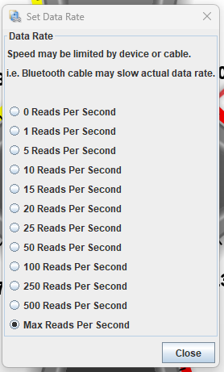

# How to Upload a Log

## Data Rate

Licensed TunerStudio gives you faster data rate which is *very* important while troubleshooting trigger/vvt issues. Go to "Communications->Data Rate->Max Rate Per Second". We pride in having above 500Hz data rate via USB! See [Logging Guide](Logging-Guide) for more info.

Slower rate is recommended for running fuel control troubleshooting; higher rate logs are needed for cranking/trigger troubleshooting. Logs below 100Hz are totally useless for trigger troubleshooting.

## How To

In TunerStudio, hit "Data Logging" -> "Start Logging".
Once you've done something interesting, hit "Data Logging" -> "Stop".

Then hit "Data Logging" -> "Show DataLog Folder".

At this point you can upload your log to [rusEFI Online](https://rusefi.com/online/).
