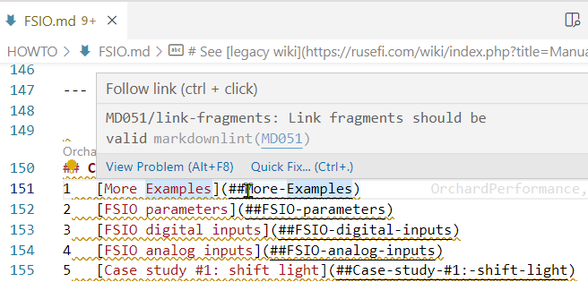
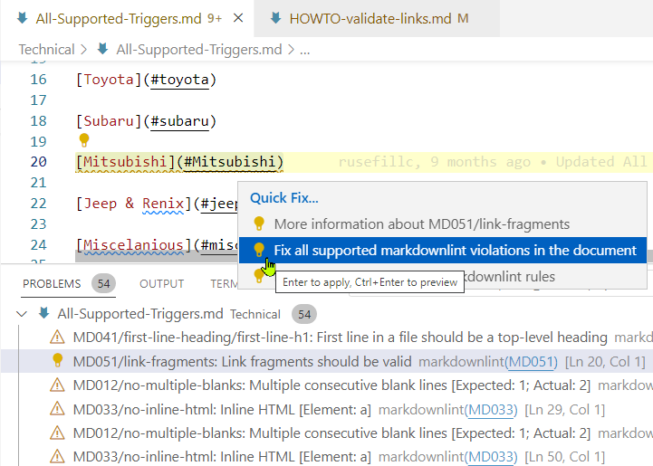

# link validation in markdown documents

VS Code introduced a [link validator](https://code.visualstudio.com/Docs/languages/markdown) in version 1.72. This seems the best approach while a single file is being edited due to automated "fix all supported markdownlint violations in the document" (see below for more details).

For bulk validation <https://github.com/webhintio/markdown-link-validator> seems best

## findings for bulk validation

- debug mode is extremely helpful for troubleshooting
- it's incredible fast
- should work cross-platform (tried on Windows & WSL Debian)
- <https://www.te.com/usa-en/> seems to block or throttle access via an automated script after a certain number of requests

```bash
  markdown-link-validator:utils:request problem with request: connect ETIMEDOUT 2a01:4f8:221:3b0a:1000:0:19:200:443 - https://www.lammertbies.nl/comm/cable/RS-232.html +21s
  markdown-link-validator:utils:request problem with request: read ECONNRESET - https://www.te.com/usa-en/product-4-1437290-1.html +1m
```

### solution

- use exclude list for batch validation, skip all external links

```powershell
markdown-link-validator . -i https?:\/\/.* --debug >.\wiki-tools\md_link_validation.log
...
Found a total of 1361 links in directory "C:\Users\mholzer\Documents\git\rusefi_documentation":
    1298 valid
    63 invalid
Time to validate: 1.07s
```

### open issue(s)

- would like to have only "invalid" references in output. There is [already an enhancement request](https://github.com/webhintio/markdown-link-validator/issues/6) filed since Aug 2019 :(
- requested to [assign committer](https://github.com/webhintio/hint/issues/5382)

### workaround

- edit output log file to find "invalid" references quickly

1. find all strings containing " 0 invalid" (note leading blank) and replace them with "nothing"
2. find all strings containing "invalid" => only actually erroneous links with show

#### using a "quick fix" version

<https://github.com/chmac/markdown-link-validator/commits/omit-success-output> has a quick fix

note: as of 2022-12-13 the method to install:
did NOT work for me, trying to get help!!

```powershell
npm install --save chmac/markdown-link-validator#omit-success-output
```

to run:

```powershell
node .\node_modules\markdown-link-validator\dist\src\bin\markdown-link-validator.js . -i https?:\/\/.* --debug
```

## using VS Code for markdown files

### prerequisites

VS Code Extensions "markdownlint" and "Code Spell Checker" have to be installed





## find orphaned files

- mkdocs build

-create python venv
bash: python3.10 -m venv ~/weborphans_venv

-switch to venv
ps1: $HOME\Documents\.venv\bin\Activate.ps1
bash: source ~/weborphans_venv/bin/activate
-run script
ps1:  mkdocs build >..\mkdocs.log 2>..\mkdocs.error.log

```powershell
python3.10 .\wiki-tools\weborphans.py C:\Users\mholzer\Documents\git\rusefi_documentation\mkdocs\site\Home\ https://wiki.rusefi.com/ >.\wiki-tools\weborphans.log
```
