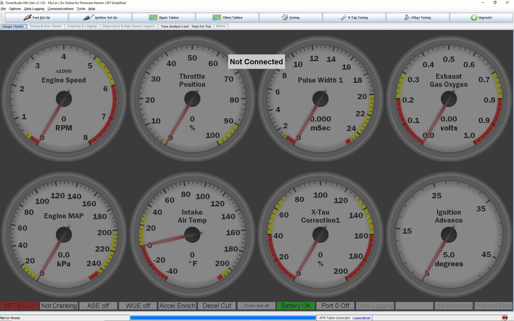

#HOWTO create a Tunerstudio project

Tunerstudio is application that might be needed while working with rusEFI. Here is how you create your first project in Tunerstudio:

After  clicking the link you'll see this:

You have successfully created your first Tunerstudio project.