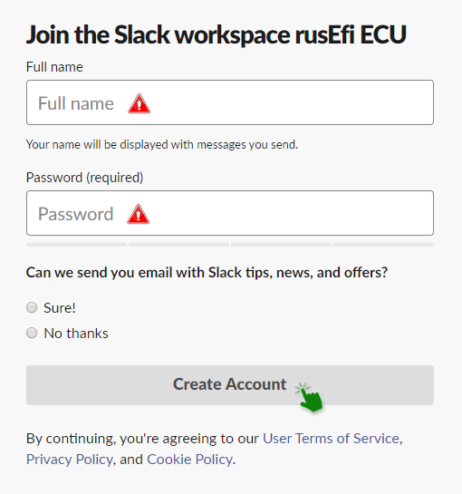
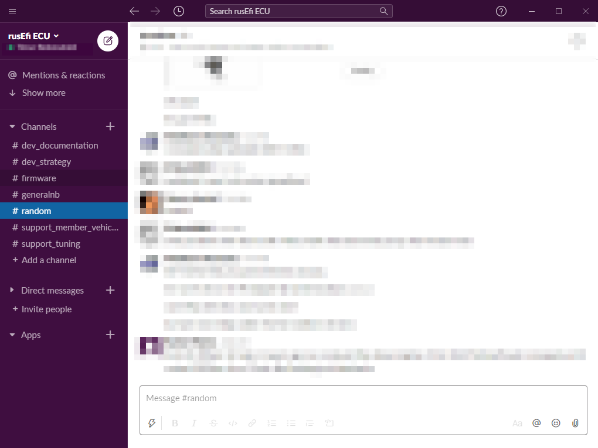

# Joining the rusEFI slack channel

#### What is slack and whi should I be there?

Slack in a business messenger that can be accessed through your browser or as an application on your PC. 

#### Joining the channel

To get started you'll have to get the invite to our channel, you can do that [here](https://rusefi.com/slack/).

 

After entering, you'll receive an invitation in your E-mail of choice.

You'll need to open the invite e-mail and click on the link inside

After opening the link you'll be directed to the sigh-up page.

You'll need to fill out the specified spaces and create your then account.

After creating your account you'll enter the rusEFI slack channel.

Welcome!

If you already have a slack account you can just use our workspace url - rusefi.slack.com , you'll know what to do.