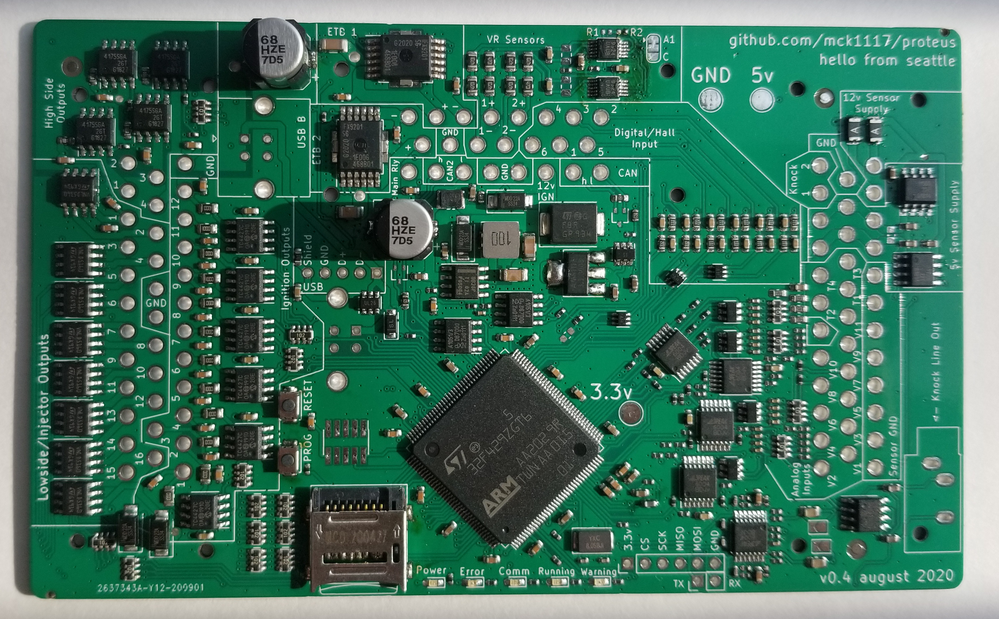
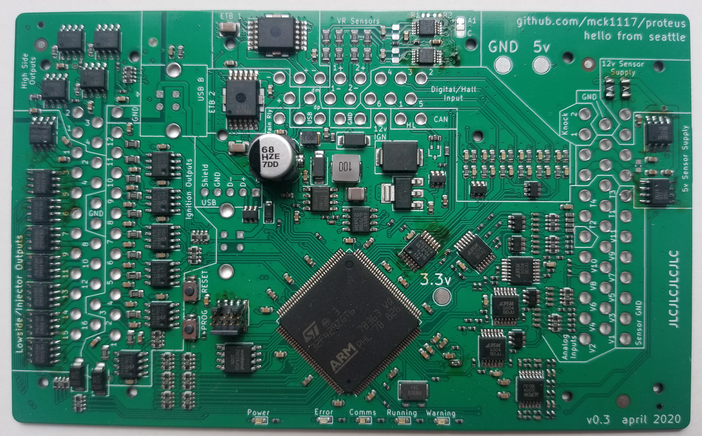

[Proteus](https://github.com/mck1117/proteus) is a 4 layer PCB measured 135mm x 82.5mm

[Interactive BOM](https://rusefi.com/docs/ibom/proteus_0_4_ibom.html)

# 0.4

# Assembly sequence:

* Buttons: paste + soldering iron
* FB1501 Ferrite: paste + hot air
* 2xFuses: paste + hot air
* USB: solder wire + soldering iron

At this point USB DFU should work

# 0.4 Non-JLC BOM

Comment,Designator,Footprint, PN
68u,"C17,C1001",Capacitor_SMD:CP_Elec_8x10,EEH-ZE1H680V
PESD1CAN-UX,"D1,D2",Package_TO_SOT_SMD:SOT-323_SC-70,PESD1CAN-UX
MAX9924,"U1203,U1204",Package_SO:MSOP-10_3x3mm_P0.5mm,MAX9924UAUB+T
VNLD5160,"U201,U202,U301,U302,U401,U402,U501,U502",Package_SO:SOIC-8_3.9x4.9mm_P1.27mm,VNLD5160TR-E

TLS115,"U1004,U1005",Package_SO:Infineon_PG-DSO-8-43,TLS115D0E
Ferrite_Bead,FB1501,Inductor_SMD:L_0603_1608Metric,BLM18EG221SN1D
Polyfuse,"F101,F102",Resistor_SMD:R_1206_3216Metric,1206L012WR
Micro_SD_Card,J1,Connector_Card:microSD_HC_Wuerth_693072010801,47219-2001
SW_Push,"SW1501,SW1502",Button_Switch_SMD:SW_Push_SPST_NO_Alps_SKRK,

[jlcpcb.com](http://www.jlcpcb.com) not only fabricates the PCB but also assembles a significant portion of Proteus pretty cheaply.

For best results take three official files from latest [export](https://github.com/mck1117/proteus/tree/master/export) folder

1) gerbers.zip for PCB files - On first step you point at this file and selec "PCB Assembly" checkbox.

2) Bill Of Materials for what components to assembled

3) placement file for where to place those components

At QTY 10, each pre-assembled Proteus board costs under $40. DHL delivery is cheap and fast, you should have your 80% ready board in about 12 days!

The remaining components would cost you XXX more, BOM for final assembly is available at YYY.

As of May 2020 we have not figured out a great case solution.

Acceptable 3D printed case files are not public yet.

CNC files to cut holes in 1590wxxfl/1590xxfl cases are available [here](https://github.com/mck1117/proteus/blob/master/export/proteus-case.step)

# 0.3

 

