# Patchcord assembly: alphax-8chan to BMW-N52-adapter

Generated by PatchCordHelper - do not edit manually.

34 wire(s) matched by pin function. Wiring order follows the
[Universal Patchcord Color Scheme](https://github.com/rusefi/rusefi_documentation/blob/master/Universal-Patchcord-Color-Scheme.md).

On each image: solid circles are wires of the current step (circle color = wire color),
dimmed grey circles are pins already wired in previous steps.

Vehicle adapter side images have orange circles in all four corners: put the paint
marker on that end of each wire, so the two identical plugs of the finished patchcord
can be told apart. The same is repeated per wire in the tables below: the 'Adapter pin'
column starts with the wire color dot followed by the orange paint marker dot.

## Step 1: Power and grounds (1 of 7)

| Wire color | ECU pin | Adapter pin | Function |
|------------|---------|-------------|----------|
| black | 8chan-A-B / 17A |   N52-26pins-4k / 13D | GNDA Analog/Sensor Ground |
| yellow | 8chan-C / 12C |   N52-60pin / 27A | Power/Chassis GND ground |

alphax-8chan, connector 8chan-A-B:

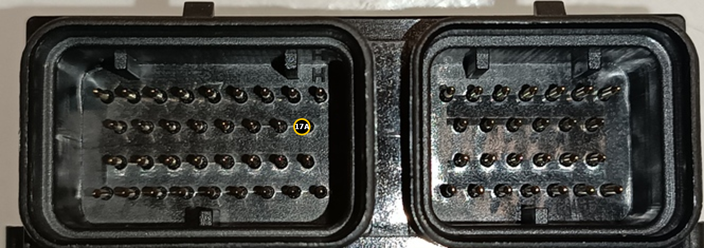

alphax-8chan, connector 8chan-C:

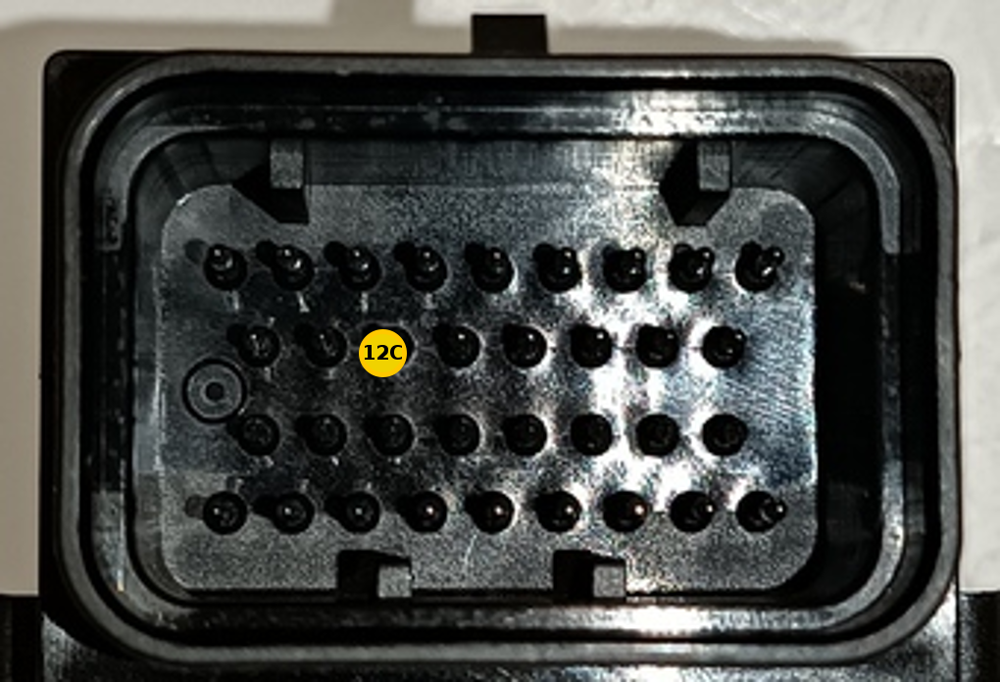

BMW-N52-adapter, connector N52-26pins-4k:

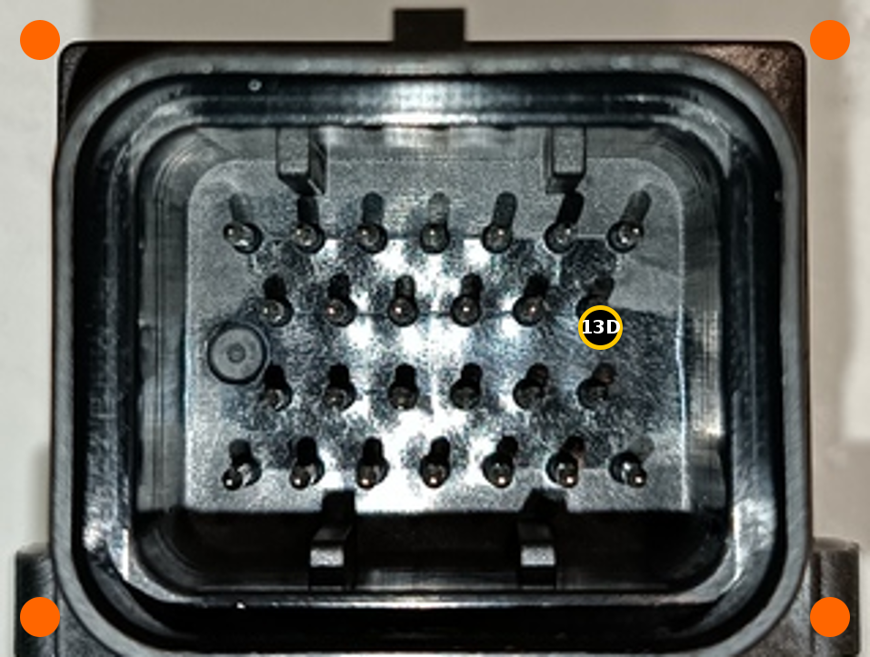

BMW-N52-adapter, connector N52-60pin:

## Step 2: Power and grounds (2 of 7)

| Wire color | ECU pin | Adapter pin | Function |
|------------|---------|-------------|----------|
| black | 8chan-A-B / 18A |   N52-60pin / 18A | Power/Chassis GND ground |

alphax-8chan, connector 8chan-A-B:

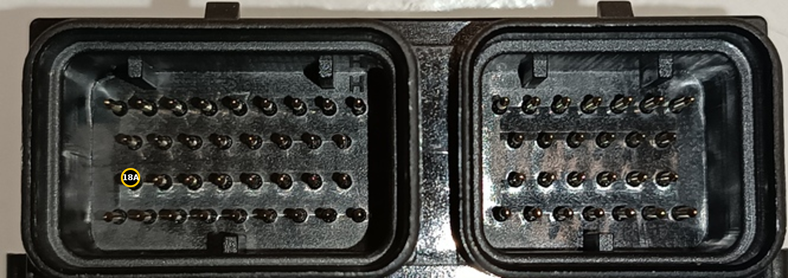

BMW-N52-adapter, connector N52-60pin:

## Step 3: Power and grounds (3 of 7)

| Wire color | ECU pin | Adapter pin | Function |
|------------|---------|-------------|----------|
| black | 8chan-A-B / 20B |   N52-26pins-4k / 16D | GNDA Analog/Sensor Ground |

alphax-8chan, connector 8chan-A-B:

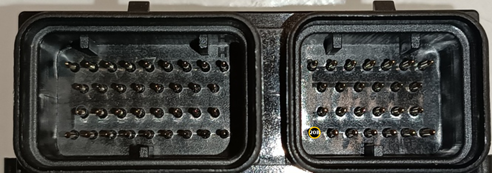

BMW-N52-adapter, connector N52-26pins-4k:

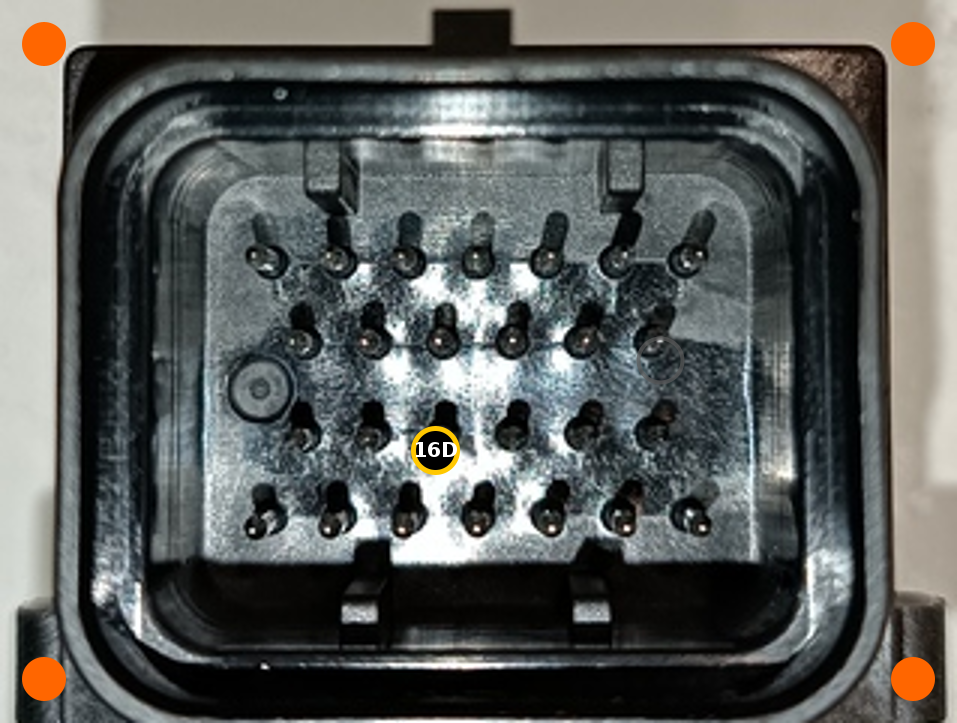

## Step 4: Power and grounds (4 of 7)

| Wire color | ECU pin | Adapter pin | Function |
|------------|---------|-------------|----------|
| black | 8chan-A-B / 25A |   N52-26pins-4k / 15D | GNDA Analog/Sensor Ground |

alphax-8chan, connector 8chan-A-B:

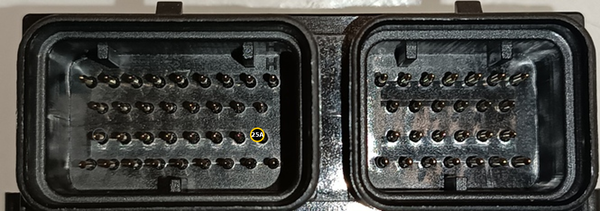

BMW-N52-adapter, connector N52-26pins-4k:

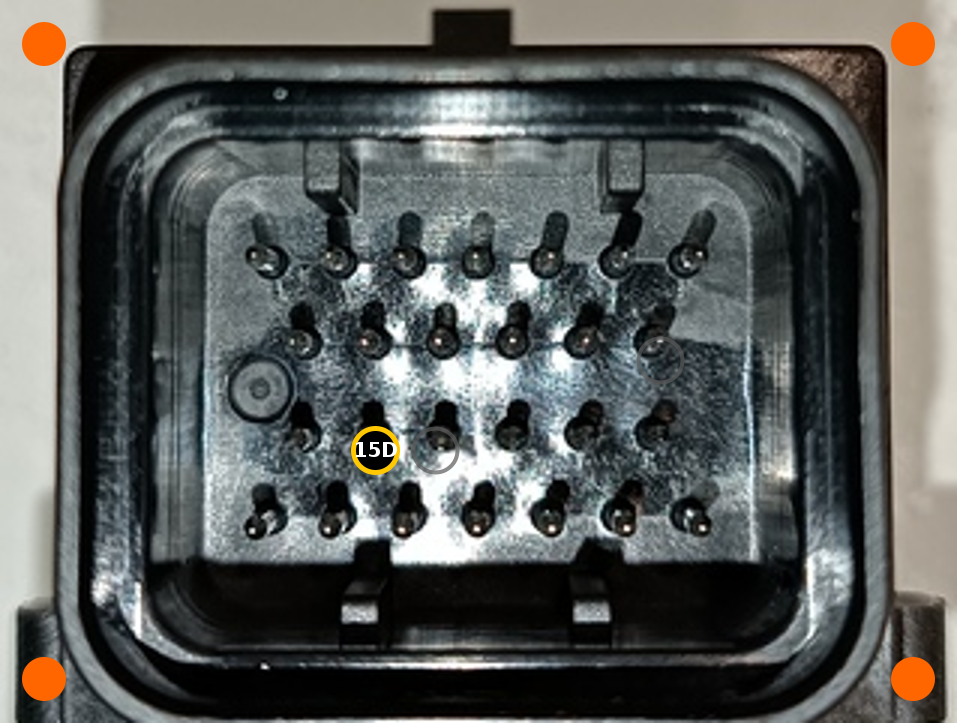

## Step 5: Power and grounds (5 of 7)

| Wire color | ECU pin | Adapter pin | Function |
|------------|---------|-------------|----------|
| black | 8chan-A-B / 25B |   N52-60pin / 26A | Power/Chassis GND ground |

alphax-8chan, connector 8chan-A-B:

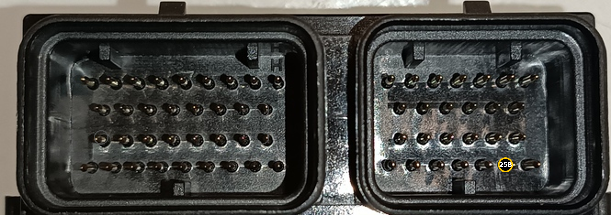

BMW-N52-adapter, connector N52-60pin:

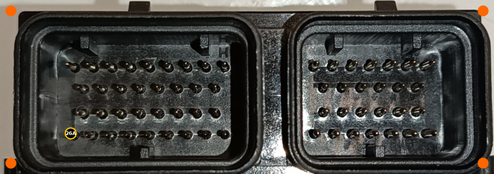

## Step 6: Power and grounds (6 of 7)

| Wire color | ECU pin | Adapter pin | Function |
|------------|---------|-------------|----------|
| black | 8chan-A-B / 7A |   N52-60pin / 10A | Power/Chassis GND ground |

alphax-8chan, connector 8chan-A-B:

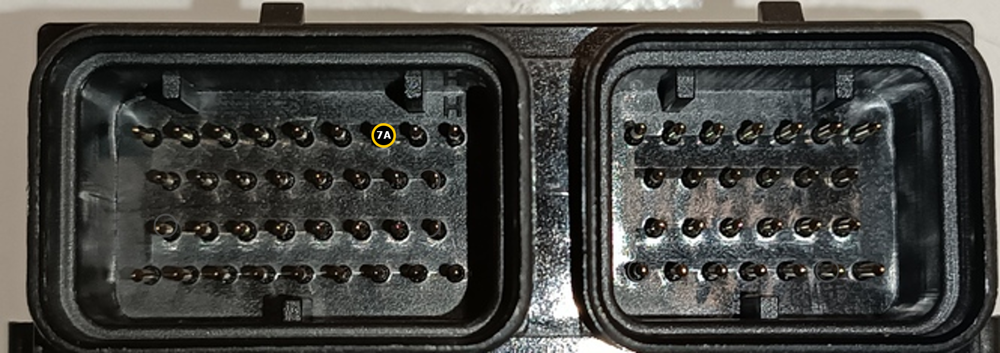

BMW-N52-adapter, connector N52-60pin:

## Step 7: Power and grounds (7 of 7)

| Wire color | ECU pin | Adapter pin | Function |
|------------|---------|-------------|----------|
| black | 8chan-A-B / 8A |   N52-26pins-4k / 8D | GNDA Analog/Sensor Ground |

alphax-8chan, connector 8chan-A-B:

BMW-N52-adapter, connector N52-26pins-4k:

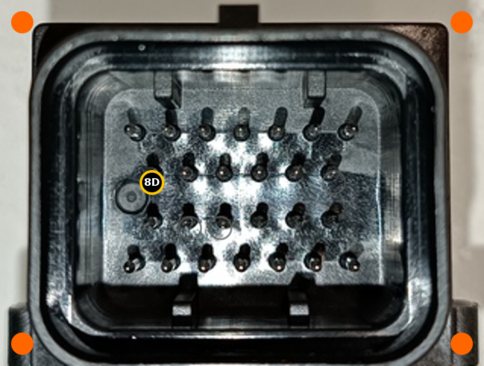

## Step 8: Communication

| Wire color | ECU pin | Adapter pin | Function |
|------------|---------|-------------|----------|
| blue | 8chan-C / 33C |   N52-34pins-4k / 21C | CAN bus Low |
| green | 8chan-C / 32C |   N52-34pins-4k / 30C | CAN bus High |

alphax-8chan, connector 8chan-C:

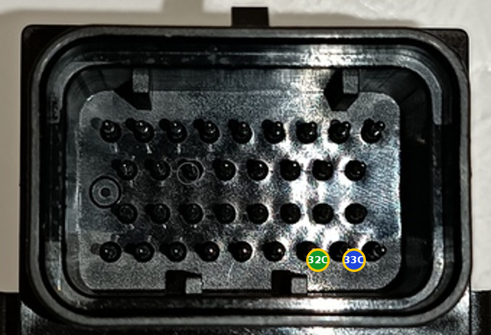

BMW-N52-adapter, connector N52-34pins-4k:

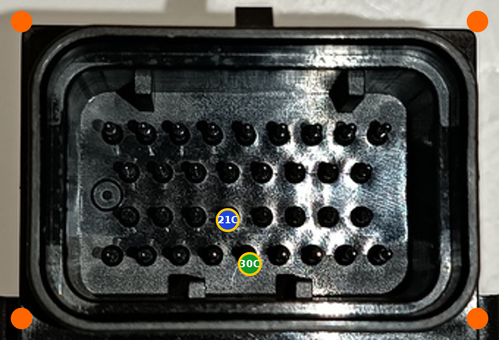

## Step 9: Sensors

| Wire color | ECU pin | Adapter pin | Function |
|------------|---------|-------------|----------|
| blue | 8chan-A-B / 33A |   N52-60pin / 34A | Universal analog input. Suggested TPS 2 sensor input |
| green | 8chan-A-B / 31A |   N52-60pin / 32A | Universal analog input. Suggested TPS 1 sensor input |
| orange | 8chan-A-B / 32A |   N52-34pins-4k / 16C | Universal analog input. Suggested PPS input 1 |
| purple | 8chan-A-B / 29A |   N52-60pin / 16B | ECT CLT Coolant Sensor Input |
| white | 8chan-A-B / 34A |   N52-34pins-4k / 8C | Universal analog input. Suggested PPS input 2 |

alphax-8chan, connector 8chan-A-B:

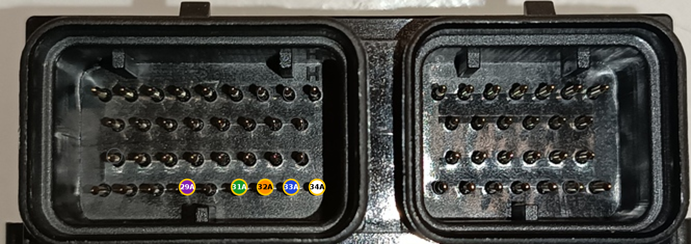

BMW-N52-adapter, connector N52-60pin:

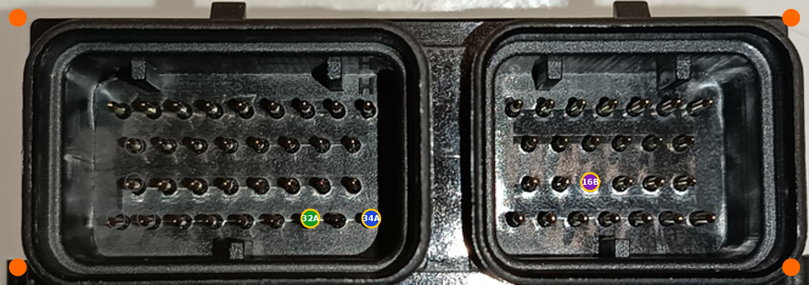

BMW-N52-adapter, connector N52-34pins-4k:

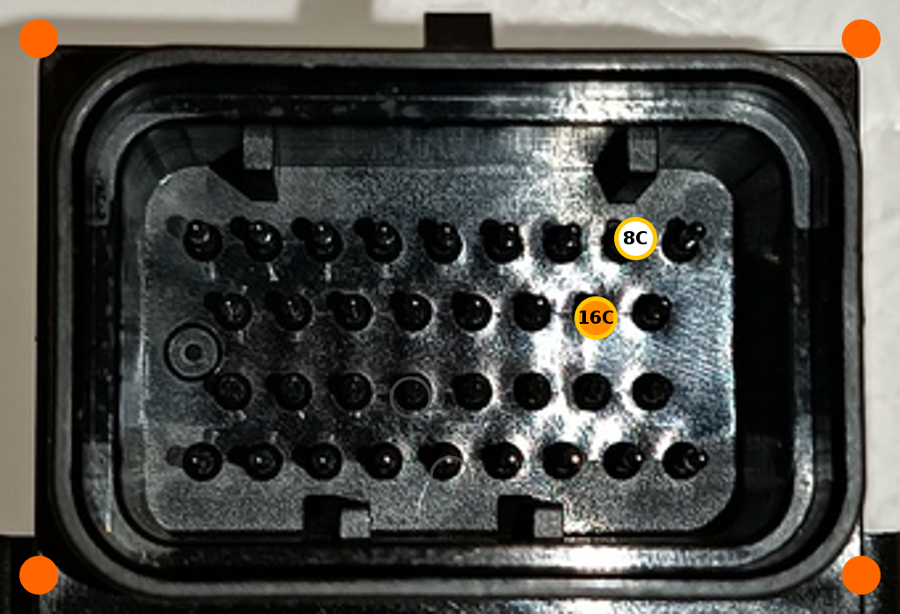

## Step 10: Wideband oxygen sensor (1 of 2)

| Wire color | ECU pin | Adapter pin | Function |
|------------|---------|-------------|----------|
| black | 8chan-A-B / 12B |   N52-26pins-4k / 9D | WBO2 Vs (Un) (pin 6) |
| green | 8chan-A-B / 17B |   N52-26pins-4k / 4D | WBO1 CalR (pin 5) |
| red | 8chan-A-B / 16B |   N52-26pins-4k / 11D | WBO1 Ip (pin 1) |
| white | 8chan-A-B / 14B |   N52-26pins-4k / 6D | WBO1 Heater Negative (pin 3) |
| yellow | 8chan-A-B / 15B |   N52-26pins-4k / 2D | WBO1 Vs/Ip (Vm) (pin 2) |

alphax-8chan, connector 8chan-A-B:

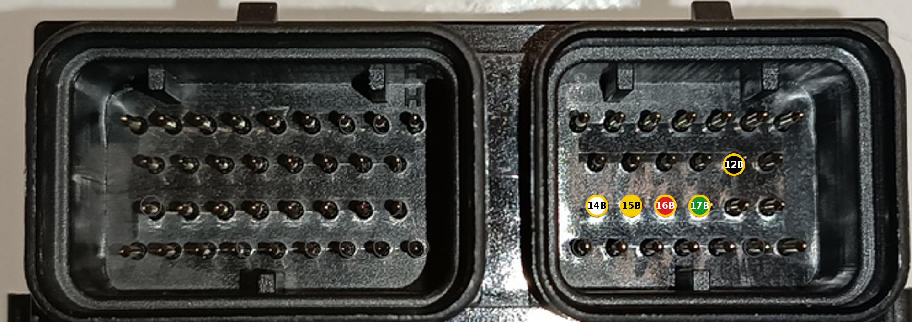

BMW-N52-adapter, connector N52-26pins-4k:

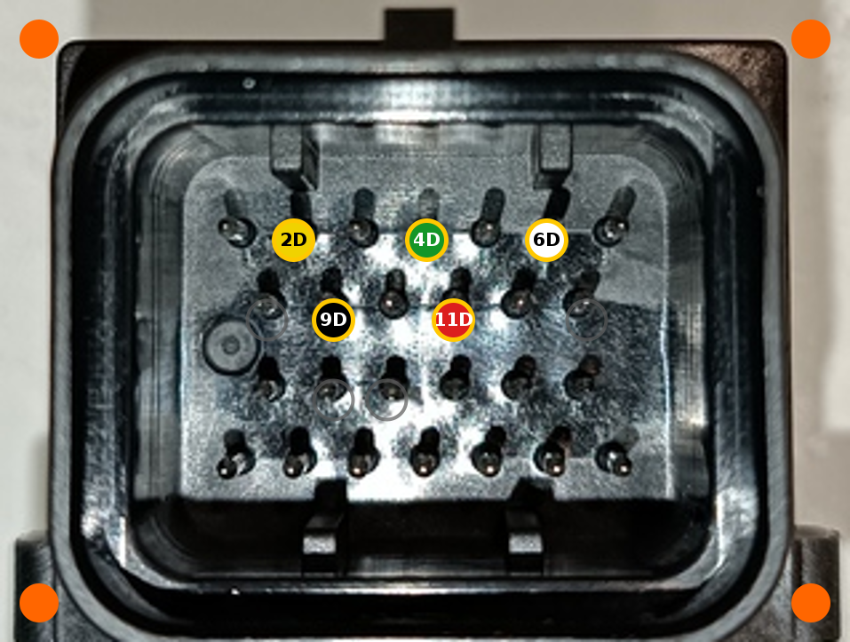

## Step 11: Wideband oxygen sensor (2 of 2)

| Wire color | ECU pin | Adapter pin | Function |
|------------|---------|-------------|----------|
| black | 8chan-A-B / 18B |   N52-26pins-4k / 3D | WBO1 Vs (Un) (pin 6) |
| white | 8chan-A-B / 8B |   N52-26pins-4k / 7D | WBO2 Heater Negative (pin 3) |

alphax-8chan, connector 8chan-A-B:

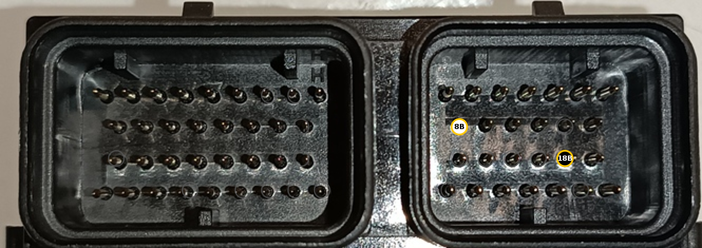

BMW-N52-adapter, connector N52-26pins-4k:

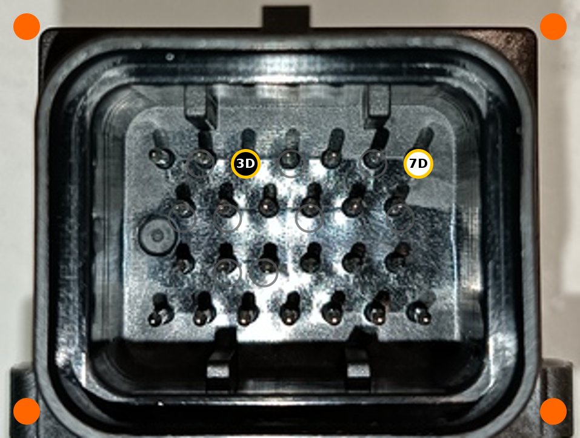

## Step 12: Injectors, coils and other numbered channels (1 of 4)

| Wire color | ECU pin | Adapter pin | Function |
|------------|---------|-------------|----------|
| blue | 8chan-C / 13C |   N52-60pin / 21B | Smart Ignition Coil 3 |
| green | 8chan-C / 11C |   N52-60pin / 23B | Smart Ignition Coil 1 |
| orange/brown | 8chan-C / 20C |   N52-60pin / 20B | Smart Ignition Coil 4 |
| white | 8chan-C / 19C |   N52-60pin / 22B | Smart Ignition Coil 2 |

alphax-8chan, connector 8chan-C:

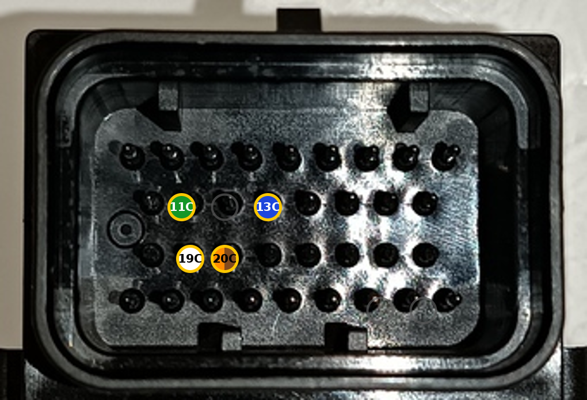

BMW-N52-adapter, connector N52-60pin:

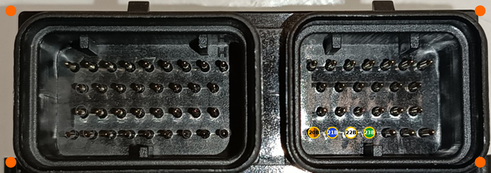

## Step 13: Injectors, coils and other numbered channels (2 of 4)

| Wire color | ECU pin | Adapter pin | Function |
|------------|---------|-------------|----------|
| blue | 8chan-D / 3D |   N52-60pin / 24B | Injector 3 |
| green | 8chan-C / 14C |   N52-60pin / 7B | Smart Ignition Coil 5 |
| orange/brown | 8chan-D / 4D |   N52-60pin / 4B | Injector 4 |
| white | 8chan-C / 28C |   N52-60pin / 6B | Smart Ignition Coil 6 |

alphax-8chan, connector 8chan-D:

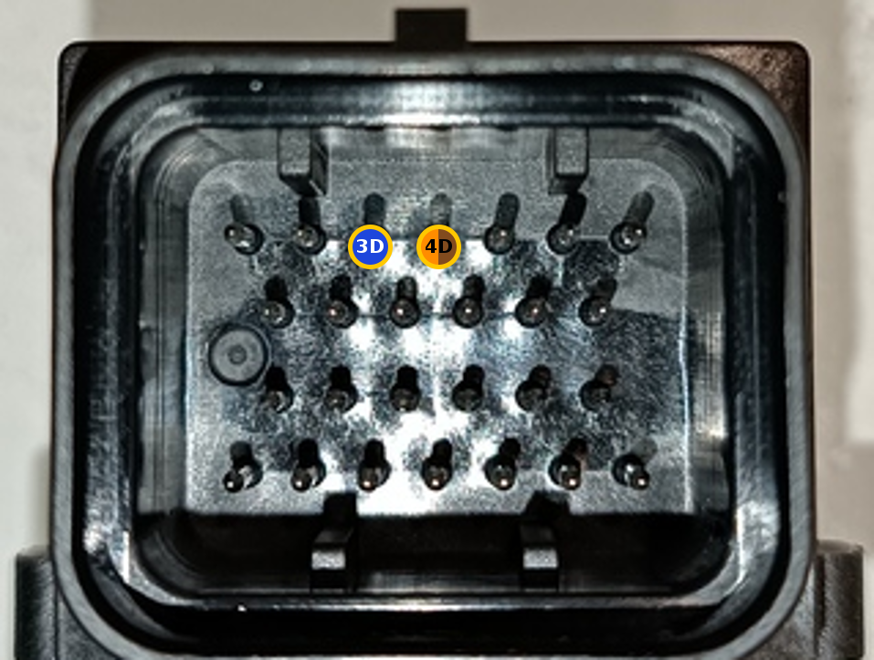

alphax-8chan, connector 8chan-C:

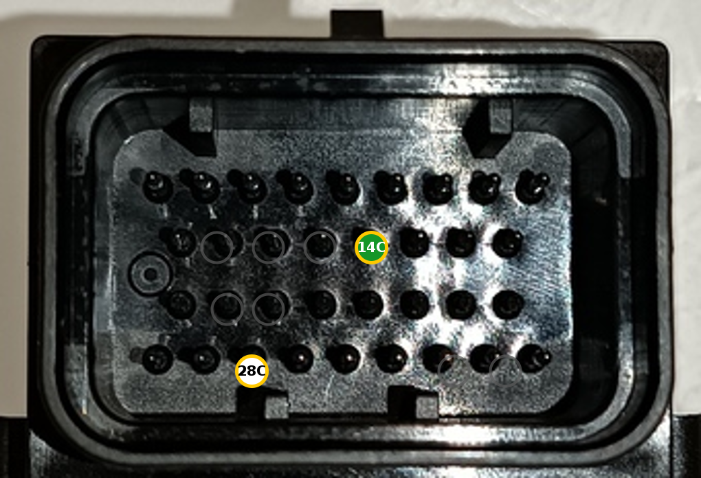

BMW-N52-adapter, connector N52-60pin:

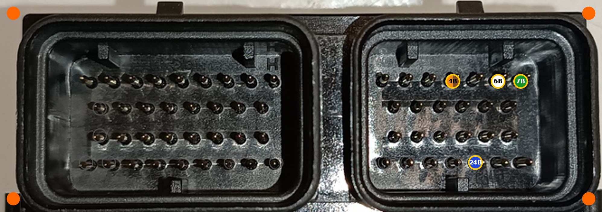

## Step 14: Injectors, coils and other numbered channels (3 of 4)

| Wire color | ECU pin | Adapter pin | Function |
|------------|---------|-------------|----------|
| green | 8chan-D / 1D |   N52-60pin / 26B | Injector 1 |
| white | 8chan-D / 2D |   N52-60pin / 25B | Injector 2 |

alphax-8chan, connector 8chan-D:

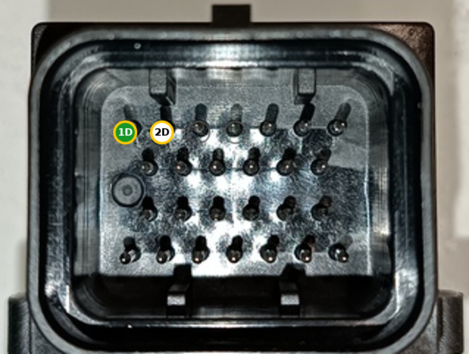

BMW-N52-adapter, connector N52-60pin:

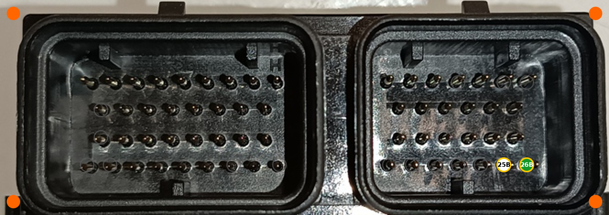

## Step 15: Injectors, coils and other numbered channels (4 of 4)

| Wire color | ECU pin | Adapter pin | Function |
|------------|---------|-------------|----------|
| green | 8chan-D / 5D |   N52-60pin / 2B | Injector 5 |
| white | 8chan-D / 6D |   N52-60pin / 5B | Injector 6 |

alphax-8chan, connector 8chan-D:

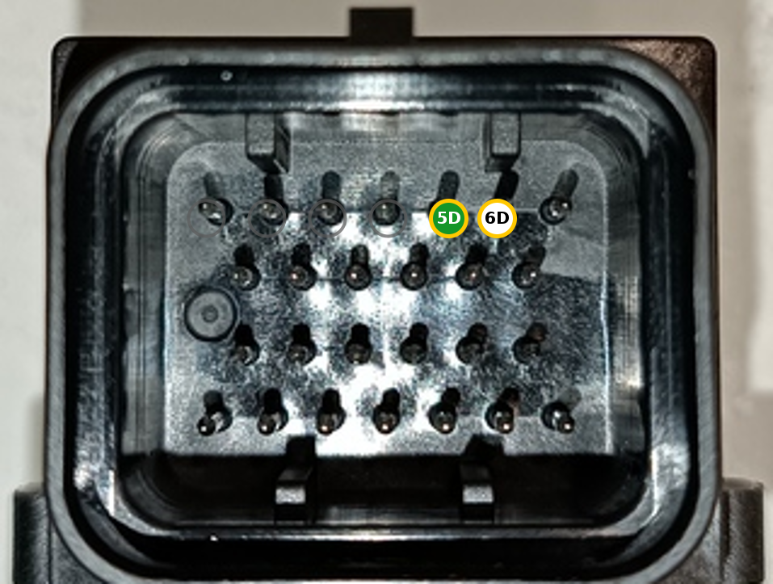

BMW-N52-adapter, connector N52-60pin:

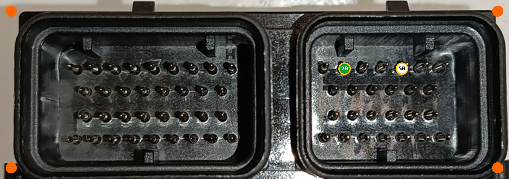

## Unmatched pins on ECU (alphax-8chan) side

No pin with the same function was found on the other side; wire manually or fix the yaml function text.

| Pin | Type | Wire color | Function |
|-----|------|------------|----------|
| 8chan-A-B / On-board MAP | av | orange | MAP Sensor Input |
| 8chan-A-B / 1A | av | blue | Auxiliary analog input 1 PullDown 500K / External MAP |
| 8chan-A-B / 2A | av | violet | Auxiliary analog input 4 PullDown 500K |
| 8chan-A-B / 3A | av | yellow | Auxiliary analog input 2 PullDown 500K |
| 8chan-A-B / 4A | av | blue | Auxiliary analog input 7 PullDown 500K |
| 8chan-A-B / 5A |  | red | Switch 4 |
| 8chan-A-B / 6A |  | white | Switch 1 |
| 8chan-A-B / 9A | hall | green | Hall Input 4 |
| 8chan-A-B / 10A | av | yellow | Auxiliary analog input 5 PullDown 500K |
| 8chan-A-B / 11A | av | yellow | Auxiliary analog input 3 PullDown 500K |
| 8chan-A-B / 12A | av | yellow | Auxiliary analog input 8 PullDown 500K |
| 8chan-A-B / 13A | hall | yellow | Hall Input 5 |
| 8chan-A-B / 14A |  | orange | Switch 2 |
| 8chan-A-B / 15A | hall | orange/brown | Hall Input 1 |
| 8chan-A-B / 16A | 5v | orange | +5v sensors |
| 8chan-A-B / 19A | av | blue | Auxiliary analog input 6 PullDown 500K |
| 8chan-A-B / 20A | av | blue | Auxiliary analog input 9 PullDown 500K |
| 8chan-A-B / 21A | din | blue | Digital Input / Flex fuel sensor |
| 8chan-A-B / 22A |  | orange | Switch 3 |
| 8chan-A-B / 23A | hall | white | Hall Input 2 (cannot be used simultaneously with VR3) |
| 8chan-A-B / 24A | hall | black | Hall Input 3 / SENT |
| 8chan-A-B / 26A | hall | purple | VSS Hall Input |
| 8chan-A-B / 27A | at | purple | IAT Sensor Input |
| 8chan-A-B / 28A | at | purple | Aux Temp 1 |
| 8chan-A-B / 30A | at |  | Aux Temp 2 |
| 8chan-A-B / 1B |  | red | VR1-/Hall Input max9924 |
| 8chan-A-B / 2B |  |  | VR1+ max9924 |
| 8chan-A-B / 3B |  |  | VR2+ |
| 8chan-A-B / 4B |  |  | VR2- |
| 8chan-A-B / 3B4B |  |  | VR2 |
| 8chan-A-B / 5B |  |  | VR3- |
| 8chan-A-B / 6B |  |  | VR3+ |
| 8chan-A-B / 5B6B |  |  | VR3 (cannot be used simultaneously with Hall2) |
| 8chan-A-B / 7B |  |  | VR4- |
| 8chan-A-B / 9B | wbo | yellow | WBO2 VM Vs/Ip (Vm) (pin 2) |
| 8chan-A-B / 10B | wbo | red | WBO2 IP Ip (pin 1) |
| 8chan-A-B / 11B | wbo | green | WBO2 cal R CalR (pin 5) |
| 8chan-A-B / 13B |  |  | VR4+ |
| 8chan-A-B / 7B13B |  |  | VR4 |
| 8chan-A-B / 19B | 12v |  | regulated +12V output (12V from main relay for consumers) |
| 8chan-A-B / 21B |  | white | Knock2 Input |
| 8chan-A-B / 22B |  | green | Knock Input |
| 8chan-A-B / 23B | 5v | red | +5v sensors |
| 8chan-A-B / 24B | 12v | green | +12V engine ECU power source, run/start |
| 8chan-A-B / 26B | 12v |  | +12V from main relay ETB/DC power source |
| 8chan-C / 1C | etb | blue | DC1+ |
| 8chan-C / 2C | etb | blue | ETB+ |
| 8chan-C / 3C | etb | white | DC1- |
| 8chan-C / 4C | etb | white | ETB- |
| 8chan-C / 5C |  |  | High Side 1 |
| 8chan-C / 6C |  | orange | High Side 2 |
| 8chan-C / 7C |  | purple | High Side 3 |
| 8chan-C / 8C |  | purple | Low Side 3 |
| 8chan-C / 9C |  | yellow | Low Side 4 |
| 8chan-C / 10C | etb | yellow | DC2- |
| 8chan-C / 15C | ign | orange/brown | Smart Ignition Coil 8 |
| 8chan-C / 16C | can | blue | CAN2 bus Low |
| 8chan-C / 17C |  |  | Low Side 5 |
| 8chan-C / 18C | etb |  | DC3- |
| 8chan-C / 21C | ign | blue | Smart Ignition Coil 7 |
| 8chan-C / 22C | gnd | orange | Power/Chassis GND ground |
| 8chan-C / 23C | ign | orange | Smart Ignition Coil 10 |
| 8chan-C / 24C | can | green | CAN2 bus High |
| 8chan-C / 25C |  |  | Low Side 6 |
| 8chan-C / 26C | etb | blue | DC3+ |
| 8chan-C / 27C | etb | blue | DC2+ |
| 8chan-C / 29C | ign |  | Smart Ignition Coil 9 |
| 8chan-C / 30C | ign |  | Smart Ignition Coil 11 |
| 8chan-C / 31C | ign | orange | Smart Ignition Coil 12 |
| 8chan-C / 34C |  |  | Low Side 7 |
| 8chan-D / 7D | inj | blue | Injector 7 |
| 8chan-D / 8D | ls | purple | VVT 1 |
| 8chan-D / 9D |  | purple | Fuel Pump Relay Output (low) |
| 8chan-D / 10D | ls | purple | Fan Relay Output (low) |
| 8chan-D / 11D | ls | grey | Main Relay Control Output (low) |
| 8chan-D / 12D | ls | purple | NOS Relay Output (low) |
| 8chan-D / 13D | inj | orange/brown | Injector 8 |
| 8chan-D / 14D | ls | orange | VVT 2 |
| 8chan-D / 15D |  | orange | Tachometer Output (low) |
| 8chan-D / 16D |  | orange | Low Side 1 |
| 8chan-D / 17D | gnd | purple | Power/Chassis GND ground |
| 8chan-D / 18D | gnd | purple | Power/Chassis GND ground |
| 8chan-D / 19D | inj | purple | Injector 9 |
| 8chan-D / 20D | ls | purple | VVT 3 |
| 8chan-D / 21D | ls | purple | VVT 4 |
| 8chan-D / 22D |  | purple | Boost (low) |
| 8chan-D / 23D |  |  | Low Side 2 |
| 8chan-D / 24D | inj |  | Injector 12 |
| 8chan-D / 25D | inj |  | Injector 11 |
| 8chan-D / 26D | inj | yellow | Injector 10 |

## Unmatched pins on adapter (BMW-N52-adapter) side

No pin with the same function was found on the other side; wire manually or fix the yaml function text.

| Pin | Type | Wire color | Function |
|-----|------|------------|----------|
| N52-26pins-4k / 1D | wbo | yellow | WBO2 Vs/Ip (Vm) (OEM 2-11) |
| N52-26pins-4k / 5D | wbo | green | WBO2 CalR (OEM 2-5) |
| N52-26pins-4k / 10D | wbo | red | WBO2 Ip (pin 1) (OEM 2-7) |
| N52-26pins-4k / 12D | agnd | black | KNOCK CYL 4-6 gnd (OEM 5-42) |
| N52-26pins-4k / 14D | 5v | red | +5v (PPS mod supply) (OEM 1-11) |
| N52-26pins-4k / 17D | gnd | black | ECCENTRIC SHAFT pin5 GND (OEM 7-20) |
| N52-26pins-4k / 18D | 5v | red | +5v (THROTTLE TPS power) (OEM 5-14) |
| N52-26pins-4k / 19D | agnd | black | KNOCK CYL 1-3 gnd (OEM 5-41) |
| N52-26pins-4k / 20D |  |  | MASS AIR FLOW pin4 (OEM 5-27) |
| N52-26pins-4k / 21D | agnd | black | Neutral sensor mb agnd (OEM 5-5) |
| N52-26pins-4k / 22D | 5v | red | +5v (MAP MANIFOLD PRESSURE supply) (OEM 5-31) |
| N52-26pins-4k / 23D | agnd | black | GNDA Analog/Sensor Ground (ENGINE COOLANT TEMP) (OEM 7-17) |
| N52-26pins-4k / 24D |  |  | ECCENTRIC SHAFT pin6 SPLY (OEM 7-21) |
| N52-26pins-4k / 25D | agnd | black | GNDA Analog/Sensor Ground (TPS THROTTLE) (OEM 5-38) |
| N52-26pins-4k / 26D | agnd | black | GNDA Analog/Sensor Ground (CAM SENSOR INTAKE) (OEM 7-24) |
| N52-34pins-4k / 1C |  |  | OXYGEN SENSOR 2 pin3 (OEM 2-24) |
| N52-34pins-4k / 2C |  |  | OXYGEN SENSOR 1 pin3 (OEM 2-23) |
| N52-34pins-4k / 3C |  |  | EXH FLAP SIG (OEM 1-5) |
| N52-34pins-4k / 4C |  |  | SPLY (-) (OEM 1-6) |
| N52-34pins-4k / 5C |  |  | E BOX SIG FAN (OEM 1-26) |
| N52-34pins-4k / 6C | 12v | red | Ignition Switch / Battery Voltage Analog Input (SPLY TERM 15 ignition on) (OEM 1-22) |
| N52-34pins-4k / 7C |  |  | ELEC FAN SIG (OEM 1-8) |
| N52-34pins-4k / 9C |  |  | CLUTCH SW (OEM 1-18) |
| N52-34pins-4k / 10C |  |  | OXYGEN SENSOR 1 pin4 (OEM 2-20) |
| N52-34pins-4k / 11C |  |  | ANTI-THEFT SYSTEM (OEM 2-22) |
| N52-34pins-4k / 12C |  |  |  |
| N52-34pins-4k / 13C |  |  | AIR PMP (OEM 1-13) |
| N52-34pins-4k / 14C |  |  | ACTIVATION (OEM 1-9) |
| N52-34pins-4k / 15C |  |  | TD SIG (OEM 1-21) |
| N52-34pins-4k / 17C |  |  | OUTLET TEMP (OEM 1-19) |
| N52-34pins-4k / 18C |  |  | OXYGEN SENSOR 2 pin4 (OEM 2-19) |
| N52-34pins-4k / 19C |  |  | LEAK DIAG 17 (OEM 2-17) |
| N52-34pins-4k / 20C | 12v |  | Wake-up (OEM 2-1) |
| N52-34pins-4k / 22C |  |  | BRK VACUUM 15 (OEM 2-15) |
| N52-34pins-4k / 23C |  |  | VEH IMMOB (OEM 1-15) |
| N52-34pins-4k / 24C |  |  | BRK LGHT (OEM 1-16) |
| N52-34pins-4k / 25C |  |  | LEAK DIAG 16 (OEM 2-16) |
| N52-34pins-4k / 26C |  |  | OXYGEN SENSOR 2 pin2 (OEM 2-25) |
| N52-34pins-4k / 27C |  |  | OXYGEN SENSOR 1 pin2 (OEM 2-26) |
| N52-34pins-4k / 28C |  |  | BRK VACUUM SENS (OEM 2-2) |
| N52-34pins-4k / 29C |  |  | BRK VACUUM 14 (OEM 2-14) |
| N52-34pins-4k / 31C |  |  | START SIG (OEM 1-2) |
| N52-34pins-4k / 32C |  |  | BSD SIG 1-3 (OEM 1-3) |
| N52-34pins-4k / 33C |  |  | BRK LGHT SIG (OEM 1-4) |
| N52-34pins-4k / 34C |  |  | RR 5PD (OEM 1-17) |
| N52-60pin / 1A | 12v | red | +12v Bat+ (Hot all times) (constant Supply terminal 30) (OEM 3-1) |
| N52-60pin / 2A | 12v | red | +12v from main relay (ecu input to feed h-bridges) (switched Supply terminal 87) (OEM 3-2) |
| N52-60pin / 3A | hall |  | CAM Sensor Intake (OEM 7-11) |
| N52-60pin / 4A | hall |  | CAM Sensor Exhaust (OEM 7-12) |
| N52-60pin / 5A |  |  | VVT RLY (OEM 7-23) |
| N52-60pin / 6A |  |  | ECCENTRIC SHAFT pin1 (OEM 7-22) |
| N52-60pin / 7A |  |  | KNOCK SENSOR CYL 1-3 (OEM 5-19) |
| N52-60pin / 8A |  |  | DISA SIG CONTROLLER 2-2 (OEM 5-40) |
| N52-60pin / 9A |  |  | THROTTLE MOTOR 2 (OEM 5-16) |
| N52-60pin / 11A | agnd | black | GNDA Analog/Sensor Ground (PPS) (OEM 1-23) |
| N52-60pin / 12A |  |  | OIL PRESSURE LOW SWITCH (OEM 7-13) |
| N52-60pin / 13A |  |  | BSD SIG 7-26 (OEM 7-26) |
| N52-60pin / 14A |  |  | ECCENTRIC SHAFT pin4 SHIELD (OEM 7-10) |
| N52-60pin / 15A |  |  | KNOCK SENSOR CYL 4-6 (OEM 5-20) |
| N52-60pin / 16A |  |  | ECCENTRIC SHAFT pin9 (OEM 7-9) |
| N52-60pin / 17A |  |  | DISA SIG CONTROLLER 2 (OEM 5-18) |
| N52-60pin / 19A | 5v | red | +5v (PPS supply) (OEM 1-24) |
| N52-60pin / 20A |  |  | ENG HEAT RLY (OEM 5-12) |
| N52-60pin / 21A |  |  | MASS AIR FLOW pin1 (OEM 5-26) |
| N52-60pin / 22A |  |  | HOT FILM (OEM 5-4) |
| N52-60pin / 23A |  |  | MASS AIR FLOW pin2 (OEM 5-25) |
| N52-60pin / 24A |  |  | FUEL TANK SIG (OEM 5-23) |
| N52-60pin / 25A |  |  | THROTTLE MOTOR (OEM 5-15) |
| N52-60pin / 28A | av | orange | MAP signal (INTAKE PIPE PRESSURE) (OEM 5-33) |
| N52-60pin / 29A | ls | grey | Low-Side 5 main relay Control Output (DME RLY) (OEM 5-13) |
| N52-60pin / 30A |  |  | BSD SIG (OEM 5-35) |
| N52-60pin / 31A |  |  | ECCENTRIC SHAFT pin3 (OEM 7-7) |
| N52-60pin / 33A |  |  | ECCENTRIC SHAFT pin7 (OEM 7-8) |
| N52-60pin / 1B |  |  | ACT VANOS SOL VALVE EXH (OEM 7-18) |
| N52-60pin / 3B |  |  | CRANKSHAFT SENSOR (OEM 5-29) |
| N52-60pin / 8B |  |  | ACT VANOS SOL VALVE INTK (OEM 7-5) |
| N52-60pin / 9B |  |  | VAR GEAR SIG pin1-2 (OEM 4-6) |
| N52-60pin / 10B |  |  | VAR GEAR SIG pin2-2 (OEM 4-5) |
| N52-60pin / 11B |  |  | VAR GEAR SIG pin1-1 (OEM 4-4) |
| N52-60pin / 12B |  |  | VAR GEAR SIG pin2-1 (OEM 4-3) |
| N52-60pin / 13B |  |  | Supply 4-2 (OEM 4-2) |
| N52-60pin / 14B |  |  | MAP THERMOSTAT (OEM 7-19) |
| N52-60pin / 15B |  |  | ECCENTRIC SHAFT pin8 (OEM 7-6) |
| N52-60pin / 17B |  |  | MASS AIR FLOW pin5 (OEM 5-28) |
| N52-60pin / 18B |  |  | Neutral sensor (OEM 5-6) |
| N52-60pin / 19B |  |  | Supply 4-1 (OEM 4-1) |
