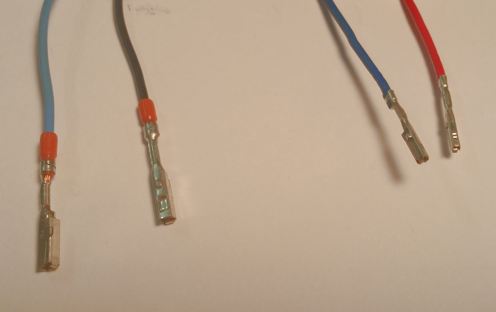
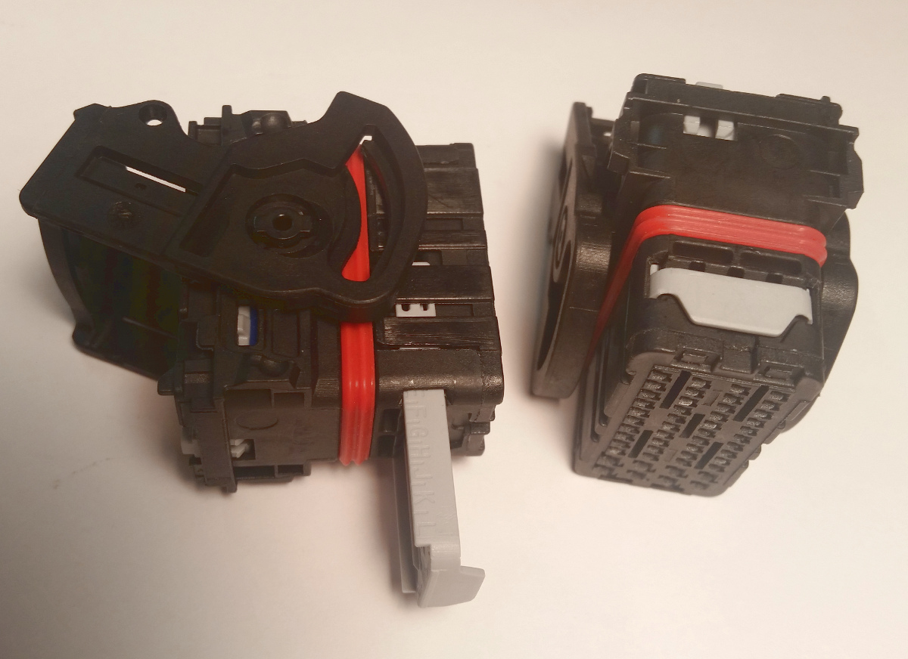
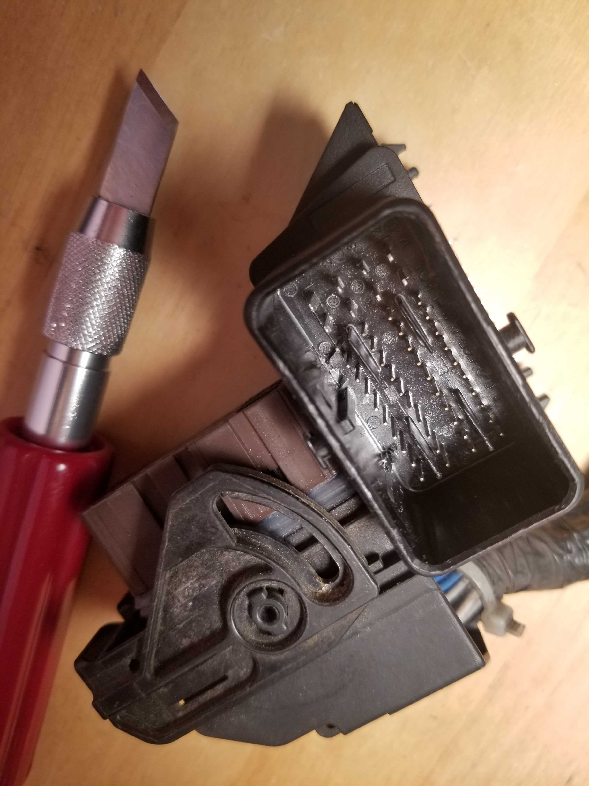

# microRusEFI Connectors

Harness donor:
US: 2007+ Nissan Altima & 2007+ Nissan Sentra

Harness side socket.
"Removable front key" style.
Left from China, Right removed from Nissan Sentra.

Removed from Nissan Sentra - square terminals.
Left large terminal. Right small pin terminal.

PCB side: [Molex 48 pin PCB plug](https://www.mouser.com/datasheet/2/276/5007620481_PCB_HEADERS-179151.pdf) 5007620481 500762-0481

PCB side "grey": 5007620482 500762-0482 (we have not use this one so far)

PCB side "brown": 5007620483 500762-0483 (Compatible with Lada & Nissan ECU plug)

Wire cap 643201301

Harness side connector 64320-1311 or 64320-3311. Blind plugs 64325-1010 and 64325-1023.

TODO investigate Flat case option 36638-0002

From Mouser, Molex.

Left large pin 64323-1039.
Right small pin 64322-1039.
todo

"Side clip" style harness socket, both from China.

Terminals

J-48817-232

## Lada as harness donor

Complete used harness for Lada could be acquired pretty cheap in some parts of the world. On same Lada vehicles ECU
is in the cabin (unline Nissan ECU in dirty engine bay) so we get pretty clean crimped connector with about 30 wires already in
it. The missing wires could be taken from the smaller ECU connector.  

With a utility knife you need to cut 4 keys from inside the male part to mate default microRusEFI connector with a brown plug. Two center keys could be left
as is.

