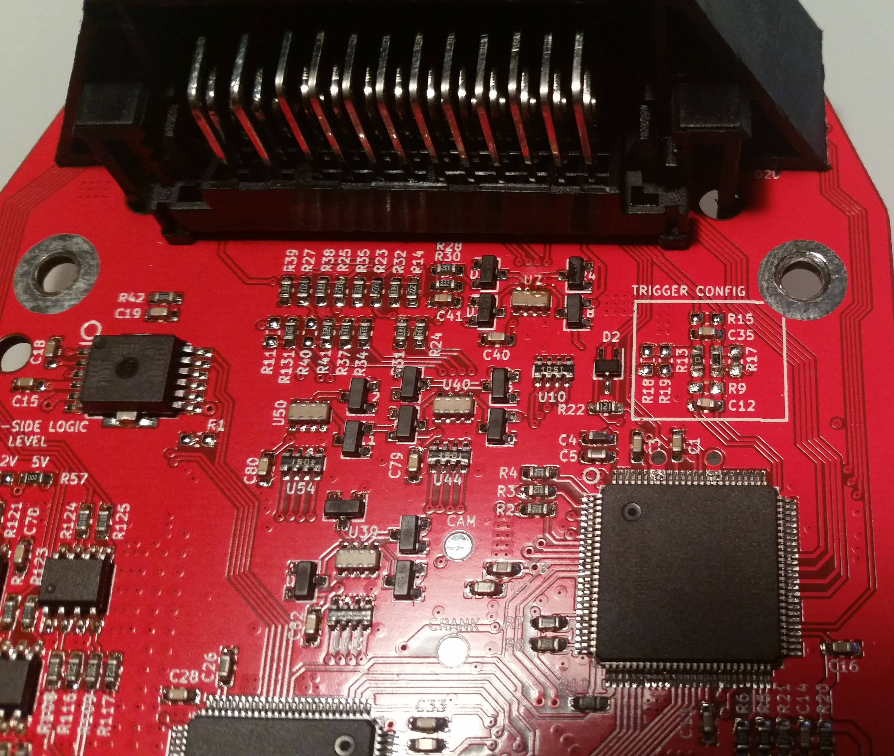
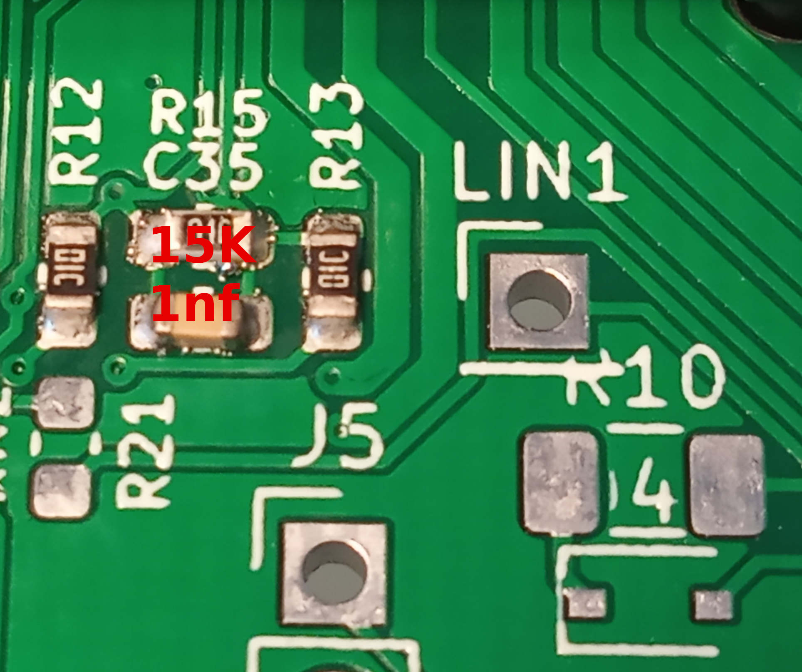
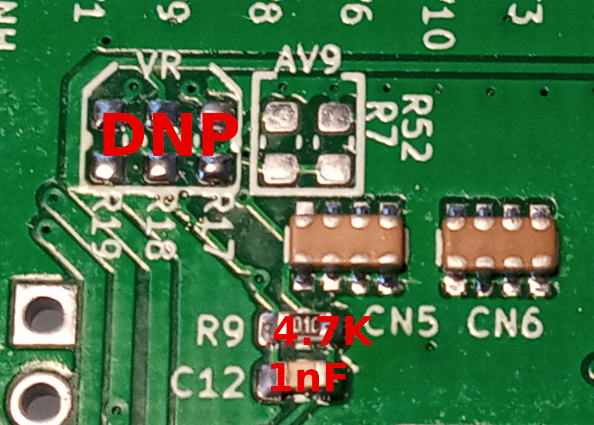

# microRusEFI Wiring

## Connector Pinout

[*__>>>Interactive Pinout<<<__*](https://rusefi.com/docs/pinouts/microrusefi/)

__WARNING: For historical reasons the microRusEFI pin numbers do not match the Molex numbers on the plastic__

In some cases without "main relay output +12v" both pins #1 and #5 should be connected to the single source of +12v.

Pin #1 feeds ETB H-bridge, battery voltage sense, gp5 & gp6 high-side +12v, TLE8888 H-bridges.

## Pin Types

These tables provide technical information about the different types of pin found on microRusEFI.

### Power

| Pin  | ID | Type | Notes & Limits |
|------|----|-------------| ---- |
| . | 12V  | Power supply        | 9-22V operating, 5A fuse recommended           |
| [#2, #6](https://rusefi.com/docs/pinouts/microrusefi/?connector=main&pin=6) | pgnd | Power ground        | Solidly ground directly to chassis or engine block. |
| [#17, #21](https://rusefi.com/docs/pinouts/microrusefi/?connector=main&pin=21) | sgnd | Signal ground       | Sensor ground.  *__Do not ground to engine!__* |
| . | 5v   | 5V sensor supply    | 5V supply for external sensors.  200mA maximum per pin. |

### Stepper

| Pin  | Name                | Notes & Limits                                                                       |
|------|---------------------| ------------------------------------------------------------------------------------ |
| #33 | GP3 | Stepper Coil #2 |
| #34 | GP2 | Stepper Coil #1 |
| #35| GP1 | Stepper Coil #1 |
| #43 | GP4 | Stepper Coil #2 |

### Input

| ID   | Type                | Notes & Limits                                                           | Possible functions                                                        |
|------|---------------------|--------------------------------------------------------------------------|---------------------------------------------------------------------------|
| at   | Analog temperature  | Analog temperature (thermistor) input.  2.7k(+-1%) pullup resistor to 5v | Thermistor temperature sensor, fuel level sender (variable resistor type) |
| av   | Analog voltage      | Analog voltage input.  500k pull down to GND                             | Analog voltage sensor (MAP, TPS, acc pedal, oil pressure, etc)            |
| vr   | Variable reluctance | VR crank input                                                           | VR sensors including crank, cam, vehicle speed                            |
| hall | Hall cam/crank      | hall sensor for cam/crank with pull-up to 5v                             | Hall sensors including crank, cam, vehicle speed                          |

### Output

| ID | Type | Notes & Limits | Possible functions |
|----|-------------| ---- | --- |
| inj  | Injector output     | Low side, 2.2A maximum __Only saturated (high impedance) injectors are supported.__ | Injector, general purpose low side |
| ign  | Ignition output     | 5V push-pull, 250mA maximum   | Ignition coil, general purpose 5V push-pull |
| ls   | High power low side | General purpose low side output, 4.5A maximum | General purpose low side, injector |
| gp_high | General purpose high side | General purpose high side push output, 5V/12V (internally selectable based on JP2 jumper) 250mA maximum | General purpose 5V/12V high side, ignition coil |
| gp_low | General purpose low side | General purpose low side pull output, 12V 500mA maximum                            | General purpose low side |
| gp_pp  | General purpose Push-Pull | General purpose push-pull (low and high side) output, 600mA | Bipolar IDLE stepper, relays, solenoids |
| mr   | Main relay          | Dedicated main relay output.  Low side turned on with power, 800mA maximum. | Main relay |
| etb  | Electronic throttle | Dedicated electronic throttle outputs. | Connect a brushed motor throttle body directly to these two pins. |

### Communication

| ID | Type | Notes & Limits |
|----|-------------| ---- |
| usb | USB     | USB tuning interface |
| can | CAN bus | CAN communication |

USB cable green wire: USB D+ DATA+

USB cable white wire: USB D- DATA-

USB cable black wire: ground

[HOWTO wire external USB](https://youtu.be/4v2VnP-YdlQ)

USB cable red wire: +5v (would not work via microRusEFI connector for versions < 0.5.0)

### Hall type Crank sensor

Depending on your crankshaft position sensor type you would need to populate either Hall or VR option.

0.1 - 0.3

R9=DNP  
R15=DNP  
R17=2.7K pull-up to 5v  
R12=10K  
R13=0R  

0.4.5, 0.4.7: For VR crankshaft position sensor you would need to add R9 & C12 on the back.

0.4.8: Comes set for VR (R9 & C12 are now on the front since)

VR mode front - comes pre-assembled

VR mode back

0.4.5, 0.4.7: For Hall, you would need to REMOVE R15 & C35 on the front, and install R17=1.5K R18=R19=4.7K on the back.

0.4.8: For Hall, you would need to REMOVE R15&R9, C12 & C35 on the front, and install R17=1.5K R18=R19=4.7K on the back.

0.5.0 Hall

0.4.7 Hall mode front

0.4.7 Hall mode back

## Extra pins

microRusEFI exposes the following pins in addition to the primary 48 pin connector:

J4:

| N | Name | Possible functions (not all listed!) |
|----|-------------| ---- |
| 9 | GNS | GND |
| 4 | VDD | 3.3V |
| 1 | 5V | 5V |
| 2 | 12V | 12V from Main Relay |
| 3 | PB8 | I2C1_SCL or CAN1_RX |
| 6 | PB9 | I2C1_SDA or CAN1_TX |
| 8 | PC10 | SPI3_SCK or USART3_TX or UART4_TX |
| 5 | PC11 | SPI3_MISO or USART3_RX or UART4_RX |
| 10 | PC12 | SPI3_MOSI or USART3_CK or UART5_TX |
| 7 | PA15 | SPI3_NSS (Chip Select) |

[J2 Interactive Pinout](https://rusefi.com/docs/pinouts/microrusefi/main.html)

Three GPIOs are available on J2 (SWD) connector. If you are not going to use debugger J2 connector can be used for other purposes.

| N | Name | Possible functions (not all listed!) |
|----|-------------| ---- |
| 7, 8 | GND | GND |
| 1, 2 | 5V | 5V |
| 3, 4 | VDD | 3.3V |
| 5 | SCK | SWD clock or PA14 gpio (no alternative functions) |
| 9 | SWDIO | SWD data or PA13 gpio (no alternative functions) |
| 6 | SWO | SWD/JTAG data out (?) or SPI1_SCK or SPI3_SCK |
| 10 | NRST | CPU reset input (active low) |

For HW version 0.5.0 and newer some additional GPIOs are available on test points around STM32.

[Test point Interactive Pinout](https://rusefi.com/docs/pinouts/microrusefi/pads.html)

| Test point | GPIO | Possible functions (not all listed!) |
|----|-------------| ---- |
| J6 | PE0 | GPIO |
| J8 | PB7 | USART1_RX or TIM4_CH2 |
| J9 | PC13 | GPIO only |
| J10 | PE6 | TIM9_CH2 |
| J11 | PE5 | TIM9_CH1 |
| J16 | PD0 | CAN1_RX |

Please refer to STM32F407 chip documentation for full list of alternative functions of GPIOs listed above.

## FAQ

*__Q:__ Can I use temperature inputs for EGT?*  
__A:__ "temperature input" is a just an analog 0-5v input with a strong pull-up implied to use with a thermistor. Your EGT sensor is probably not a thermistor, so your 0-5v output out of a conditioner would probably not be happy about the pull-up.

[microRusEFI photo](Hardware-files/microRusEFI/Hardware_microRusEFI_connector.jpg)

[microRusEFI connector PCB image](Hardware-files/microRusEFI/Hardware_microRusEFI_0_3_PCB_pinout.png)

[reality](Hardware-files/microRusEFI/microRusEFI_connectors/MRE_reality.jpg)
