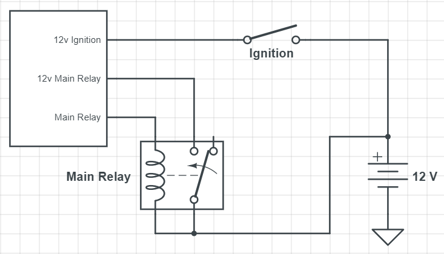

# microRusEFI

[moved to microRusEFI-Manual](microRusEFI-Manual)

## Buy here

[💲rusEFI store💲](https://www.shop.rusefi.com/shop)

microRusEFI is a highly integrated board version of the rusEFI ECU. The microRusEFI ECU is targeted at port-injected
gasoline engines up to 4 cylinders.

[Connector Pinout](Hardware-microRusEFI-wiring)

[Latest Schematics](https://github.com/rusefi/hw_microRusEfi/blob/master/gerbers/R0.6.0/micro_rusEFI.pdf)

[Forum Thread](https://rusefi.com/forum/viewtopic.php?f=4&t=1538)

[Board Source Files](https://github.com/rusefi/hw_microRusEfi)

## Capabilities

* Primary VR or Hall input (configurable with few resistor changes)
* Secondary Hall input
* x4 analog thermistor (temperature) inputs
* x10 analog voltage inputs (0-5v)
* x4 high-Z injector outputs
* x2 high-current low side outputs for IAC/VVT/other solenoids
* Dedicated main relay control output
* x4 low-current low side outputs for relays or warning lights
* x4 5v logic level ignition outputs
* x2 5v/12v configurable logic level outputs (requires resistor changes)
* Electronic throttle body (drive by wire)
* CAN connectivity on the plug
* USB connectivity on the plug

[Connector Pinout](Hardware-microRusEFI-wiring)

Main Relay Wiring:

