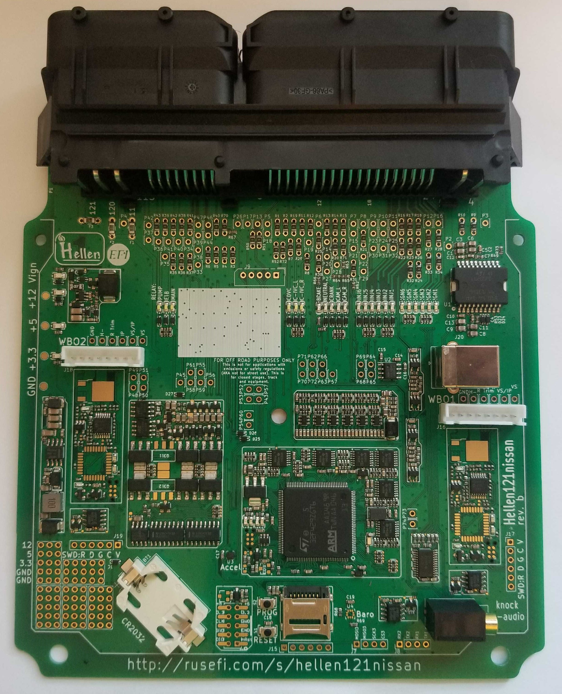

# Hellen 121 Nissan

https://www.shop.rusefi.com/shop/p/hellen-121-nissan

*Compatible with: Earlier 350Z, 2nd Generation Nissan X-Terra, some Sentra, some Maxima.

[Download release firmware](https://github.com/rusefi/rusefi/releases/latest/download/rusefi_bundle_hellen121nissan.zip)
[Download Snapshot firmware](https://rusefi.com/build_server/rusefi_bundle_hellen121nissan.zip)

[Pinout](https://rusefi.com/docs/pinouts/hellen/hellen121nissan/) & [Google Sheet](https://docs.google.com/spreadsheets/d/1mhGITGrEsXB65xr1dcxLFLKIrD0TVu754hoxm6RZHCA)

[Issue Tracker](https://github.com/rusefi/hellen121nissan-issues/issues)

[Schematics rev D](Hardware/Hellen/hellen121nissan-d-schematic.pdf)

[Schematics rev С](Hardware/Hellen/hellen121nissan-c-schematic.pdf)

[Schematics rev B](Hardware/Hellen/hellen121nissan-b-schematic.pdf)

[ibom rev D](https://rusefi.com/docs/ibom/hellen121nissan-d-ibom.html)

[ibom rev С](https://rusefi.com/docs/ibom/hellen121nissan-c-ibom.html)

[ibom rev B](https://rusefi.com/docs/ibom/hellen121nissan-b-ibom.html)

[Nissan-Xterra-2011](Nissan-Xterra-2011)

[Almera](OEM-Docs/Nissan/Almera-N16-ECU.pdf)

[Vault-Of-Nissan-OEM](Vault-Of-Nissan-OEM)

## Hardware features

## Extension Pads

| Pin | Type | Comments |
|---|---|---|
||**Outputs**||
| P43 | PP | 1.5 A peak |
| P45 | PP | 1.5 A peak |
| P48 | Bridge driver A | 3 A peak |
| P49 | Bridge driver A | 3 A peak |
| P50 | Bridge driver B | 3 A peak |
| P51 | Bridge driver B | 3 A peak |
| P52 | Low side | 0.5 A |
| P53 | Low side | 1 A |
| P54 | Low side | 0.5 A |
| P55 | Low side | 0.5 A |
| P56 | Low side | 0.5 A |
| P57 | Low side | 0.5 A |
| P58 | Low side | 0.5 A |
| P59 | Low side | 0.5 A |
| P60 | High side | 4 A |
| P61 | High side | 4 A |
| P73 | PP 5 V | 20 mA |
| P74 | PP 5 V | 20 mA |
|   | **Inputs** |   |
| P62 | Analog pull up | |
| P63 | Analog pull up | |
| P64 | Analog pull down | |
| P65 | Analog pull down | |
| P66 | Analog pull down | |
| P67 | Analog pull down | |
| P68 | Analog pull down | |
| P69 | Analog pull down | |
| DIN1 | Discrete input  | |
| DIN2 | Discrete input  | |
| DIN3 | Discrete input  | |

## Vehicle Specific Jumpers

Rev B, ECU pin 68 considerations

| Vehicle | R7 | R8 |
| --- | --- | --- |
| [All vehicles](https://github.com/rusefi/hellen121nissan-issues/issues/3) | ✔️ | ❌ |
