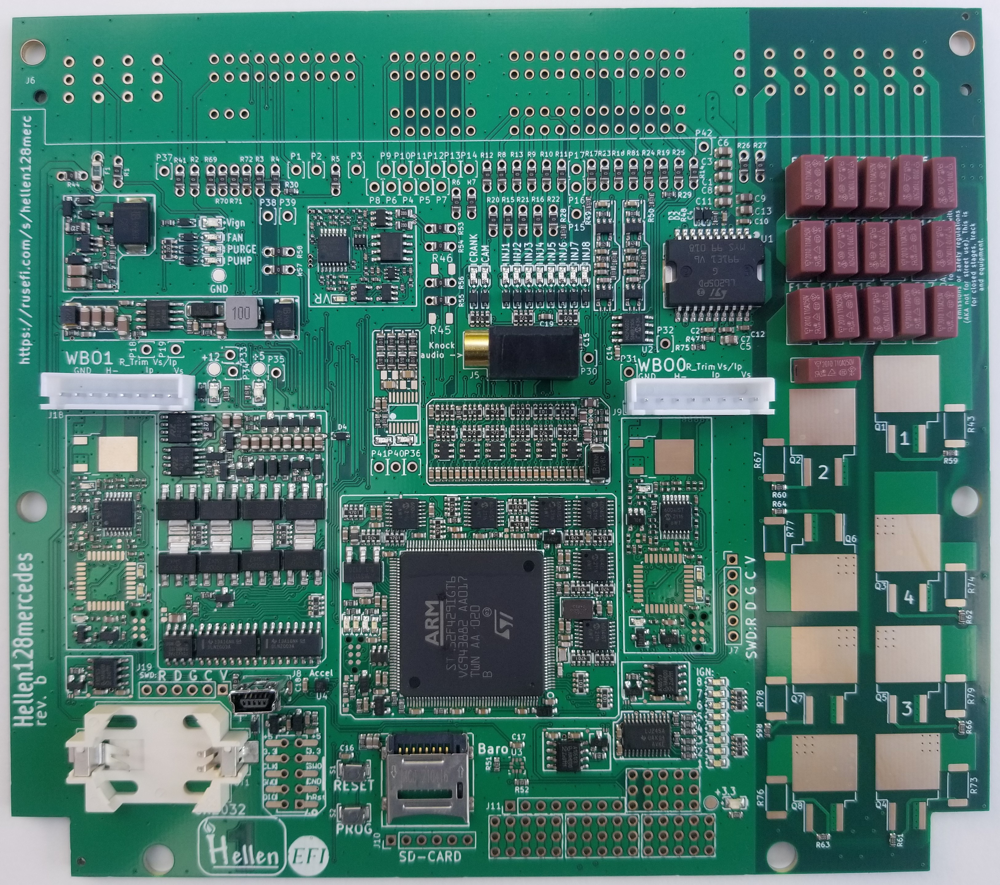
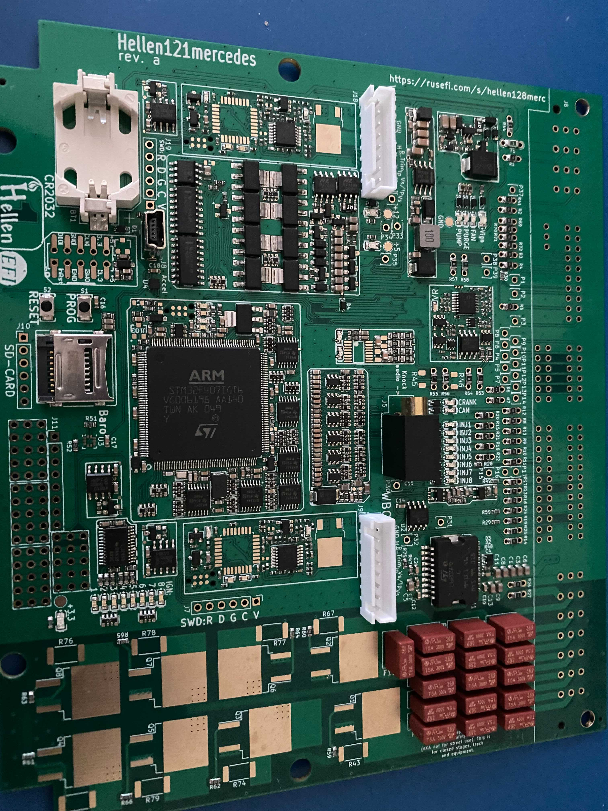

This development board is PnP for Mercedes with the 128 Pin ECU (M111 and M113 engine; late 90s-early 2000s. confirm your ecu)

[Download release firmware](https://github.com/rusefi/rusefi/releases/latest/download/rusefi_bundle_hellen128.zip)
[Nightly firmware bundle](https://rusefi.com/build_server/rusefi_bundle_hellen128.zip)

[Ebay]()

[Pinout](https://rusefi.com/docs/pinouts/hellen/hellen128/) & [Google Sheet](https://docs.google.com/spreadsheets/d/1I-lZKRajTiEGFUXdZpXEtKF2pymlOo-lPahy3cLMnl4) & [Another Google Sheet](https://docs.google.com/spreadsheets/d/1JgGFJ8AggBFiKT_CQ1D6uYhaIsqeiH9RerxuVy1kp4Y/)

[[Issue Tracker]](https://github.com/rusefi/hellen128merc-issues/issues)

[Schematics rev a](Hardware/Hellen/hellen128mercedes-a-schematic.pdf)

[iBom rev a](https://rusefi.com/docs/ibom/hellen128mercedes-a-ibom.html)

## Hardware features

* ME 2.0 pinout
* supports both smart and dumb coils
* ?

## Extension Pads (rev. a)

| Pin | Type | Comments |
|---|---|---|
||**Outputs**||
| P33 | Bridge driver B | 3 A peak |
| P34 | Low side | 0.5 A |
| P35 | Low side | 0.5 A |
|   | **Inputs** |   |
| P30 | Analog pull up | |
| P31 | Analog pull down | |
| P32 | Analog pull down | |
|   | **MCU** |   |
| J1 | SPI, UART/GPIO | See schematic for details | 
|   | **WBO1** |   |
| J9 | XH-8 WBO1 connector| |
| P19 | GND | |
| P21 | H- | |
| P22 | R Trim | |
| P23 | Ip | |
| P24 | Vs/Ip | |
| P25 | Vs | |
| J7 | SWD| |
|   | **WBO2** |   |
| J18 | XH-8 WBO2 connector| |
| P18 | GND | |
| P20 | H- | |
| P26 | R Trim | |
| P27 | Ip | |
| P28 | Vs/Ip | |
| P29 | Vs | |
| J19 | SWD | |

## Ignition jumpers (rev. a)

| Vehicle | F2 | F3 | F4 | F5 | F6 | F7 | F8 | F9 | F10 | F11 | F12 | F13 | F14 | F15 | F16 | F17 |
| --- | --- | --- | --- | --- | --- | --- | --- | --- | --- | --- | --- | --- | --- | --- | --- | --- |
| Connctor pin **(NOT jumper designator!!!)** | F4 | F5 | F6 | F7 | F9 | F10 | F11 | F12 | F13 | F14 | F16 | F17 | F18 | F19 | F20 | F21 |
| IGNx signal | IGN5 | IGN5 | IGN3 | IGN3 | IGN7 | IGN7 | IGN8 | IGN8 | IGN4 | IGN4 | IGN2 | IGN6 | IGN6 | IGN2 | IGN1 | IGN1 |
| 4 cyl 2 coil | 🟡 | 🟡 | 🟡 | 🟡 | 🟡 | 🟡 | 🟡 | 🟡 | ✔️ | 🟡 | 🟡 | 🟡 | 🟡 | 🟡 | ✔️ | 🟡 |
| Other model | ? | ? | ? | ? | ? | ? | ? | ? | ? | ? | ? | ? | ? | ? | ? | ? | ? |

🟡 - it doesn't matter, the specified pin is not connected

| Coil type | R43 | R59 | R67 | R60 | R79 | R66 | R74 | R62 | R76 | R63 | R77 | R64 | R78 | R65 | R73 | R61 |
| --- | --- | --- | --- | --- | --- | --- | --- | --- | --- | --- | --- | --- | --- | --- | --- | --- |
| Dumb | ❌ | ✔️ | ❌ | ✔️ | ❌ | ✔️ | ❌ | ✔️ | ❌ | ✔️ | ❌ | ✔️ | ❌ | ✔️ | ❌ | ✔️ |
| Smart | ✔️ | ❌ | ✔️ | ❌ | ✔️ | ❌ | ✔️ | ❌ | ✔️ | ❌ | ✔️ | ❌ | ✔️ | ❌ | ✔️ | ❌ |

[Vault-Of-Mercedes-OEM](Vault-Of-Mercedes-OEM)

[Mercedes-C230-and-SLK230](Mercedes-C230-and-SLK230)
