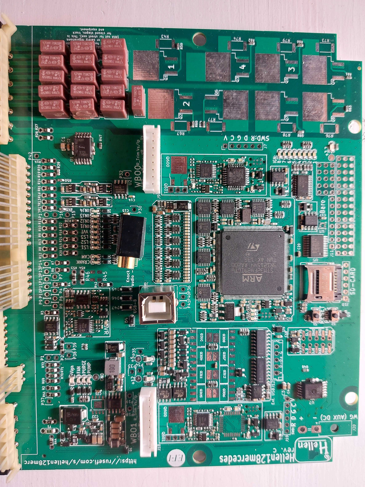

# Hellen 128 Mercedes

Available at [rusEFI store](https://www.shop.rusefi.com/shop/p/hellen-128-mercedes)

This development board is PnP for Mercedes with the 128 Pin ECU (could be used on M104, M111, M112 and M113 engines; late 90s-early 2000s. confirm your ECU _harness_)

## Hardware features

* ME 2.0/2.1 pinout
* Up to 8 Injectors.
* Up to 8 Coils (Low impedance or Smart coils)
* On board WBO controller
* ETB support
* VR Crank and HAll Cam sensor support
* 1/2 channel Knock input
* Factory Engine Sensor input support
* CAN communication
* Possibility to extend IOs (Inputs/Outputs)
* USB connection
* SD-CARD logging

## Firmware

[Download Release](https://github.com/rusefi/rusefi/releases/latest/download/rusefi_bundle_hellen128.zip)

[Download Nightly](https://rusefi.com/build_server/rusefi_bundle_hellen128.zip)

## Issue tracking

[HW related issues](https://github.com/rusefi/hellen128merc-issues/issues)

[SW related issues](https://github.com/rusefi/rusefi/issues)

## Interactive pinout

[Interactive Pinout](https://rusefi.com/docs/pinouts/hellen/hellen128/)

[Schematics rev a](Hardware/Hellen/hellen128mercedes-a-schematic.pdf) [iBom rev a](https://rusefi.com/docs/ibom/hellen128mercedes-a-ibom.html)

[Schematics rev b](Hardware/Hellen/hellen128mercedes-b-schematic.pdf) [iBom rev b](https://rusefi.com/docs/ibom/hellen128mercedes-b-ibom.html)

[Schematics rev c](Hardware/Hellen/hellen128mercedes-c-schematic.pdf) [iBom rev c](https://rusefi.com/docs/ibom/hellen128mercedes-c-ibom.html)

[Test points](Hardware/Hellen/hellen128mercedes-rev-b-reference-4-cylinder-test-points.png)

## Hardware extension/ configuration

### Ignition jumpers (rev. a, rev. b)

| Vehicle | F2 | F3 | F4 | F5 | F6 | F7 | F8 | F9 | F10 | F11 | F12 | F13 | F14 | F15 | F16 | F17 |
| --- | --- | --- | --- | --- | --- | --- | --- | --- | --- | --- | --- | --- | --- | --- | --- | --- |
| Connctor pin **(NOT jumper designator!!!)** | F4 | F5 | F6 | F7 | F9 | F10 | F11 | F12 | F13 | F14 | F16 | F17 | F18 | F19 | F20 | F21 |
| IGNx signal | IGN5 | IGN5 | IGN3 | IGN3 | IGN7 | IGN7 | IGN8 | IGN8 | IGN4 | IGN4 | IGN2 | IGN6 | IGN6 | IGN2 | IGN1 | IGN1 |
| 4 cyl 2 coil | 🟡 | 🟡 | 🟡 | 🟡 | 🟡 | 🟡 | 🟡 | 🟡 | ✔️ | 🟡 | 🟡 | 🟡 | 🟡 | 🟡 | ✔️ | 🟡 |
| Other model | ? | ? | ? | ? | ? | ? | ? | ? | ? | ? | ? | ? | ? | ? | ? | ? | ? |

🟡 - it doesn't matter, the specified pin is not connected

| Coil type | R43 | R59 | R67 | R60 | R79 | R66 | R74 | R62 | R76 | R63 | R77 | R64 | R78 | R65 | R73 | R61 |
| --- | --- | --- | --- | --- | --- | --- | --- | --- | --- | --- | --- | --- | --- | --- | --- | --- |
| Dumb | ❌ | ✔️ | ❌ | ✔️ | ❌ | ✔️ | ❌ | ✔️ | ❌ | ✔️ | ❌ | ✔️ | ❌ | ✔️ | ❌ | ✔️ |
| Smart | ✔️ | ❌ | ✔️ | ❌ | ✔️ | ❌ | ✔️ | ❌ | ✔️ | ❌ | ✔️ | ❌ | ✔️ | ❌ | ✔️ | ❌ |

### Supercharger Clutch

Guide valid for Rev. B and Rev. C

If you want to control the clutch on a Mercedes supercharger, some hardware modifications are required.  The following modifications will result in pin F21 being able to control the supercharger clutch:

* F13, F14, F17 must be removed
* Find R80 on the back of the ECU.  It should be a pair of pads for a resistor.  Bridge R80 with solder or connect a 0 Ohm Jumper on R80.
* Remove IGBT from Q6
* Solder high-current MOSFET (for example VNB14NV04, VNB14NV0413TR) instead on Q6
* in TunerStudio use F17 - IGN 6

Rev. A board does not have R80! for this variant, you need to remove the Fuses from the list above and solder a wire instead of placing R80:
todo: <image>

### Solenoid control

By design Rev. A and Rev. B boards are designed to drive the VVT coil. On Rev. C hardware E1, E2, E3 and E4 can all be used as solenoid control. They have the internal diodes needed for protection.

### Add extra IO

Using the Interactive pinout, Test Points are documented that are connected from the Car connector to the PCB. These can be connected with wires to the Test Points that are available in TunerStudio.

Example:

    E17 is Test Point P17 (In some variants this is oil level).
    In case we would like to use this as an oil pressure sensor, in Tuner Studio: Sensors > Oil Pressure > Oil Pressure ADC input drop down would display a list where we can see P30_IN_AUX4. By selecting this input, the user needs to connect a wire from P17 to P30.

    The end user should keep track of mods, since there is no way for us to do this. Dedicated connections are available in Tuner Studio with Car connecter Pin cod in the name.

todo: add a picture with board/TunerStudio config.

### Extension Pads

| Pin | Type | Comments | Hardware revision |
|---|---|---|---|
||**Outputs**|||
| P18 | Low side | 1.5 A | C |
| P19 | Low side | 0.5 A | B, C |
| P33 | Bridge driver B | 3 A peak | A, B, C |
| P34 | Low side | 0.5 A | A, B, C |
| P35 | Low side | 0.5 A | A, B, C |
|   | **Inputs** |   | |
| P30 | Analog pull up | | A, B, C |
| P31 | Analog pull down | | A, B, C |
| P32 | Analog pull down | | A, B, C |
| P36 | Analog pull down | | B, C |
| P40 | Analog pull up | | B, C |
| P41 | Analog pull up | | B, C |
|   | **MCU** |   | |
| J1 | SPI, UART/GPIO | See schematic for details | A,B,C |

NOTE: the Analog inputs can also be used as switched inputs! These can be configured for example clutch pedal switch or switch for launch control.

### rusEFI WBO controller

Since a narrow band lambda (O2 sensor) was used in the original ECU, Hellen includes an onboard wideband controller. A harness is needed to connect the lambda sensor, these lines are not possible to wire in to the car connector.

[Legacy Hellen WBO](Legacy-Hellen-WBO)

Project page [rusEFI-Wideband-Controller](rusEFI-Wideband-Controller)

## Misc

### Pinout comparison

[Google Sheet](https://docs.google.com/spreadsheets/d/1I-lZKRajTiEGFUXdZpXEtKF2pymlOo-lPahy3cLMnl4)

[Another Google Sheet](https://docs.google.com/spreadsheets/d/1JgGFJ8AggBFiKT_CQ1D6uYhaIsqeiH9RerxuVy1kp4Y/)

### 4 cylinder application (Jimmy M111 2.3 Kompressor setup on 190e)

* uses E13,E14,E25,E26 for INJECTORS
* two IGBT: Q1 & Q3
* one MOSFET soldered instead of IBGT for clutch solenoid
* E1 with fly-back for boost control solenoid
* E3 for supercharger bypass valve

### M104

* three IGBT: Q1, Q3 & Q5

[Vault-Of-Mercedes-OEM](Vault-Of-Mercedes-OEM)

[Mercedes-C230-and-SLK230](Mercedes-C230-and-SLK230)

## FAQ

### Would this work on my all original Mercedes?

Hellen 128 was originally designed for M111 swaps into W201. Depending on the year some W202, R170 and other models could be driven with different amount of supporting mods:

* Somewhere around 99 Mercedes has transitioned from just plain wires on C40 and D3 to CAN-bus starter security. For those later models one would have to simplify starter wiring and add a start button

* M112 and M113 are also supported as long as you have those with the matching engine _harness_!

* And obviously your engine harness should use <a href="Images/mercedes-128.png">this ME 2.0 style of plug</a> not <a href="Images/mercedes-134.png">this 134 pin style of plug</a>.

### Transmission Control

As of April 2022 we know nothing about m111 automatic transmission control. All successful swaps so far were using manual gearboxes. 722.6 automatic transmission

## Changelog

### rev C

* wastegate diode
* USB type B

### rev B Aug 27, 2021

* better provisions for high-current control of supercharger [clutch solenoid on M111 Q6 R80](https://github.com/rusefi/hellen128merc-issues/issues/10)
* ignition fuse changed from 36915000000 5A to 2010-T10A0V2T11192AM5G 10A. 0697H9100-02 could be use for refitting of rev A

### rev A June 10, 2021

* good to drive, great success!

### Spare Parts

ISL9V3040S3S is the large IGBT driver (same thing as ISL9V3040S3ST)

Smaller NGD8201AN or ISL9V3040D3ST could probably be used as well.

See also [HOWTO-M111-on-microRusEFI](HOWTO-M111-on-microRusEFI)
