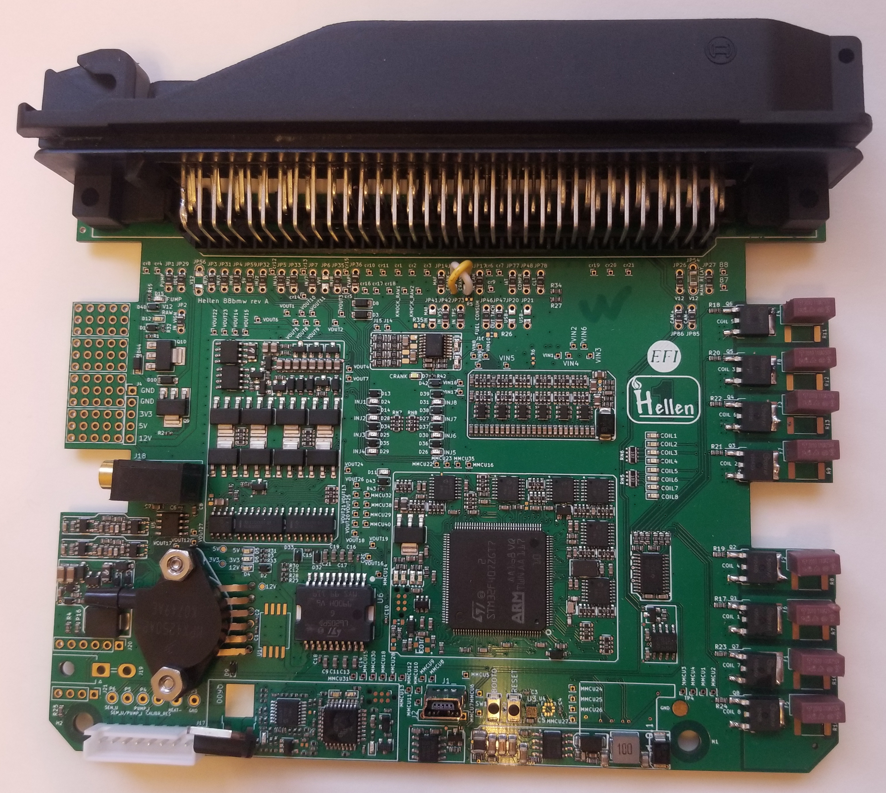

# Hellen 88 BMW

PnP Development board for M50
M60 and Pre-1995 Euro M3
M50tu and Pre-1995 USA M3

[snapshot bundle](https://rusefi.com/build_server/rusefi_bundle_hellen88bmw.zip)

[schematics rev A](Hardware-files/Hellen/hellen88bmw-a-schematic.pdf)

[Issue Tracker](https://github.com/rusefi/hellen88bmw-issues)

[ibom-a](https://rusefi.com/docs/ibom/hellen88bmw-a-ibom.html)

[BMW e34](BMW-e34) E34 ~= E36

[BMW e36](BMW-e36)

[1996 325 electrical manual](https://github.com/rusefi/rusefi_documentation/blob/master/OEM-Docs/Bmw/1994_e36/1996%20BMW%20318is-c%20-%20320i%20-%20325i-c%20-%20328i-c%20%20Electrical%20Troubleshooting%20Manual.pdf)

[Dev Pinout Notes](https://docs.google.com/spreadsheets/d/1OiEaak7TElKwF-fXWvl9Dk-fD84a0NENe6lOwhXiOe4/)

## Supported

Up to 8 cylinder with OEM dumb or aftermarket smart coils. We hope that this board supports:

* M3.1 - M50
* M3.3 - M60 and Pre-1995 Euro M3
* M3.3.1 - M50tu and Pre-1995 USA M3

## Not supported

This board definitely does not support:

Siemens

* MS41.0 - E36 M52
* MS41.1 - E39 M52
* MS41.2 - E36 M3 USA Post 1995

todo: clarify about
Bosch
M1.7 - E30 M42
M1.7.2- E36 M42
M1.7.3 - Z3 M44
M5.2 - E36/Z3 M44 and M62 and M73

## Auxiliary Pins

* DC Motor for drive-by-wire or DC motor wastegate see J19
* Dual channel PPS and TPS sensors add-on connector. We are hinting at M52 swaps into E36. See J20 and J21 for sensor hookup.
* GPIO pins XXX:

## Spare Parts

Extra ECU connector terminals: 969005-2 & 927845-2
