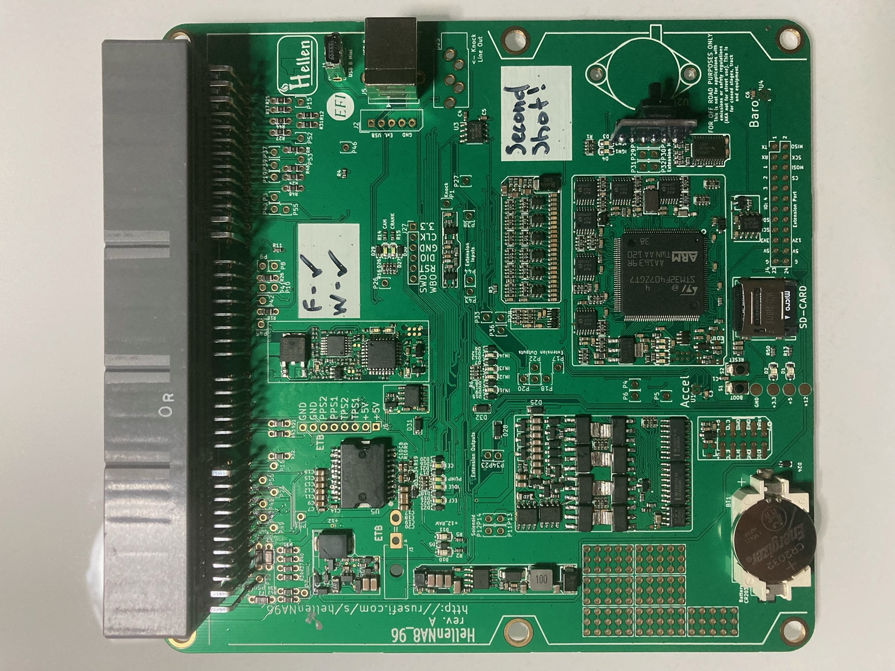
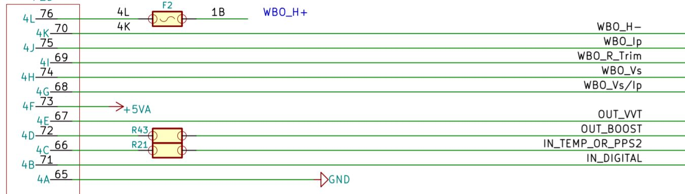

# Hellen NA96

open source, somewhat abandoned https://github.com/rusefi/hellen-miata-NA8

[Issue tracker](https://github.com/rusefi/hellen-NA8-96-issues)

[Download release firmware](https://github.com/rusefi/rusefi/releases/latest/download/rusefi_bundle_hellenNA8_96.zip)

[Snapshot firmware bundle](https://rusefi.com/build_server/rusefi_bundle_hellenNA8_96.zip)

[⏩ Interactive Pinout ⏪](https://rusefi.com/docs/pinouts/hellen/hellenNA8_96/)

[Mazda-Miata-1996](Mazda-Miata-1996)

[Mazda-Miata-1997](Mazda-Miata-1997)

[ibom rev a](https://rusefi.com/docs/ibom/hellen64_NA8_96-a-ibom.html)

[neomiata 1997 Wiring Diagram](http://neomiata.com/garage/Wiring%20Diagrams/Wiring%20Diagrams%201997-2000/1997_Miata%20System%20Wiring%20Diagrams.pdf)

[**Schematic Rev A**](Hardware-files/Hellen/hellen64_NA8_96-a-schematic.pdf)

REV A

## Options Port

| Pin | Type | Comments |
|---|---|---|
| 4A | Ground | |
| 4B | Digital Input | Flex Sensor |
| 4C | Temperature or PPS2 | Temp or ETB Pedal |
| 4D | Boost Controller Output ||
| 4E | VVT Output | |
| 4F | +5v | |
| 4G | WBO Vs/Ip | LSU 4.9 Pin 2 |
| 4H | WBO Vs | LSU 4.9 Pin 6 |
| 4I | WBO R Trim | LSU 4.9 Pin 5 |
| 4J | WBO Ip | LSU 4.9 Pin 1 |
| 4K | WBO Heater - | LSU 4.9 Pin 3 |
| 4L | +12v | LSU 4.9 Pin 4 |

**Options Port Schematic**

## Additional Hardware

[Options Port Connector](https://www.bmotorsports.com/shop/product_info.php/products_id/4462)

[LSU 4.9 Wideband Connector](https://www.bmotorsports.com/shop/product_info.php/products_id/2081)

[LSU 4.9 Wideband Sensor](https://www.bmotorsports.com/shop/product_info.php/products_id/1645) Or Similar

## Changelog

### rev A

* good to drive, great success!
