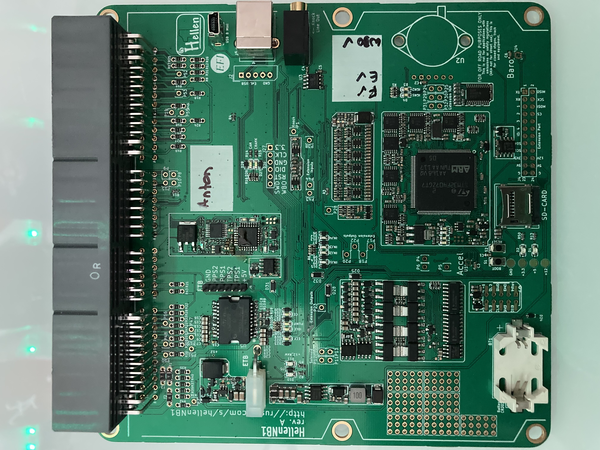
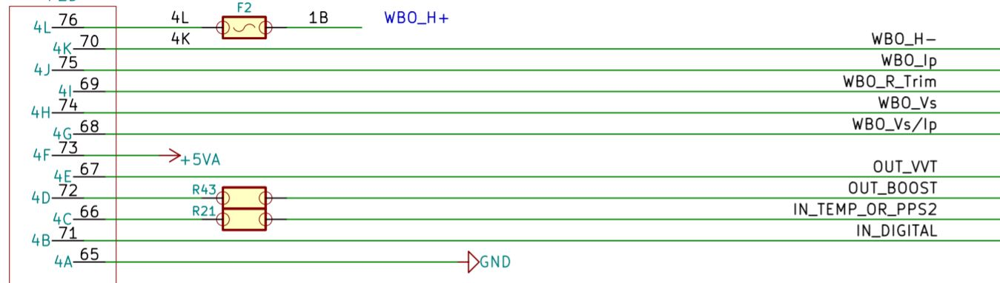

# Hellen NB1

[Download release firmware](https://github.com/rusefi/rusefi/releases/latest/download/rusefi_bundle_hellen-nb1.zip)

[Snapshot firmware bundle](https://rusefi.com/build_server/rusefi_bundle_hellen-nb1.zip)

[https://github.com/rusefi/hellen-NB1-issues](https://github.com/rusefi/hellen-NB1-issues)

[⏩ Interactive Pinout ⏪](https://rusefi.com/docs/pinouts/hellen/hellen-nb1/)

[Miata 1999](Mazda-Miata-1999)

[ibom rev a](https://rusefi.com/docs/ibom/hellen64_NB1-a-ibom.html)

[neomiata 2000 Wiring Diagram](http://neomiata.com/garage/Wiring%20Diagrams/Wiring%20Diagrams%201997-2000/2000_Miata%20Wiring%20Diagrams.pdf)

[**Schematic Rev A**](Hardware/Hellen/hellen64_NB1-a-schematic.pdf)

## Options Port

| Pin | Type | Comments |
|---|---|---|
| 4A | Ground | |
| 4B | Digital Input | Flex Sensor |
| 4C | Temperature or PPS2 | Temp or ETB Pedal |
| 4D | Boost Controller Output |
| 4E | VVT Output | |
| 4F | +5v |
| 4G | WBO Vs/Ip | LSU 4.9 Pin 2 |
| 4H | WBO Vs | LSU 4.9 Pin 6 |
| 4I | WBO R Trim | LSU 4.9 Pin 5 |
| 4J | WBO Ip | LSU 4.9 Pin 1 |
| 4K | WBO Heater - | LSU 4.9 Pin 3 |
| 4L | +12v | LSU 4.9 Pin 4 |

**Options Port Schematic**

## Additional Hardware

[Options Port Connector](https://www.bmotorsports.com/shop/product_info.php/products_id/4462)

[LSU 4.9 Wideband Connector](https://www.bmotorsports.com/shop/product_info.php/products_id/2081)

[LSU 4.9 Wideband Sensor](https://www.bmotorsports.com/shop/product_info.php/products_id/1645) Or Similar

## Changelog

### rev B Nov 30, 2021

* [high-side outputs protection](https://github.com/rusefi/hellen-NB1-issues/issues/25)

### rev A

* good to drive, great success!
