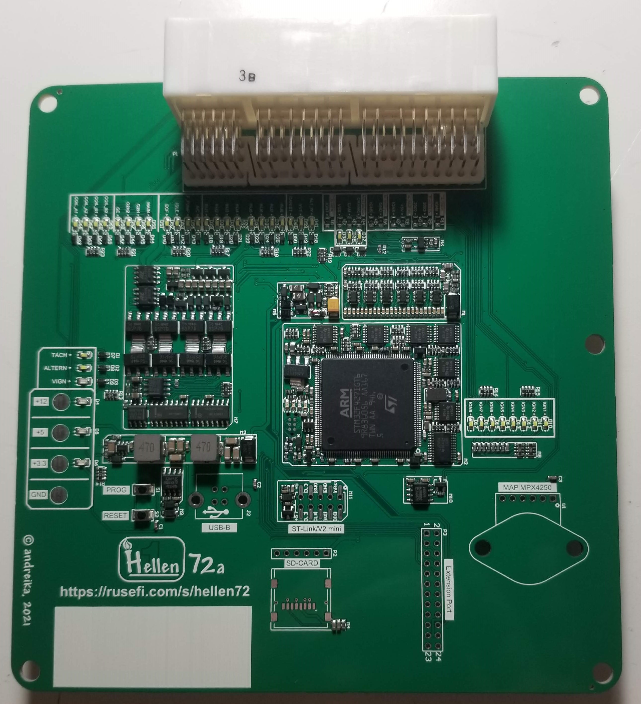
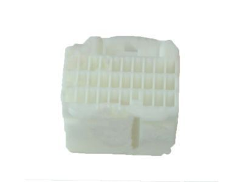

# Hellen NB2

open source, somewhat abandoned https://github.com/rusefi/hellen-miata-NB2

[Download release firmware](https://github.com/rusefi/rusefi/releases/latest/download/rusefi_bundle_hellen72.zip)

[Snapshot firmware bundle](https://rusefi.com/build_server/rusefi_bundle_hellen72.zip)

[Issue Tracker](https://github.com/rusefi/hellen-NB2-issues)

## Hardware features

* knock detection module
* built-in WBO
* Two auxiliary low side outputs
* A/C toggle switch
* A/C relay control

## User Support

[Click here for Support overview](Support)

## Technical Details

[schematic rev F](Hardware-files/Hellen/hellen72_NB2-f-schematic.pdf)
[Interactive iBom rev F](https://rusefi.com/docs/ibom/hellen72_NB2-f-ibom.html)

[schematic rev E](Hardware-files/Hellen/hellen72_NB2-e-schematic.pdf)
[Interactive iBom rev E](https://rusefi.com/docs/ibom/hellen72_NB2-e-ibom.html)

[schematic rev D](Hardware-files/Hellen/hellen72-d-schematic.pdf)
[Interactive iBom rev D](https://rusefi.com/docs/ibom/hellen72-d-ibom.html)

[schematic rev C](Hardware-files/Hellen/hellen72-c-schematic.pdf)
[Interactive iBom rev C](https://rusefi.com/docs/ibom/hellen72-c-ibom.html)

[rev F Pinout]

[rev C-E Pinout](https://rusefi.com/docs/pinouts/hellen/helen72/)

[Forum DEVELOPMENT thread](https://rusefi.com/forum/viewtopic.php?f=4&t=1947)

[It's Complicated](It's-complicated)

[Mazda Miata 2003](Mazda-Miata-2003) [Mazdaspeed Miata 2005](Mazdaspeed-Miata-2005)

## Options Port (rev F)

Using 28 Pin [Connector](https://www.bmotorsports.com/shop/product_info.php/products_id/5655?osCsid=cs48b6aap1pgdvt9vgn1889sq0)

| Pin | Type | Comments |
|---|---|---|
| 5P | PPS1 | Pedal Position Sensor Input 1 |
| 5R | TPS1 | Throttle Position Sensor Input 1 |
| 5S | TPS2 | Throttle Position Sensor Input 1 |
| 5T | PPS2 | Pedal Position Sensor Input 2 |
| 5Z | WBO Vs/Ip | LSU 4.9 Pin 2 |
| 5AA | WBO Vs | LSU 4.9 Pin 6 |
| 5AB | WBO R Trim | LSU 4.9 Pin 5 |
| 5AC | WBO Ip | LSU 4.9 Pin 1 |
| 5AD | WBO Heater - | LSU 4.9 Pin 3 |
| 5AE | +12v | LSU 4.9 Pin 4 |

*ETB+ and ETB- are on ECU PCB

## Jumpers (Applies to board version 72a-72c so far)

 in order to run a Miata NB test vehicle:

External MAP vs more ignition channels:
a) if you are going to use an external MAP, then remove "R5 (IGN5)", "R7 (IGN6)" and "R11 (IGN8)"

b) or if you NOT using an external MAP (either internal MAP or external MAF, or alpha-N), then remove "R6 (GND)" and "R8 (+5V)"

Warning! The board can be damaged if you skip this step!

External WBO vs more ignition channels:
if you want to use an external WBO (AFR) sensor, then remove "R1 (IGN7)"

Miata vehicle type:
a) if you have a Miata 2002 (where we measure the battery voltage from 4T=alternator), then remove "R9 (2003)"

b) or if you have a Miata 2003 (where we measure the battery voltage from 4S=ign.switch), then remove "R10 (2002)"

## OEM harness add-ons  

The OEM ECU connector uses AMP Multilock .040 and .070 pins.

| Board   | stm32 pin  |   |
|-----|---|---|
| 4U  | MAP| Manifold absolute pressure analog signal from [external sensor](GM-map-sensor) |
| 4K  | +5v | +5v feed for MAP sensor |
| 3Z | GND | Sensor & USB ground |

## Proto Area Pinout

|Proto   | stm32 pin  |
|-----|---|
| EXT_SPI_SCK    |   |
| UART_RX    | PD6  |
| UART_TX    | PD5  |
| EXT_IO1    | PB12  |
| EXT_IO2    |  PB13 |
|     |   |
|     |   |

[rev C Reference image of jumpers set for external MAP sensor on 2003 miata](https://rusefi.com/forum/download/file.php?id=7570)

See [Legacy-Hellen-WBO](Legacy-Hellen-WBO)

