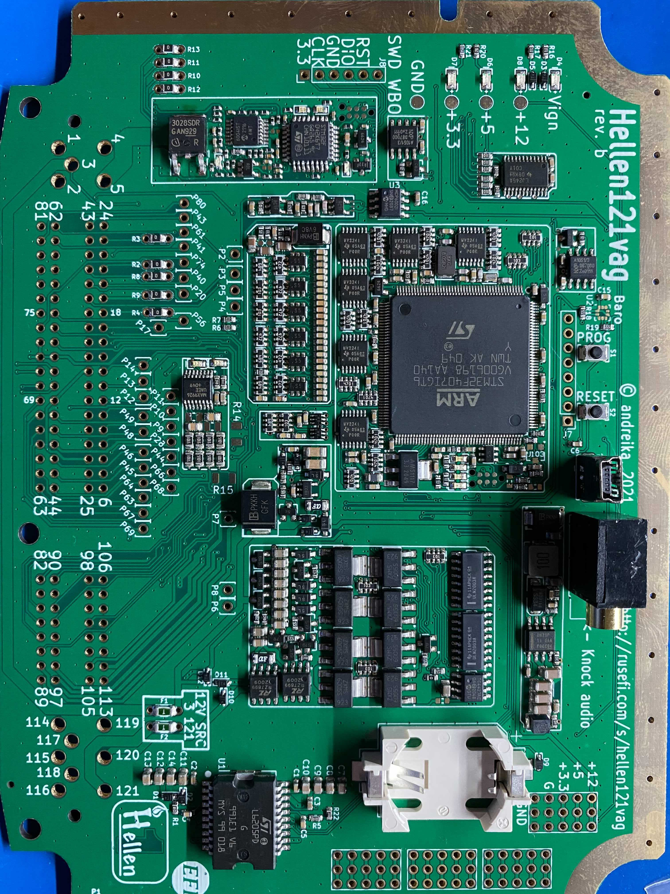

# Hellen 121 VAG

Hellen Plug-and-Play for ME7 VAG vehicles

[💲Gets yours at rusEFI Store💲](https://www.shop.rusefi.com/shop/p/hellen-121-vag)

[Download release firmware](https://github.com/rusefi/rusefi/releases/latest/download/rusefi_bundle_hellen121vag.zip)
[Snapshot firmware bundle](https://rusefi.com/build_server/rusefi_bundle_hellen121vag.zip)

[⏩ Interactive Pinout ⏪](https://rusefi.com/docs/pinouts/hellen/hellen121vag/)

[Schematics rev a](https://github.com/rusefi/hellen121vag/raw/main/boards/hellen121vag-a/board/hellen121vag-a-schematic.pdf)

[Schematics rev b](https://github.com/rusefi/hellen121vag/raw/main/boards/hellen121vag-b/board/hellen121vag-b-schematic.pdf)
[iBom rev b](https://rusefi.com/docs/ibom/hellen121vag-b-ibom.html)

[Schematics rev c](https://github.com/rusefi/hellen121vag/raw/main/boards/hellen121vag-c/board/hellen121vag-c-schematic.pdf)

[KiCAD source files](https://github.com/rusefi/hellen121vag)

Status: early phases of testing!

## Hardware features

* Electronic Throttle Body
* knock detection module with headphone jack
* built-in WBO - **WARNING 4.2 software is not ready but we believe that the hardware is universal** (footprint, stm32f042 not in stock at JLC)
* Baro sensor LPS25HB (footprint, not populated)

## Vehicle Specific Jumpers

Main Relay option **Never have both R2 and R3 jumpers populated!**

Voltage Input option **Never have both R8 and R9 jumpers populated!**

Raw +12 option **Never have both F1 and F2 jumpers populated!**

| Vehicle | R2 | R3 | R8 | R9 | F1 | F2 |
| --- | --- | --- | --- | --- | --- | --- |
| 2000 Early Audi A4 1.8T (ME7.1, NBO2, NO VVT, DBW) | ✔ | ✘ | ✘ | ✔ | ✘ | ✔ |
| 2001 Audi A4 1.8T (ME7.5, WBO2, VVT, DBW) | ✔ | ✘ | ✘ | ✔ | ✘ | ✔ |
| 2002 Audi Allroad 2.7t apb |  ✘ | ✘ | ✘ | ✔ | ✔ | ✘|
| 2006 Jetta 2.5 BGQ | ✘ | ✔ | ✘ | ✔ | ✔ | ✘ |
| 2003 Audi A6 3.0 | ✘ | ✔ | ✘ | ✔ | ? | ? |
| 2003 Audi A6 4.2 | ✘ | ✔ | ✔ | ✘ | ✔ | ✘ |
| 2001 VR6 12V AFP | ✘ | ✘ | ✘ | ✔ | ✔ | ✘ |
| 2002 VR6 24V BDF | ✘ | ✔ | ✘ | ✔ | ✔ | ✘|
| 2004 Cayenne 3.2 | ✘ | ✔ | ✔ | ✘ | ✔ | ✘|
| Other model | ? | ? | ? | ? | ? | ? |

[Connector Pinout Spreadsheet, with links to wiring drawings](https://docs.google.com/spreadsheets/d/1H0cZPAJFbpprgSu1Y8BiAYzXbqddvIn-Hhod4QCVQwk)

[VAG-B5]

[VAG-C5]

## Q: what cars is the 121vag applicable for?

A: We do not know the whole list. Definitely B5 1.8T Passat but could also work on 5 cylinder Jetta and VR6 and even a 8 cylinder A8. Whatever VAG product with a 121 header please check Hellen pinout above and let us know :)
