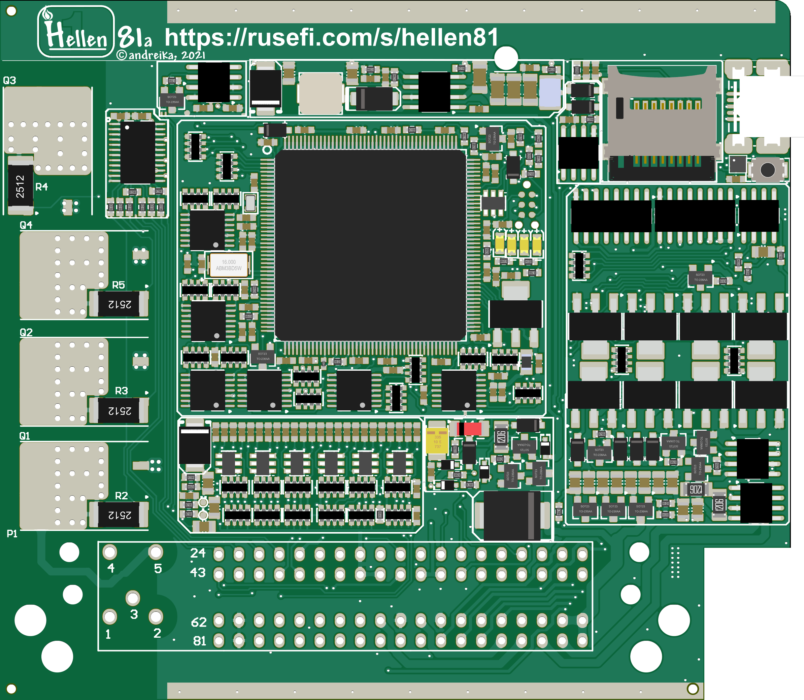

# Hellen 81

[ibom](https://rusefi.com/docs/ibom/hellen81-a-ibom.html)

[Pinout](https://rusefi.com/docs/pinouts/hellen/hellen81/)

Hellen81 is an ultracompact and cheap yet full-functional 8-Cylinder ECU board compatible with 81-pin M7.9.7/ME7.9.7/ME7.8.8/Yanvar7.2/Micas10.3.

The board is NOT compatible with 121-pin VAG ME7.x vehicles! For VAG, please see [Hellen121vag](Hellen121VAG).

***

The board is a part of Hellen-One family and currently is in "**work in progress**" state, meaning **NOT fabricated or tested yet**!

**Please do not use the gerber files, the board is not ready yet**

Key features:

* up to 8 ignition channels (logic-level) and 4 high-voltage built-in igniters;
* up to 8 injection outputs, 1 ETB, 10 low-side outputs, 2 push-pull outputs, 1 high-side output;
* 20 analog inputs, 3 digital inputs, VR sensor;
* USB-mini, CAN, K-Line, microSD, accelerometer;

The gerber files and schematics:
[https://github.com/andreika-git/hellen81/](https://github.com/andreika-git/hellen81/)

Pinout table:
[Hellen81 Pinout Spreadsheet](https://docs.google.com/spreadsheets/d/e/2PACX-1vSg41St_69moQ2rh92Mo4bStP-pNEcl9Qb2QOHikwrR-RgWGXKjmL9DsMgeUy9ewP8MYs3RSP3EftIc/pubhtml)

