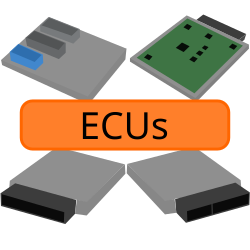
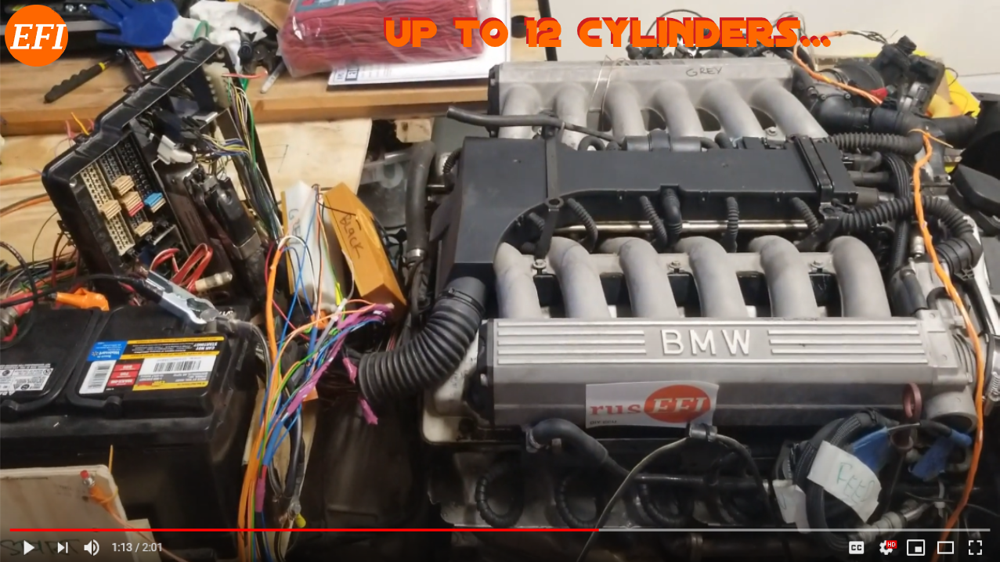

# Home

|a {: .invisible}|a {: .invisible}|a {: .invisible}|
|-|-|-|
| {: .invisible}| {: .invisible}| {: .invisible}|

Hello, and welcome to the rusEFI wiki main page. Here you will find information related to rusEFI, a GPL open-source engine control unit for gasoline internal combustion engines. This project involves embedded hardware, software, and engines (vroom vroom). This community has many members from many walks of life who are scattered all around the world.

In order to use rusEFI you will need to acquire one of the [supported control units](Hardware). You can also design your own custom board if so desired.

## What is rusEFI for?

| Application                  | Should I use rusEFI? |
|------------------------------|----------------------|
| Race Car                     | ✓                    |
| Snow Blower                  | ✓                    |
| Fixed Engine Application     | ✓                    |
| Science Experiment           | ✓                    |
| Emissions-controlled Vehicle | ✗                    |
| Safety Critical Application  | ✗                    |
| Manned Aircraft              | ✗                    |

## Features

| Feature                                                                                                     | Supported? |
|-------------------------------------------------------------------------------------------------------------|------------|
| [Hall, VR, CLT, TPS and all popular sensors](FAQ-Basic-Wiring-and-Connections)                              | ✓          |
| [20+ OEM Triggers Supported](All-Supported-Triggers)                                                        | ✓          |
| [TunerStudio online tuning](HOWTO-create-tunerstudio-project)                                               | ✓          |
| [Batch Injection](https://rusefi.com/docs/guide/#menu_Fuel_Injection_configuration)                         | ✓          |
| [Sequential Injection up to 12 cylinders](https://rusefi.com/docs/guide/#menu_Fuel_Injection_configuration) | ✓          |
| [Staged Injection](https://rusefi.com/docs/guide/#menu_Fuel_Staged_injection)                               | ✓          |
| [Direct Injection](GDI-status)                                                                              | ✓          |
| [Flex Fuel](Flex-Fuel) 🌽                                                                                   | ✓          |
| [Closed Loop Fueling](Fuel-Overview#closed-loop-correction)                                                 | ✓          |
| [Acceleration Enrichment - wall wetting/fuel trip/tau factor](X-tau-Wall-Wetting)                           | ✓          |
| [Onboard Wideband Controller](Wide-Band-Sensors)                                                            | ✓          |
| [Dual AFR Signal Logging](Wide-Band-Sensors)                                                                | ✓          |
| [Sequential Ignition up to 12 cylinders](https://rusefi.com/docs/guide/#menu_Ignition_Ignition_settings)    | ✓          |
| [Wasted Spark Ignition](https://rusefi.com/docs/guide/#menu_Ignition_Ignition_settings)                     | ✓          |
| [Multi-Spark](Multi-Spark)                                                                                  | ✓          |
| [Electronic Throttle Body](Electronic-Throttle-Body-Configuration-Guide)                                    | ✓          |
| [CAN Bus Connectivity](CAN)                                                                                 | ✓          |
| [Bluetooth Connectivity](Bluetooth)                                                                         | ✓          |
| [Digital Dash](Digital-Dash)                                                                                | ✓          |
| [Lua Scripting](Lua-Scripting)                                                                              | ✓          |
| [Boost Control](https://rusefi.com/docs/guide/#menu_Advanced_Boost_control)                                 | ✓          |
| [Launch Control](HOWTO-Launch-Control)                                                                      | ✓          |
| [Flat Shifting](https://rusefi.com/docs/guide/#menu_Advanced_Shift_Torque_Reduction_(Flat_Shift))           | ✓          |
| [Antilag](https://github.com/rusefi/rusefi/issues/2403)                                                     | ✓          |
| [Boost-by-gear](https://github.com/rusefi/rusefi/issues/2404)                                               | ✓          |
| [Traction Control](https://rusefi.com/docs/guide/#menu_Controller_Traction_Control_ETB_drop)                | ✓          |
| [Blending (advanced version of dual table)](Blending)                                                       | ✓          |
| [Knock Sensing & Response](knock-sensing)                                                                   | ✓          |
| [Kick Start](Kick-Start)                                                                                    | ✓          |
| [Rotary Engines](Rotary)                                                                                    | ✓          |
| [Automatic Transmission Control](TCU-status)                                                                | ✗          |

And many more!
The unsupported features listed here are all things that would be amazing to see! If *you* have a project that includes any of those configurations or anything else, please jump in on the forums and we can work together to make it happen! 👍

| Achievement                                                 | Results |
|-------------------------------------------------------------|---------|
| Hundreds of rusEFI units produced                           | ✓       |
| We've lost track of how many vehicles are running on rusEFI | ✓       |

## Get Started

Thinking of doing an engine control project? You have stopped by the correct place. The rusEFI project has many options that can likely help you out. We have several forum members with a wide variety of skills that are often willing to help people out. We have several hardware options as well. If a feature doesn't exist, inquire in the forums and it is likely that we can develop the feature. Or if you feel like giving something back, you can develop it yourself and share it with others.

[PDF Manual](https://wiki.rusefi.com/book.pdf) - contains some of the basic content from this wiki

[Quick Start](HOWTO-quick-start)

[Get Running](HOWTO-Get-Running)

[Get Tuning](Get-tuning-with-TunerStudio-and-your-rusEFI)

[Help Out](HOWTO-help-rusEFI)

## rusEFI in action

[Engines running rusEFI](Case-Studies)

  
