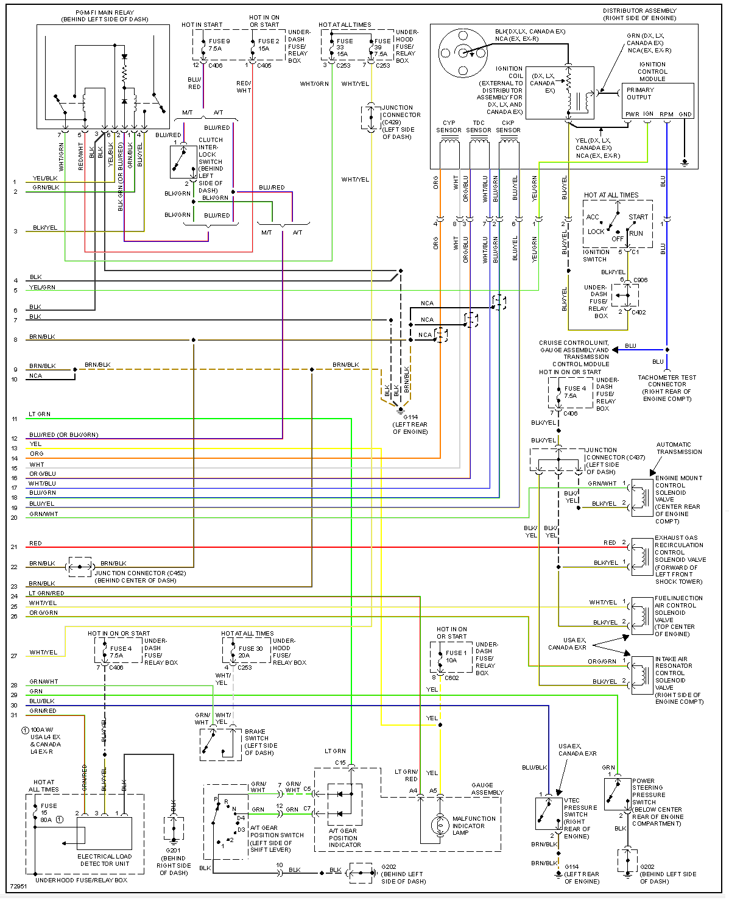
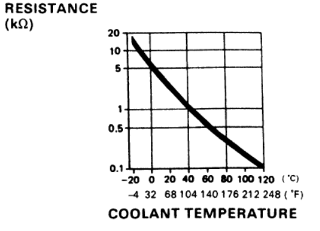
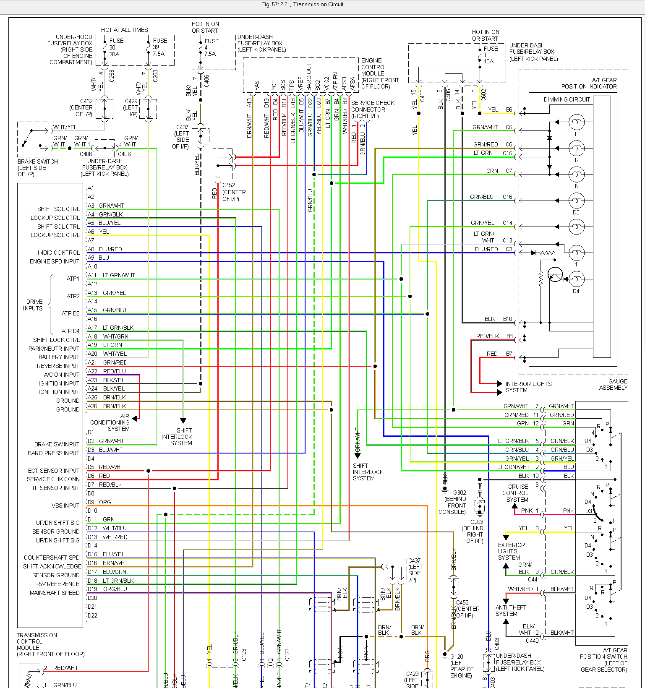
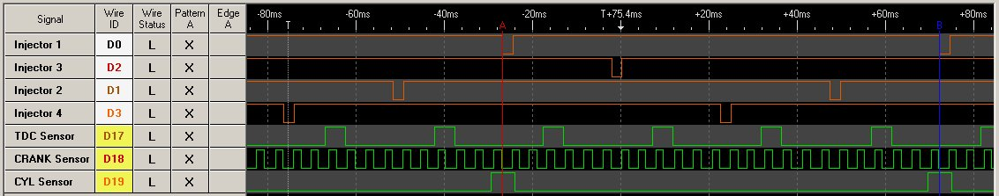

## ECU pinout
37820-P0A-A51 

[94 accord ex ecu pinout](http://honda-tech.com/showthread.php?t=2377726)

## 26 pin

|     |                                      |           |                                                                 |                              |
| --- | ------------------------------------ | --------- | --------------------------------------------------------------- | ---------------------------- |
| A1  | W63                                  | BRowN     | Injector \#1            | Output                       |
| A2  | W64                                  | YEL       | Injector \#4            | Output                       |
| A3  | W61                                  | RED       | Injector \#2            | Output                       |
| A4  | W62                                  | GRN/YEL   | VTEC Solenoid Valve                                             | Output                       |
| A5  | W59                                  | BLUe      | Injector \#3            | Output                       |
| A6  | W60                                  | ORG/BLK   | O2 Heater                                                       | Output, sink/low             |
| A7  | W57                                  | GRN/BLK   | Fuel Pump Relay         | Output, sink/low             |
| A8  | W58                                  | \*        | \*                                                              | \*                           |
| A9  | W55                                  | BLK/BLU   | Idle Air Control Valve                                          | Output, sink/low. 500Hz      |
| A10 | W56                                  | GRN/WHT   | Engine Mount Control                                            | Output                       |
| A11 | W53                                  | RED       | EGR SOL                                                         | Output                       |
| A12 | W54                                  | GReeN     | Radiator Fan Control Module                                     | Output                       |
| A13 | W51                                  | LTGRN/RED | MIL                                                             | Output, low-side             |
| A14 | W52                                  | WHT/YEL   | Fuel Injection Air Control                                      |                              |
| A15 | W49                                  | RED/BLU   | A/C compressor clutch relay                                     | Output                       |
| A16 | W50                                  | WHT/GRN   | Alternator Control                                              |                              |
| A17 | W47                                  | \*        | \*                                                              | \*                           |
| A18 | W48                                  | BRN/WHT   | FAS (TCM)                                                       |                              |
| A19 | W45                                  | ORG/GRN   | Intake Air Resonator Control Solenoid valve                     | Output                       |
| A20 | W46                                  | RED/YEL   | PCS                                                             |                              |
| A21 | W43                                  | YEL/GRN   | Ignition Control Module | Output, \~12v                |
| A22 | W44                                  | \*        | \*                                                              | \*                           |
| A23 | W41 | BLK       | Power Ground            | Ground                       |
| A24 | W42 | BLK       | Power Ground                                                    | Ground                       |
| A25 | W39   | YEL/BLK   | Power Source            | Input, +12 if ignition is on |
| A26 | W40 | BRN/BLK   | Logic Ground                                                    | Ground                       |

## 16 pin

|     |      |                      |                                                    |                                                           |
| --- | ---- | -------------------- | -------------------------------------------------- | --------------------------------------------------------- |
| B1  | W37  | YEL/BLK              | Power Source                                       | Input, constant +12V                                      |
| B2  | W38  | BRN/BLK              | Logic Ground                                       | Ground                                                    |
| B3  | W35  | WHT/RED              | AFS A (TCM) Up/Down shift signal                   |                                                           |
| B4  | W36  | GRN                  | AFS B (TCM) Up/Down shift signal                   |                                                           |
| B5  | W33  | RED/WHT              | AC Pres Switch                                     |                                                           |
| B6  | W34  | \*                   | \*                                                 | \*                                                        |
| B7  | W31  | lightLTGRN           | AT Gear Pos Part/Neutral                           | Input                                                     |
| B8  | W32  | GRN                  | Power Steering Pres Sw                             | Input, indicates high power steering load                 |
| B9  | W29  | BLU RED (or BLK/GRN) | STS                                                |                                                           |
| B10 | W30  | ORG                  | Vehicle Speed Sensor                               | Input (grounded 4 times per speedometer cable revolution) |
| B11 | W27  | ORanGe               | CYP Signal                                         | Input, one pulse per cam rev                              |
| B12 | W28  | WHT                  | CYP Ground                                         |                                                           |
| B13 | CAM- | ORG BLU              | TDC Signal | Input, four pulses per cam revolution                     |
| B14 | CAM+ | WHT BLU              | TDC Ground                                         |                                                           |
| B15 | CNK- | BLU GRN              | CKP Signal | Input, 24 pulses per cam                                  |
| B16 | CNK+ | BLU YEL              | CKP Ground                                         |                                                           |

## 22 pin

|     |                                      |                |                                                    |                                             |
| --- | ------------------------------------ | -------------- | -------------------------------------------------- | ------------------------------------------- |
| D1  | W21                                  | WHT YEL        | Voltage Back Up                                    | Input, constant +12V                        |
| D2  | W22                                  |                | Brake Switch                                       | Input                                       |
| D3  | W19                                  | \*             | \*                                                 | \*                                          |
| D4  | W20                                  | RED            | Service Check Signal                               | Input, ground to activate                   |
| D5  | W17                                  | BLU/WHT        | Baro OUT                                           |                                             |
| D6  | W18                                  | BLU/BLK        | VTEC Pressure Switch                               | Input                                       |
| D7  | W15                                  | lightLTGRN RED | TXD/RXD data link                                  |                                             |
| D8  | W16                                  | \*             | \*                                                 | \*                                          |
| D9  | W13                                  | WHT RED        | ALT FR Signal                                      |                                             |
| D10 | W14                                  | GRN RED        | Electrical Load Detector                           | Input (signals headlight, radio etc)        |
| D11 | W11                                  | RED/BLK        | Throttle Position Sensor                           | Input                                       |
| D12 | W12                                  | WHT/BLK        | EGR Lift Sensor                                    | Input                                       |
| D13 | W9                                   | RED/WHT        | Engine Coolant Temperature Sensor                  | Input                                       |
| D14 | W10                                  | WHT RED        | Primary O2 Sensor                                  | Input                                       |
| D15 | W7                                   | RED YEL        | Intake Air Temperature Sensor                      | Input (bias pull-up 1.5K)                   |
| D16 | W8                                   | \*             | \*                                                 | \*                                          |
| D17 | W5                                   | WHiTe/YELlow   | MAP Sensor | Input: 0.32V @ -13.9 PSI, 4.84V @ 10.94 PSI |
| D18 | W6 | lightLTGRN/BLK | VREF                                               | Output for TCM +5V                          |
| D19 | W3 | YEL/WHT        | VCC1 MAP sensor power supply                       | Output +5V                                  |
| D20 | W4 | YEL BLU        | VCC2 TPS, EGVL sensor power supply                 | Output +5V                                  |
| D21 | W1                                   | GRN/WHT        | SG1 MAP sensor GND                                 | Ground                                      |
| D22 | W2                                   | GRN BLU        | SG2 - Sensors Ground                               | ground                                      |

## Components

[Honda F22B1 Engine - Wikipedia]](http://en.wikipedia.org/wiki/Honda_F_engine#F22B1)

Fuel Injector 06164-P0A-A00 248cc/min Low impedance

MAP sensor 37830-P05-A01 

ECT sensor 37870-PJ7-003

IAT 37880-P0A-A02

DISTRIBUTOR ASSY D4T92-04

ignition control module 30120-P0A-A01

## TCM pinout
tcm 28100-P0H-A02

## TCM 26 pin

|     |              |                          |        |
| --- | ------------ | ------------------------ | ------ |
| A1  | \*           | \*                       | \*     |
| A2  | \*           | \*                       | \*     |
| A3  | GRN/WHT      | Shift solenoid control B | Output |
| A4  | GRN/YEL      | Lockup solenoid B        | Output |
| A5  | BLU/YEL      | Shift solenoid control A | Output |
| A6  | YELlow       | Lockup solenoid A        | Output |
| A7  | \*           | \*                       | \*     |
| A8  |              | D4 light control         | Output |
| A9  | BLUe         | Engine Speed from dizzy  | Input  |
| A10 | \*           | \*                       | \*     |
| A11 |              | Selector "1" input       |        |
| A12 | \*           | \*                       | \*     |
| A13 |              | Selector "2" input       |        |
| A14 | \*           | \*                       | \*     |
| A15 |              | Selector "D3" input      |        |
| A16 | \*           | \*                       | \*     |
| A17 | Lt GRN/BLacK | Selector "D4" input      |        |
| A18 | WHT/GRN      | Shift lock control       |        |
| A19 | Lt GRN       | Park/Neutr input         |        |
| A20 | WHT/YEL      | Battery input            |        |
| A21 |              | Reverse input            | Input  |
| A22 |              | A/C on input             | Input  |
| A23 |              | Ignition input           |        |
| A24 |              | Ignition input           |        |
| A25 | BRN/BLK      | Ground                   | Ground |
| A26 | BRN/BLK      | Ground                   | Ground |

## TCM 22 pin

|     |            |                                  |          |
| --- | ---------- | -------------------------------- | -------- |
| D1  | \*         | \*                               | \*       |
| D2  | \*         | Brake switch                     | Input    |
| D3  |            | Baro Pressure                    | Input    |
| D4  | \*         | \*                               | \*       |
| D5  |            | Engine Coolant Temp sensor       | Input    |
| D6  |            | Service Check Conn               |          |
| D7  |            | Throttle Position Sensor         | Input    |
| D8  | \*         | \*                               | \*       |
| D9  | ORG        | Vehicle Speed Sensor             | Input    |
| D10 | \*         | \*                               | \*       |
| D11 | GRN        | Up/Down shift sig                |          |
| D12 |            | Mainshaft speed Sensor Ground    | Ground   |
| D13 | WHT/RED    | Up/Down shift sig                |          |
| D14 | \*         | \*                               | \*       |
| D15 |            | Countershaft speed               | Input    |
| D16 | BRN/WHiTe  | Shift Ack                        |          |
| D17 |            | Countershaft speed Sensor Ground | Ground   |
| D18 | LT GRN/BLK | Voltage Reference                | Input +5 |
| D19 |            | Mainshaft speed                  | Input    |
| D20 | \*         | \*                               | \*       |
| D21 | \*         | \*                               | \*       |
| D22 | \*         | \*                               | \*       |

### diagram

## trigger signal
Measured 845 ohms between pins B15 / B16 also same for B14 / B13 and same for B12 / 11.

## stock ECU schematics highlights

IC1: main chip, OKI 66911, DIP

Inputs:
TDC input: HIC1#10, TTL signal: HIC1##8, goes to IC7#35

CYP input: HIC1#15, TTL signal: HIC1##12, goes to IC1#27

CKP input: HIC1#19, TTL signal: HIC1##17, goes to IC1#34

Outputs:
Ignition module:
IC7#28 via R28 & Q22

See also [Honda Prelude 1993](Honda-Prelude-1993)
