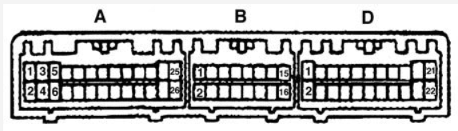
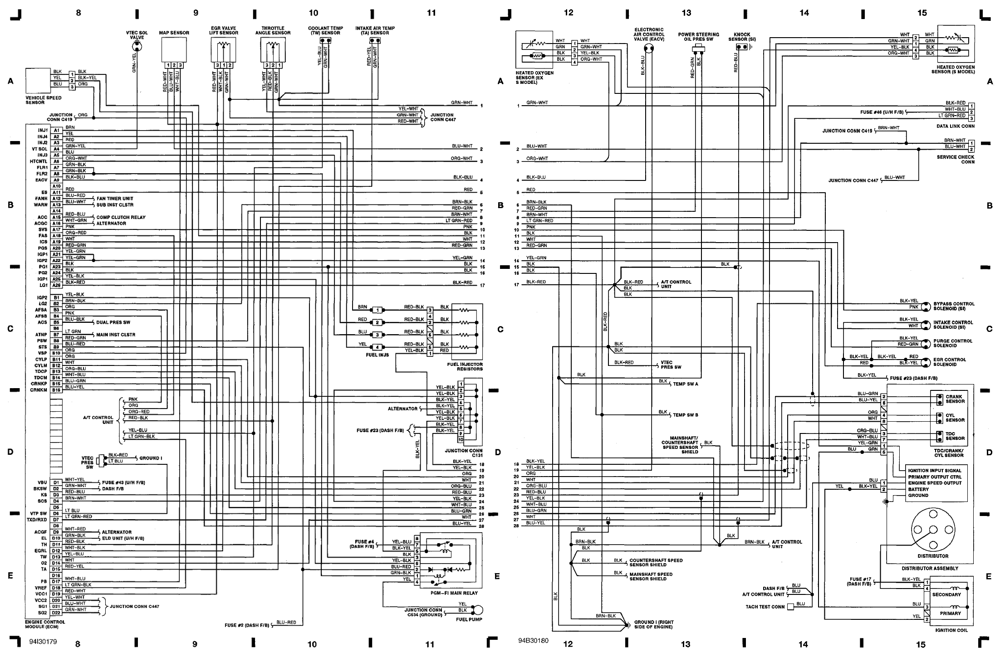

See also [Honda Accord 1995](Honda-Accord-1995)

[94 accord ex ecu pinout](http://honda-tech.com/showthread.php?t=2377726)

## 26 pin

|     |                                      |           |                                                         |                              |
| --- | ------------------------------------ | --------- | ------------------------------------------------------- | ---------------------------- |
| A1  | W63                                  | BRowN     | Injector \#1    | Output                       |
| A2  | W64                                  | YEL       | Injector \#4    | Output                       |
| A3  | W61                                  | RED       | Injector \#2    | Output                       |
| A4  | W62                                  | \*        | \*                                                      | \*                           |
| A5  | W59                                  | BLUe      | Injector \#3    | Output                       |
| A7  | W57                                  | GRN/BLK   | Fuel Pump Relay | Output, sink/low             |
| A8  | W58                                  | \*        | \*                                                      | \*                           |
| A9  | W55                                  | BLK/BLU   | Idle Air Control Valve                                  | Output, sink/low. 500Hz      |
| A12 | W54                                  | GReeN     | Radiator Fan Control Module                             | Output                       |
| A13 | W51                                  | LTGRN/RED | MIL                                                     | Output, low-side             |
| A22 | W44                                  | \*        | \*                                                      | \*                           |
| A23 | W41 | BLK       | Power Ground    | Ground                       |
| A24 | W42 | BLK       | Power Ground                                            | Ground                       |
| A25 | W39   | YEL/BLK   | Power Source    | Input, +12 if ignition is on |
| A26 | W40 | BRN/BLK   | Logic Ground                                            | Ground                       |

## 16 pin

|     |      |         |                                                    |                                                           |
| --- | ---- | ------- | -------------------------------------------------- | --------------------------------------------------------- |
| B2  | W38  | BRN/BLK | Logic Ground                                       | Ground                                                    |
| B10 | W30  | ORG     | Vehicle Speed Sensor                               | Input (grounded 4 times per speedometer cable revolution) |
| B11 | W27  | ORanGe  | CYP Signal                                         | Input, one pulse per cam rev                              |
| B12 | W28  | WHT     | CYP Ground                                         |                                                           |
| B13 | CAM- | ORG BLU | TDC Signal | Input, four pulses per cam revolution                     |
| B14 | CAM+ | WHT BLU | TDC Ground                                         |                                                           |
| B15 | CNK- | BLU GRN | CKP Signal | Input, 24 pulses per cam                                  |
| B16 | CNK+ | BLU YEL | CKP Ground                                         |                                                           |

## 22 pin

|     |                                      |              |                                                    |                                             |
| --- | ------------------------------------ | ------------ | -------------------------------------------------- | ------------------------------------------- |
| D3  | W19                                  | \*           | \*                                                 | \*                                          |
| D11 | W11                                  | RED/BLK      | Throttle Position Sensor                           | Input                                       |
| D13 | W9                                   | RED/WHT      | Engine Coolant Temperature Sensor                  | Input                                       |
| D15 | W7                                   | RED YEL      | Intake Air Temperature Sensor                      | Input (bias pull-up 1.5K)                   |
| D16 | W8                                   | \*           | \*                                                 | \*                                          |
| D17 | W5                                   | WHiTe/YELlow | MAP Sensor | Input: 0.32V @ -13.9 PSI, 4.84V @ 10.94 PSI |
| D20 | W4 | YEL BLU      | VCC2 TPS, EGVL sensor power supply                 | Output +5V                                  |
| D21 | W1                                   | GRN/WHT      | SG1 MAP sensor GND                                 | Ground                                      |
| D22 | W2                                   | GRN BLU      | SG2 - Sensors Ground                               | ground                                      |
|     |                                      |              |                                                    |                                             |

