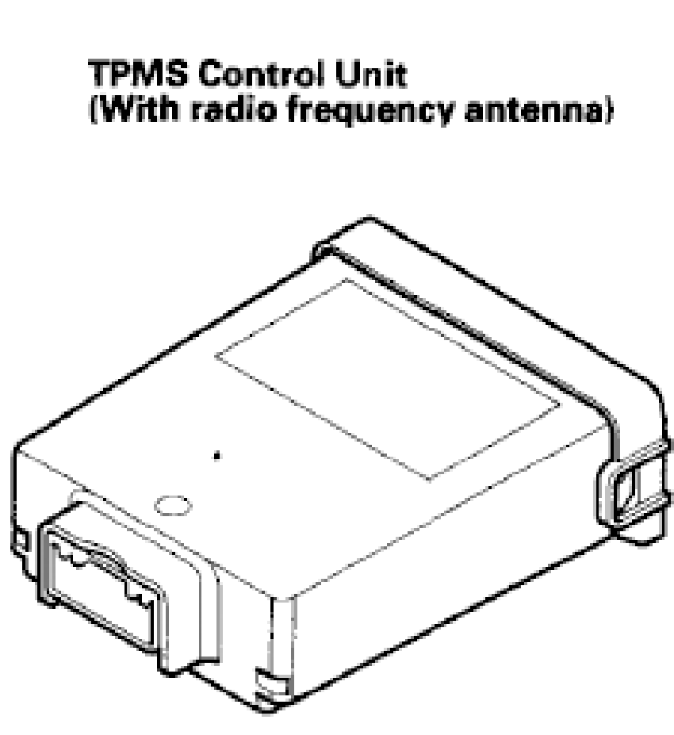
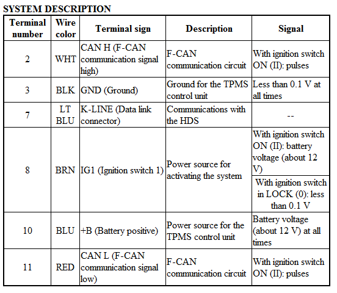
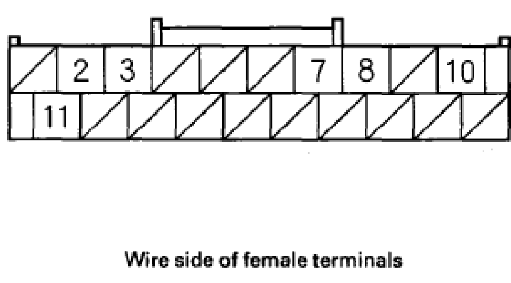
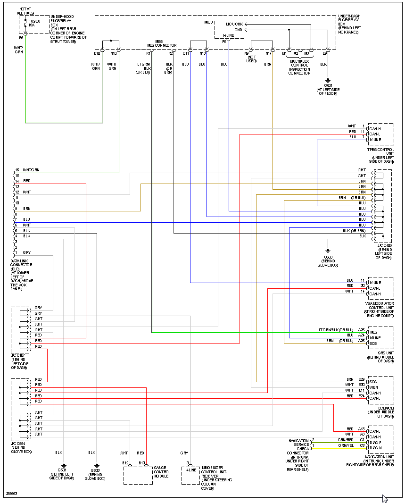

# Honda TPMS CAN trick

First generation of Honda K ECUs around 2002-2006 had CAN bus on the vehicle (Honda called it "CAN-F" for "Fast") but no CAN pins on OBD connector. Unhooking TPMS under the steering wheel is the way to access CAN bus.

