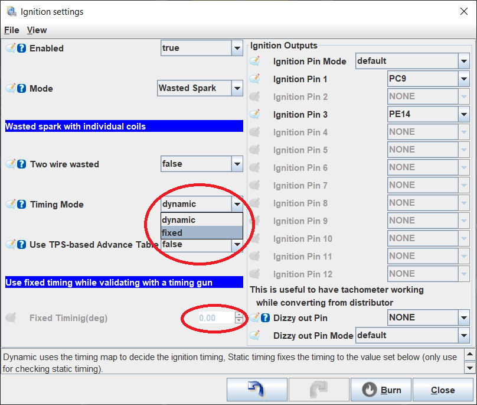
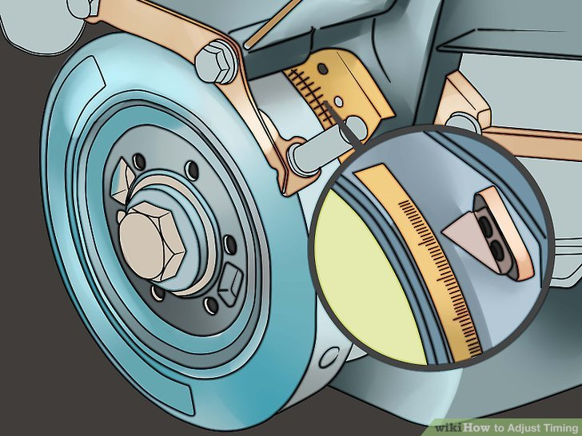

# Setting Trigger Offset

**DISABLE FUEL WHEN ADJUSTING TRIGGER OFFSET**

**FIRE DANGER**

The following guide will provide a general overview of finding and setting the trigger offset value to use in TunerStudio. This is an engine-specific value, but you may be able to use another's settings as a starting point if they have a similar trigger setup on their engine. You should always make sure your trigger setting is accurate to your engine, as this value influences every other value in your tune.

This guide assumes that you have already [configured your trigger](Trigger-Configuration-Guide) and confirmed stable synchronization and plausible cranking RPM with fuel and ignition disabled.

## Why Do I Care About Trigger Offset?

In order for your engine to run properly, the ECU must know *exactly* where the engine is in its rotation. This is determined by your trigger solution, but there's a catch. In many cases, the trigger pattern does not properly align with the position of the engine, and this is what trigger offset is for. Trigger offset is a fixed value that tells the ECU how much the position of the trigger differs from top dead center on cylinder #1.

## How do I Set My Trigger Offset?

To set your trigger offset setting, you must determine how far your ECU is from your engine position. The easiest way to do this is to use a timing light on cylinder #1 and check its position on your engine's timing marks.

1. Have a fire extinguisher ready.
2. In TunerStudio, open "Injection" -> "Injection Settings". Set "Enabled" to "false", and save the setting. In your fuse box, find and remove the fuse(s) that power your injectors. Drain the carburetors if applicable.
3. Open "Ignition" -> "Ignition Settings" and set "Timing Mode" to "fixed". Set "Fixed Timing(deg)" to a value that corresponds to a mark on your crank pulley. Zero will correspond to the TDC mark, or your manufacturer may specify different values.

    

4. Remove the spark plugs. This will eliminate compression in the cylinders, allowing the engine to turn freely and give better results when checking timing.
5. Connect a timing light and spark plug to the #1 spark plug wire. In engines with individual coils, you may need to get creative here, such as extending the coil with a spare plug wire to give you a place to attach the timing light. Ground the threads on this spark plug somewhere on the engine.
6. With the timing-light setup ready, enable ignition in "Ignition" -> "Ignition Settings" if it was disabled for the signal-only test. Keep fuel disabled and the injector fuses removed. Crank the engine, watching the position of your engine's timing marks.

    

7. Adjust "Setup" -> "Trigger" -> "Trigger Angle Advance" up or down (negative values are allowed) until the timing light shows the fixed advance selected in step 3. For example, if fixed timing is 10 degrees BTDC, the measured timing must be 10 degrees BTDC. Align with TDC only when fixed timing is zero. This is now your trigger offset.
8. Stop cranking and reinstall your spark plugs. Restore the injector fuses and re-enable fuel. Select a fixed advance suitable for starting your engine, following the manufacturer's recommendations, and try to start it. With the engine running, verify that measured timing matches the selected fixed advance and adjust the offset if needed.
9. After verification, change timing mode back to "dynamic" so the engine uses its configured timing strategy. Restore any other settings changed for testing before normal operation.

<!-- Fixed timing behavior checked against rusEFI revision 0b04635f12b63e5071747c8b2e03ce1cab99b68d: firmware/controllers/algo/ignition/ignition_state.cpp, getAdvance. -->

## Related pages

- [Triggers](Trigger) - trigger overview: how rusEFI reads crank/cam position, plus troubleshooting.
- [Trigger Configuration Guide](Trigger-Configuration-Guide) - configuring Hall/VR sensors, sensor polarity, and gap overrides.
- [All Supported Triggers](All-Supported-Triggers) - list of built-in trigger patterns with diagrams.
- [Unknown Trigger](Unknown-Trigger) - what to do when your trigger pattern is not yet supported.
