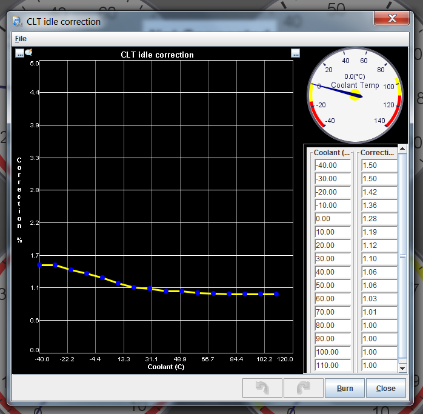

# Idle Control

rusEFI supports both solenoid-type IAC out of the box (well, with a fly-back diode - 1 or two wire) and [stepper motors](Stepper-Motor) (4 to six wires, add-on board from eBay required)

By default Idle control is in 'manual' mode, while in manual mode you can control the idle valve with
`set idle_position X`
command, where X should be between 1 and 100.

In order to enable automatic idle control you would need `set_idle_enabled 1` command. Another command related to idle is `set idle_position X`, where X is desired idle speed

In case of stepper idle valve, the position is a percent of the total stepper steps. On startup, rusEFI would move stepper all the way in in order order to find zero position.

In case of solenoid valve, the % is just the PWM of the control signal - it has nothing to do with the actual percentage of valve opening and you should not expect it to be linear.

## Warm-up correction in manual mode

While the engine is still cold it's good to have a bit of extra idle air, we have idle warm up correction for that. This correction adjust the idle valve position according to current engine coolant temperature. More air causes engine to run higher revs, once engine goes warmer idle air goes down and so does idle RPM.

For example, here we have a 10% extra open at 30C.

## Valve initialization

In case of stepper valve we in order to get to a known position we retract the valve all the way in on startup and then go to the desired position. Solenoid-based valve does not require any initialization.
