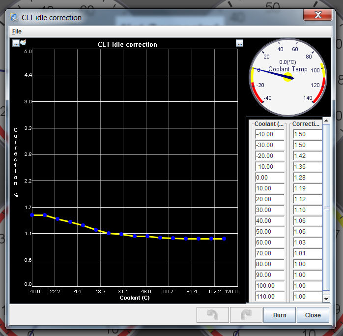

# Idle Control

rusEFI supports both solenoid-type (one or two wires; requires additional fly-back diode) and [stepper motor](Stepper-Motor) (four to six wires, add-on board required) IAC valves.

By default, idle control is in 'open-loop' mode, while in manual mode you can control the idle valve.

In the case of a stepper idle valve, the position is a percent of the total stepper steps. On startup, rusEFI moves the stepper all the way in order to find the zero position.

In the case of a solenoid valve, the percent is just the PWM duty of the control signal - it has nothing to do with the actual percentage of valve opening and you should not expect it to be linear.

## Warm-up Correction in Manual Mode

While the engine is still cold, it's good to have a bit of extra idle air; we have idle warm up correction for that. This correction adjusts the idle valve position according to the current engine coolant temperature. More air causes the engine to idle higher, but once the engine gets warmer air mass goes down and so does idle RPM.

For example, here we have 10% extra opening at 30C.

## Valve Initialization

In the case of a stepper valve, in order to get to a known position we retract the valve all the way at startup and then go to the desired position. A solenoid-based valve does not require any initialization.

## Stepper idle valve wiring

Set `useStepperIdle` when you have a stepper-motor idle valve (bipolar, usually 4-wire). rusEFI can drive a stepper in two ways:

- **Step / direction driver** — a dedicated stepper driver IC (on the board, or added via a drop-in adapter) is controlled by `stepperStepPin` and `stepperDirectionPin`. rusEFI sends step and direction signals, and the driver powers the motor coils. This is the usual method.
- **Direct coil drive** — set `useRawOutputToDriveIdleStepper`, described in the firmware as: "If enabled we use four Push-Pull outputs to directly drive stepper idle air valve coils". This drives the two coils directly from four suitable outputs (for example the H-bridges on Proteus) instead of using a step/direction driver.

Unipolar stepper valves are not supported. See the [Wiring & Connectivity Overview](FAQ-Basic-Wiring-and-Connections#idle-air-control-valve) for more on the idle valve types.

## Closed-loop idle control

The `idleMode` setting chooses between two strategies:

- **Open Loop** — the idle valve position comes only from the open-loop position and its corrections (see above).
- **Open Loop + Closed Loop** — a PID controller (`idleRpmPid`) is added on top of the open-loop base to actively hold a target idle RPM. Its output is a duty cycle bounded by the PID's minimum and maximum ("Output Min/Max Duty Cycle").

Closed-loop correction only runs when the engine is actually idling. rusEFI decides this from:

- `idlePidDeactivationTpsThreshold` — "Below this throttle position, the engine is considered idling".
- `idlePidRpmUpperLimit` — "How far above idle speed do we consider idling, i.e. coasting detection threshold".
- `idlePidRpmDeadZone` — "If the RPM closer to target than this value, disable closed loop idle correction to prevent oscillation".

Configure the target idle RPM, the PID gains, and these thresholds in TunerStudio; no values are prescribed here. Tune the PID gradually and confirm behaviour on a [log](Logging-Guide).

## Technical sources

- Configuration field definitions: `firmware/integration/rusefi_config.txt` — `idleMode`, `idleRpmPid`, `idlePidDeactivationTpsThreshold`, `idlePidRpmUpperLimit`, `idlePidRpmDeadZone`, and the `idle` hardware settings (`solenoidFrequency`, `solenoidPin`, `useStepperIdle`, `stepperStepPin`, `stepperDirectionPin`, `useRawOutputToDriveIdleStepper`).
