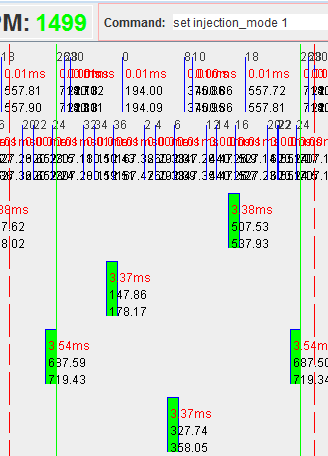

# Injector Lag Tuning

In sequential mode, each cylinder gets on time injector lag correction per engine cycle; in batch mode each cylinder gets the same amount of fuel split into two squirts, with two times injection lag correction,  per engine cycle. In a perfect world, the AFR measured would be the same. In the case of a wrong injector lag, batch mode would be affected more.

If the configured injector lag is above the actual injector lag, in batch mode the engine would get more fuel than it should, resulting in a richer air-fuel ratio than in sequential mode. During the switch from sequential to batch, the AFR would go leaner.

If the configured injector lag is below the actual injector lag, in batch mode the engine would get less fuel than it should, resuliting in a leaner air-fuel ratio than in sequential mode. During the switch from sequential to batch, the AFR would go richer.

[auto-tune injector open/close lag](https://github.com/rusefi/rusefi/issues/492)
