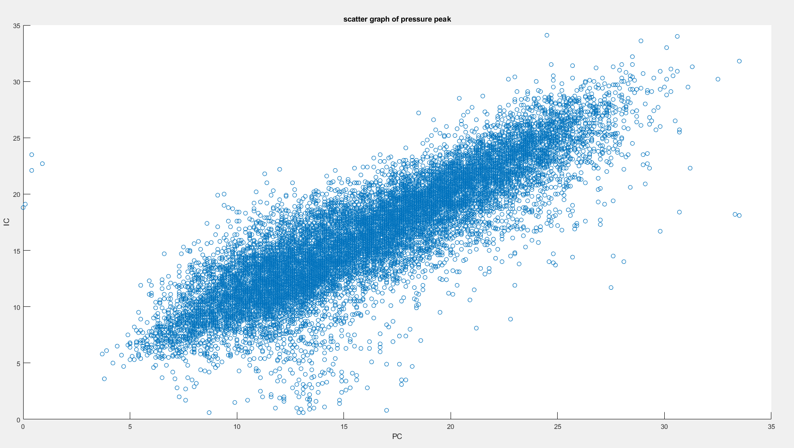

# Ion Sense

## January 2021 update

Early versions of our own DIY hardware has been tested on an engine with in-cylinder pressure sensing.
The data from this has been analysed and we have had some promising results.  
Our board has been able to produce a strong corelation for the angle of peak cylinder pressure and the signal processing method has been passed to MK for creation of the code.

While we have had success with the peak pressure the current version of the board is unable to produce the flame progression or the MFB50 angle at this time, we feel that this may be possible to correct with further signal processing or improved hardware.

The DIY hardware is undergoing a revision to provide better protection from ground loops as at present there is a risk of damage to the ECU should the secondary voltage make it back to the ECU.

Further information will become available as things progress, for now the graph below shows the corelation of the angle ATDC of the Ion sensed pressure peak (IC) vs the pressure sensor sensed peak pressure (PC).  

We like

*Saab 9-3 COP 2003-on ecotec engine

*Mazda skyactiv COP 2016-on  

*mini r50 coil pack (for use with DIY board)

*BMW M5 v-10 COP  usable for ion sense. M5 coils, Bremi PN/20631   bmw 12 13 7 835 108

Q: Is Saab/Mazda smart coil unusual in any way?

A: the problem with many smart coils is that you can't apply a voltage/sense current on the primary since it's grounded internally. The mazda/Saab coils have the voltage generation internally.

The three pins on bmw  are just both sides of the primary, and one side of the secondary (other side on the plug ofc)
They are a normal dumb coil
All the magic is in the box
The mazda/Saab coils have the voltage generation internally
They have gnd/12v/trigger/sense
here is no magic in the bmw coil
It's just a transformer
No silicon
In my mazda, they cut the BMW box in half: half is in the coil, half is in the ecu
On Saab, they put half in the coil, and half in the extra module

Background on mazda skyactiv coil on plug  [https://www.hexorcism.com/16ND/sh13084/](https://www.hexorcism.com/16ND/sh13084/)

bmw M5 ionic control module... for reference... we do not use this  --  

AndreiKA latest---
[cheap cylinder pressure sensor option - smart diesel glow plug with pressure sensor](https://rusefi.com/forum/viewtopic.php?p=34988#p34988) [Ion Sense](https://rusefi.com/forum/viewtopic.php?p=35035#p35035)
