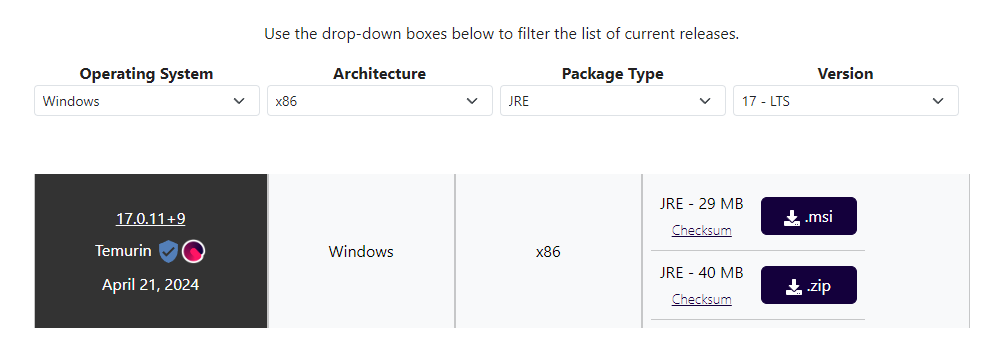

# JRE

[OpenJDK17U-jre_x64_windows_hotspot_17.0.11_9.msi](https://github.com/adoptium/temurin17-binaries/releases/download/jdk-17.0.11%2B9/OpenJDK17U-jre_x86-32_windows_hotspot_17.0.11_9.msi) same as https://rusefi.com/s/jre-redirect

[Eclipse Temurin](https://adoptium.net/temurin/releases/) is one of the options for Java Runtime Environment these days.

