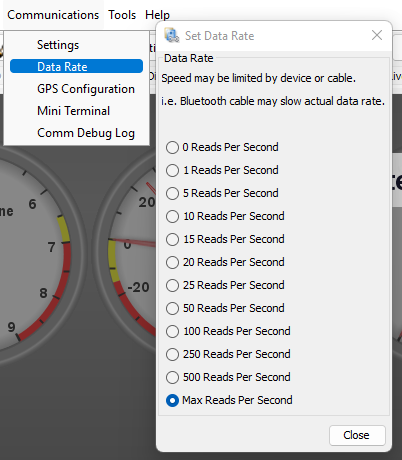
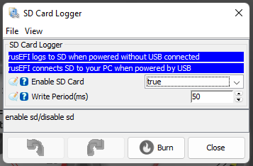
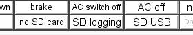
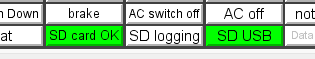

# Logging Guide

rusEFI supports multiple methods to collect logs from your ECU.

Both of the methods detailed here will produce a `.mlg` file compatible with [MegaLogViewer](https://www.efianalytics.com/MegaLogViewer/). For some technical reasons, the content between the two methods differs slightly, but all important fields are identical.  For most troubleshooting, either log type will do the job.

If you're trying to share the log with someone to help you with your engine, please upload it to [rusEFI Online](https://rusefi.com/online).

## TunerStudio logging

The preferred log for tuning and debugging is a log made in TunerStudio. It requires having a PC plugged in whenever you want to log, but you're probably already plugged in to tune the engine or look at more gauges.

### Start/Stop Logging

1. In the menu bar, press `Data Logging` -> `Start Logging`, and pick a file name for your log (the default is the date/time), and press save. The log is now being saved by TunerStudio. The "Data Logging" indicator at the bottom of the TS dashboard should light up green.
2. Do whatever thing you want a log of. If there's a specific behavior you're getting help with, a consise, specific log is much easier to interpret than a long and complicated one.
3. To stop logging, go back to the menu bar and press `Data Logging` -> `Stop`. Closing TunerStudio or starting a new log file will also stop any running log.

### Logging Data Rate

rusEFI is capable of feeding data to TunerStudio several hundred times per second, so TS lets you select the sample rate as desired. For most purposes, 100 Hz is suitable. When looking at trigger sync or some other high-speed need, set the rate to "Max reads per second"; this shouldn't hurt ECU performance but will make a humongous log file pretty quickly.

The data rate should default to 100 Hz when using rusEFI, but it's worth checking that its set to a speed appropriate for your application. That said, storage is cheap, so it doesn't really hurt to have it set faster than you need.

## Internal SD Card

Some rusEFI ECUs support logging to a microSD card directly. This is useful for all the times you don't have a PC around. Maybe you're busy driving around a racetrack!

To enable it, find the "SD Card Logger" menu under the "Controller" section (far right).  Set "Enable SD Card" to true to start logging. Set how often the log should be written: the default is every 50 ms, i.e. 20 times per second (20 Hz).

### Storage Consumption

rusEFI SD logging is thorough, but not too heavy when compared to the size of cheaply available SD cards. Expect about 20 MB/hr when set to the default 50 ms period, with consumption scaling linearly with logging rate. 20 MB/hr means 50 hr/GB, or ~400 hours (2.4 weeks!) with an 8 GB card.

### SD Card USB Connection

When connected to a PC, rusEFI ECUs will function as an SD card reader, allowing you to transfer logs to your PC. However, since the SD card can't be both connected to your PC and used for logging by rusEFI, the following logic is used to decide which to do:

- ECU first powered from car, USB never connected: SD card logging mode
- ECU first powered from car, USB later connected: SD card logging mode
- ECU first powered from USB: SD card reading mode

If you're unsure what the SD card is currently doing, have a look at the three SD card-related indicators in TunerStudio:

No SD card detected:

SD card logging mode:

SD card reading mode:

The assumption is that if you have USB connected, you will be logging using TunerStudio instead of the onboard SD card.
