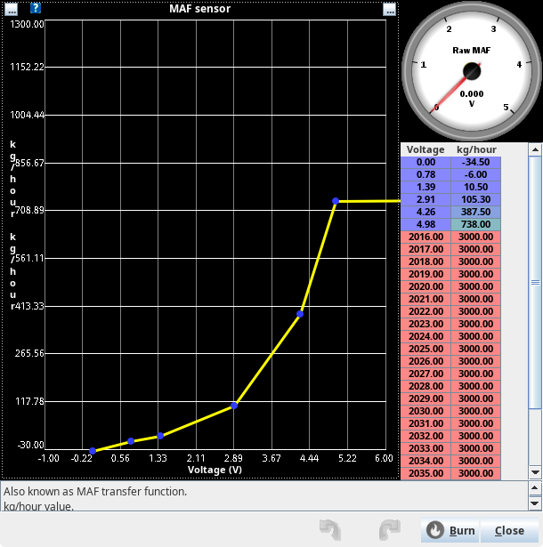

# MAF

## Current Status

rusEFI's MAF-based fuel strategy is still undergoing development; fueling is functioning correctly but it presents a few tuning challenges due to TunerStudio integration and the Spark Table still being reliant on the old engine load math.

This is an evolving situation at present and thus MAF fueling is still considered experimental.  
**Please use only for development - work at your own risk.**

## MAF Fuel Theory - The Details

The implementation of MAF in rusEFI is intended to replicate the functionality of OEM systems and as such is more complex than some other systems.

The foundation of the MAF system is the Mass Air Flow sensor itself. This is a device using a hot wire, hot film, or vane to directly measure the flow of air into the engine.
Obviously this sensor does not give out an airflow value - it gives us a voltage, current, or PWM signal that represents the flow. rusEFI can interpret a voltage or current MAF via a transfer function table.

The transfer function table is used to convert the raw MAF sensor reading into a kg/h (Kilogram Per Hour) airflow.

This kg/h value is then processed into a required fuel quantity by the following calculations:

`g/s = kg/h * 1000 / 3600`

`n/s = RPM / 60`

`airPerRevolution = g/s / n/s`

`cylinderAirmass = airPerRevolution / (cylinderCount / 2)`

In rusEFI, we use a correction factor table to modify this measured airmass to allow correction of any errors in the measurement due to dynamic airflow effects.
To do this we need to have a "load" value that allows us to have a Load Vs Speed fuel table.

`StandardAirCharge = engine displacement / number of cylinders * 1.2929`

This produces the airmass for cylinder filling at 100% VE under standard SAE conditions.
Using this we can relate our cylinder air mass back to a standardised 100% cylinder filling and thus we have a "load" value to use when tuning.

`airChargeLoad = 100 * cylinder Airmass / Standard AirCharge`

The required fuel is now simply corrected by adjusting the measured air by the value in the VE table; this value is simply a percentage.

`corrected Cylinder Airmass = cylinder Airmass * (VE map value / 100)`

`fuelMassGram = corrected Cylinder Airmass / desired AFR`

`pulse Width = fuelMass / injector flow (in g/s)`

Using this method, rusEFI is able to directly measure the air flow into the engine and calculate the required fuel with minimal tuning.

## MAF fuel tuning - The quick version

To tune rusEFI using the MAF is probably the quickest and easiest method, provided you have a working MAF sensor and the correct information to input in the transfer function table.

The first step is to define the voltage (or current) to kg/h relationship in the transfer function table in TunerStudio.

Next you will need to decide what Air/Fuel ratio you would like your engine to run at and enter this into the AFR table in TunerStudio.
For a first start a value of 14 is perfectly acceptable for gasoline.
This table is the primary source of the desired fuel mixture; it will be this table that is tuned to decide the engine's target AFR.

Before starting the engine for the first time it is wise to ensure that the VE Table is filled with values of "100"; this means that the fuel calculation uses 100% of its measured air mass to decide on the fuel injection pulse.  
Tuning this table will adjust for dynamic airflow effects that happen in the inlet of the engine and will allow small (or large but hopefully not) corrections to the fuel injection which may be required to have the engine meet it's desired air/fuel target.  
This table should only be tuned if the engine is not meeting the desired air/fuel target under relatively steady state conditions (i.e. without any acceleration enrichment or overrun fuel cut).
If a different air/fuel ratio is desired at a specific load or RPM, then the AFR Table is the correct table to adjust instead.

Some useful MAF sensor maths in [this link](https://www.efunda.com/designstandards/sensors/hot_wires/hot_wires_theory.cfm)
