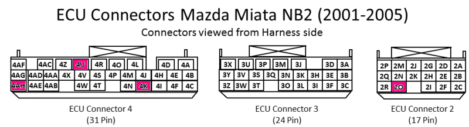

Mazda Miata MX5 NB2 2001-2005 Standalone

[microRusEFI](Hardware_microRusEfi) should be set for Hall

High-side jumper should be set for +12v.

[Some versions of Miata may need a jumper set on the board, See detail here](PNP_72_Jumpers)

https://rusefi.com/forum/viewtopic.php?t=1677

https://rusefi.com/wiki/index.php?title=Vehicle:Mazda_Miata_2002

https://rusefi.com/wiki/index.php?title=Vehicle:Mazda_Miata_2003

https://github.com/rusefi/rusefi/wiki/Hardware/pnp_microRusEfi_nb2/hw72nb.pdf

| Pin Number | Name     | microRusEFI pin |  Type ID      | Default function                                     |
| ----------:|:-------- | ------------ | ------------  |:---------------------------------------------------- |
| 2A  | Inj 1           |#37| Low-Side     | Injector #1                           |
| 2B  | Fan             |#34| Low-Side     | Radiator Fan Control Relay Output     |
| 2C  | A/C Fan         |#43| Low-Side     | A/C Fan Control Relay Output          |
| 2D  | Inj 2           |#38| Low-Side     | Injector #2                           |
| 2G  | Inj 3           |#41| Low-Side     | Injector #3                           |
| 2J  | Inj 4           |#42| Low-Side     | Injector #4                           |
| 2O  | rusEFI WBO      |   | x            | x                                     |
| 2M  | Fuel Pump       |#35| Low-Side     | Fuel Pump Relay Output                |
| 2P  | IAC Feed        |   | 12V          | Idle Valve Power                      |
| 2Q  | IAC Control     | #3| Low-Side     | Idle Valve Control                    |
| 2R  | MIL             |#33| Low-Side     | Check Engine Light output             |
| -   |    -            | - | -            | -                                     |
| 3A  | GND             | #2| Power Ground | Ground                                |
| 3B  | GND             | #6| Power Ground | Ground                                |
| 3F  | Coil #1         | #9| High-Side    | Coil #1 control                       |
| 3I  | Coil #2         |#11| High-Side    | Coil #2 control                       |
| 3H  | Main Relay      |#29| Low-Side     | Main Relay Control                    |
| 3K  | rusEFI USB PWR  |   | x            | x                                     |
| 3L  | rusEFI CAN H    |   | x            | x                                     |
| 3M  | Alternator      |#13| High-Side    | Alternator Control Output             |
| 3N  | rusEFI CAN L    |   | x            | x                                     |
| 3O  | Tach            |#14| High-Side    | Tachometer Output                     |
| 3V  | Cam             |#25| Hall Input   | Cam shaft Hall Input                  |
| 3U  | Alt Warn        |   | x            | x                                     |
| 3Y  | Crank           |#45| Hall Input   | Crank shaft Hall Input                |
| 3Z  | rusEFU USB GND  |   | x            | x                                     |
| -   |    -            |   | -            | -                                     |
| 4A  | GND             |   | Ground       | Ground                                |
| 4D  | VVT Feed        |   | 12V          | VVT Power                             |
| 4K  | rusEFI 5v out   |#39| 5v           | External MAP sensor power             |
| 4L  | rusEFI 5v out   |#44| 5v           | Throttle Position Sensor Power        |
| 4N  | IAT             |#23| AT           | Intake Air Temperature Sensor         |
| 4O  | GND             |   | GND          | Sensor Ground                         |
| 4P  | CLT             |#18| Temp Input   | Coolant Temperature Sensor Input      |
| 4R  | VVT             | #7| Low-side     | VVT Control                           |
| 4S  | Key             | #5| 12V          | +12v from Ignition Key                |
| 4V  | TPS             |#26| AV           | Throttle Position Sensor              |
| 4X  | MAF not routed  |   | x            | x                                     |
| 4AE | EGR Boost Sensor|   | AV           | MAP                                   |
| 4AF | Main Relay Power| #1| 12V          | +12v from Main Relay                  |

### x4 AUX low-side drivers ###
There are 4 low-side drivers available. One is used for the alternator warning light on the dash. 
The following I/O is available. A jumper wire will need to be routed between the Jx hole on the board and the appropriate pin on the car-side connector. 
| Board   | stm32 pin  |
|---------|------------|
|   J3    |    PB8     |   
|   J1    |    PB9     |   
|   J2    |    PC12    |   

Extra pins for [353830-5 72 pin](https://rusefi.com/wiki/index.php?title=Hardware:OEM_connectors#72_pin): 

TE 316836-1 for 20 AWG to 22 AWG

TE 316838-1 for 16 - 18 AWG

Note the [latch on OEM ECU](installations/MazdaMiataNB2_Frankenso/nb2_ecu_plugs_latch.jpg) plugs while installing add-on pins.

[MREAdapter72 0.2 InteractiveBOM](https://rusefi.com/docs/ibom/hw72nb_0.2.html)

### AV8 

In order to use this output as an analogue input requires the removal of the LED. 

---

### OEM harness add-ons  

| Board   | stm32 pin  |   |
|-----|---|---|
| 3L  | AFR | Analog signal for external wide band oxygen controller |  
| 4U  | MAP| Manifold absolute pressure analog signal from [external sensor](GM-map-sensor) | 
| 4K  | +5v | +5v feed for MAP sensor |
| 3Z | GND | Sensor & USB ground | 

---

### Adapter Board Wiring

| Connector   | microRusEFI |   |
|---|---|---|
| | | |

---

### SD card wiring

| Board   | stm32 pin  |   |
|---|---|---|
|   | PC10  | SD card SPI Clock  |
|   | PC11  | SD card SPI MISO |
|   | PC12  | SD card SPI MOSI  |
|   | PB8  | SD card SPI Chip Select |

---

### Bluetooth/TTL wiring

| Board   | stm32 pin  |   |
|---|---|---|
|   | PC10  |   |
|   | PC11  |   |

---

# Photos
https://github.com/rusefi/rusefi/wiki/Hardware/pnp_microRusEfi_nb2/MREAdapter72_0_2_front.jpg
https://github.com/rusefi/rusefi/wiki/Hardware/pnp_microRusEfi_nb2/MREAdapter72_0_2_back.jpg

https://youtu.be/6IZcHCQl8yo

Case compatibility:

Toyota Camry 89661-3T270

Toyota Camry 89661-06691
