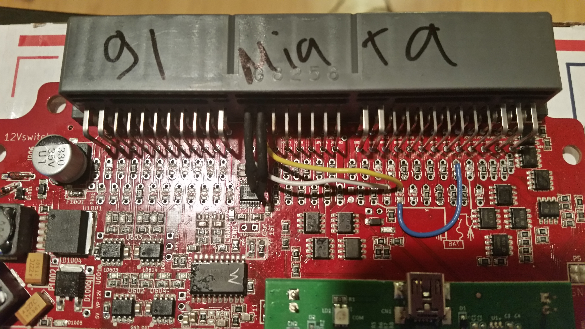

# 1991 Mazda Miata

[Mazda Miata 1990](Mazda-Miata-1990)

[<https://svn.code.sf.net/p/rusefi/code/trunk/misc/www/images/Frankenso/frankenso_1991_miata_f.jpg> frankenso front]

AFR jumper: Frankenso analog #7 pin 3J, W48 top <>W48 bottom jumper

MAP jumper wire: Frankenso analog #6 pin 3R, W56 (5th lower row pin from the end) top <> W45 bottom jumper, not OEM (something not right here, correction pending)

