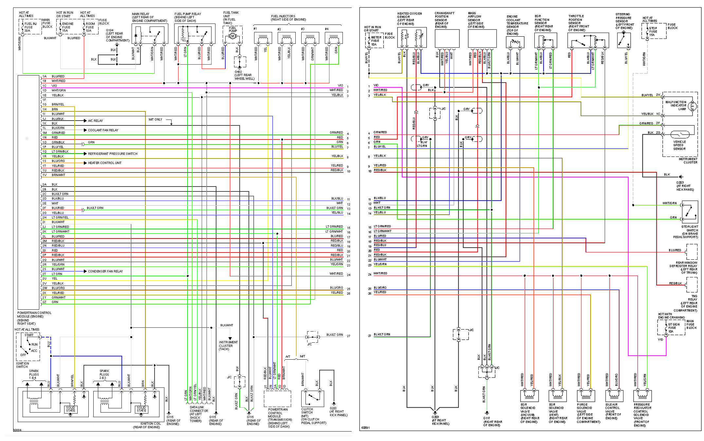
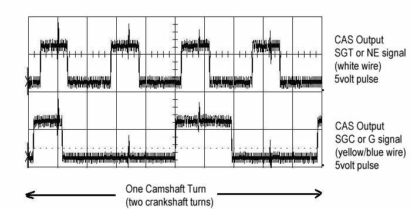
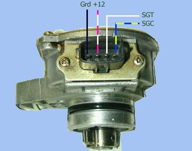

[Frankenso Mazda Miata NA6 PnP](Frankenso-MazdaMiataNA6-pnp)

[Frankenso options](https://docs.google.com/spreadsheets/d/1LTvS7I-128Hft9uXHG1JrBxetVjGJDSBkySgVDQ6MGk)

ECU pin-out seems to be very similar to [1990](Mazda-Miata-1990) with few exceptions:

1. dedicated MAF ground

2. individual injector wiring

## Plug 1
22 pin

| pos | b pos   | color      | desc                                                     | type             |
| --- | ------- | ---------- | -------------------------------------------------------- | ---------------- |
| 1A  |         | BLU/RED    | Hot at all times. Room Fuse.                             | Input +12v       |
| 1B  |         | WHT/RED    | Main relay                                               | Input +12v       |
| 1C  |         | VIO        |                                                          |                  |
| 1D  |         | WHT/GRN    | Data Link Connector                                      |                  |
| 1E  |         | YEL/BLK    | Check Engine Light                                       |                  |
| 1F  | \*      | \*         | \* Extra analog input (WB O2?)                           | Extra Input      |
| 1G  | W7 0Ohm | BRN/YEL    | Coil Pack Cylinder 1&4                                   | Output           |
| 1H  | W8 0Ohm | BRN        | Coil Pack Cylinder 2&3                                   | Output           |
| 1I  |         | BLU/WHT    | Powertrain Control Module (Transmission)                 |                  |
| 1J  |         | BLU/BLK    | A/C Compressor Relay                                     |                  |
| 1K  |         | BLK        | J/C? (M/T Only)                                          |                  |
| 1L  |         | BLK/GRN    | Coolant Fan Relay                                        | Output, low-side |
| 1M  |         | GRN/RED    | Vehicle Speed Sensor                                     | Input            |
| 1N  |         | RED        | Powertrain Control Module (Transmission)                 |                  |
| 1O  |         | GRN/BLK    | stop light switch                                        | Input            |
| 1P  |         | BLU/YEL    |                                                          |                  |
| 1Q  |         | LT GRN/BLK | AC Pressure Switch                                       |                  |
| 1R  |         | YEL/BLK    |                                                          |                  |
| 1S  |         | BLU/ORG    | Heater Control Unit                                      |                  |
| 1T  |         | YEL/RED    |                                                          |                  |
| 1U  |         | RED/BLK    |                                                          |                  |
| 1V  |         | BRN/WHT    | Powertrain Control Module (Transmission) & Clutch Switch |                  |

## Plug 2
26 pin

| pos | b pos    | color      | desc                        | type                |
| --- | -------- | ---------- | --------------------------- | ------------------- |
| 2A  |          | BLK        | Pwr Ground                  | Ground              |
| 2B  |          | BLK        | Pwr Ground                  | Ground              |
| 2C  |          | BLK/LT GRN | Logic Ground                | Ground              |
| 2D  |          | BLK/BLU    | Logic Ground                | Ground              |
| 2E  | W43 0Ohm | WHT        | Crank angle \#1 CKP         | Input, four times   |
| 2F  |          | BLK/RED    | MAF signal ground           | Ground              |
| 2G  | W45 0Ohm | YEL/BLU    | Crank angle \#2             |                     |
| 2H  |          | LT GRN/YEL | Data Link Connector         |                     |
| 2I  |          | BLK/WHT    | tacho signal                | Input               |
| 2J  |          | LT GRN/RED | EGR Function Sensor         | Input               |
| 2K  | W49 0Ohm | LT GRN/WHT | \+5 ref/TPS power           | Output 5v           |
| 2L  |          | BLU/RED    | Rear Defroster relay        |                     |
| 2M  | W51 0Ohm | RED/BLK    | throttle position sensor    |                     |
| 2N  | W52 0Ohm | RED/BLU    | heated O2 sensor            |                     |
| 2O  | W53 0Ohm | RED        | MAF signal                  | analog input        |
| 2P  | W54 0Ohm | RED/BLK    | intake air thermosensor     | analog input        |
| 2Q  |          | BLU/WHT    | Coolant thermosensor        |                     |
| 2R  |          | YEL/GRN    | Pressure regulator solenoid | Output/low side (?) |
| 2S  |          | BLU/WHT    | Condenser Fan Relay         | Output/low side (?) |
| 2T  | W58 0Ohm | LT GRN     | Fuel Pump relay             | Output/low side     |
| 2U  | W59      | YEL        | Injector \#1                | Output/low side     |
| 2V  | W60 0Ohm | YEL/BLK    | Injector \#2                | Output/low side     |
| 2W  | W61 0Ohm | BLU/ORG    | idle valve control          | Output/low side     |
| 2X  | W62      | YEL/RED    | purge solenoid              | Output/low side     |
| 2Y  | W63 0Ohm | GRN/WHT    | Injector \#3                | Output/low side     |
| 2Z  | W64 0Ohm | GRN        | Injector \#4                | Output/low side     |

== Diagram ==
[1990-2000 Miata System Wiring Diagrams](http://www.miataforumz.com/1990-200-Miata-Wiring/94sys.pdf)

## CAS
Source: [http://www.rivercityroad.com/garage/cas.htm](http://www.rivercityroad.com/garage/cas.htm)
The CAS has four wires. Two are for +12 power and ground. The other two are the output signals read by the engine computer.

The signals are called SGC and SGT on the 1.8 engine. They are called called NE and G signals on the 1.6 engine. The computer can decode the position of the engine camshaft and the engine speed from these two signals. With this information, it calculates when to send spark to the spark plugs and fuel to the fuel injectors.

