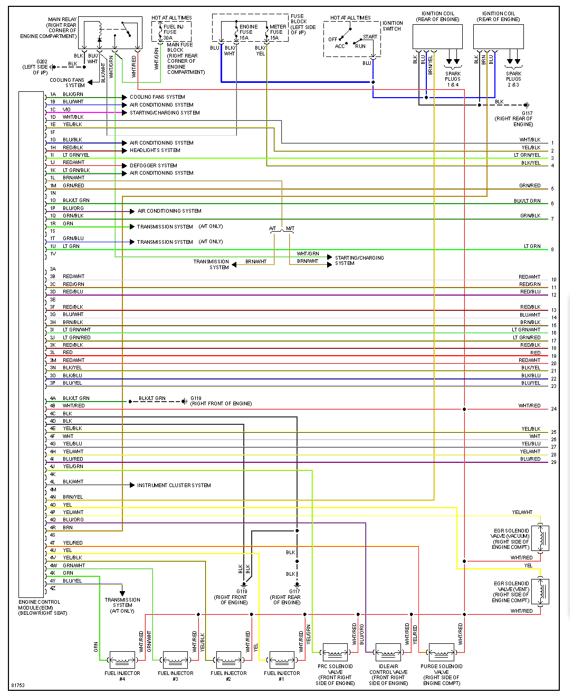
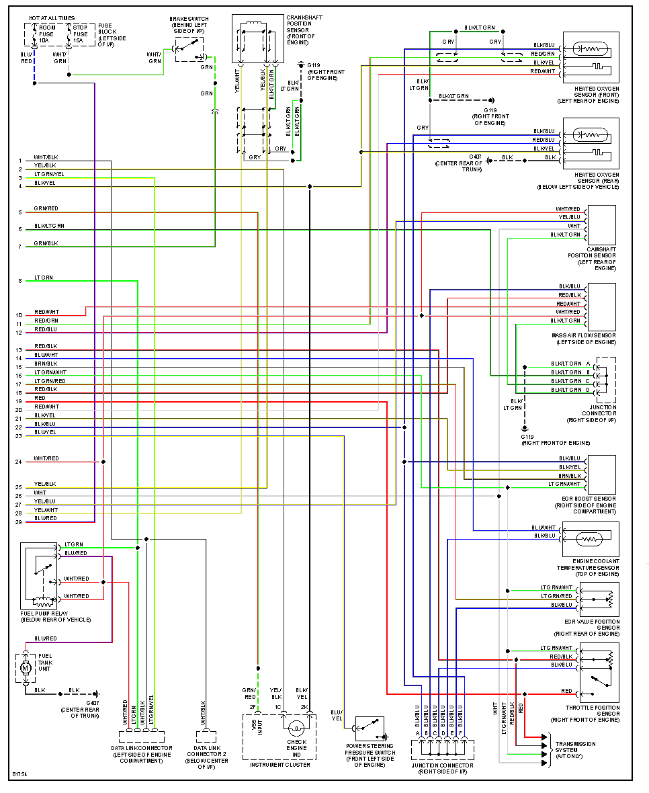

# 1996 Mazda Miata

1996 US 1.8

## Plug 1

22 pin

| pos | b pos | color | desc                 | type             |
| --- | ----- | ----- | -------------------- | ---------------- |
| 1A  |       |       | Radiator Fan1        | Output, low-side |
| 1B  |       |       | Radiator Fan 2       | Output, low-side |
| 1C  |       |       |                      |                  |
| 1D  |       |       |                      |                  |
| 1E  |       |       |                      |                  |
| 1F  | \*    | \*    | Not Used             | \*               |
| 1G  |       |       |                      |                  |
| 1H  |       |       |                      |                  |
| 1I  |       |       |                      |                  |
| 1J  |       |       |                      |                  |
| 1K  |       |       |                      |                  |
| 1L  |       |       |                      |                  |
| 1M  |       |       |                      |                  |
| 1N  | \*    | \*    | Not Used             | \*               |
| 1O  |       |       | Ground               |                  |
| 1P  |       |       |                      |                  |
| 1Q  |       |       |                      |                  |
| 1R  |       |       | A/T only             |                  |
| 1S  | \*    | \*    | Not Used             | \*               |
| 1T  |       |       | A/T only             |                  |
| 1U  |       |       | Fuel pump, INJ06/PE4 | Output           |
| 1V  | \*    | \*    | Not Used             | \*               |

## Plug 2

12 pin (Plug on OEM ECU is not used)

|    |  |  |  |  |
| -- | -| -| -| -|
| 2A |  |  |  |  |
| 2B |  |  |  |  |

## Plug 3

16 pin

| pos | b pos | color   | desc                 | type      |
| --- | ----- | ------- | -------------------- | --------- |
| 3A  | \*    | \*      | \*                   | \*        |
| 3B  |       | RED/WHT | MAF, INP1            | Input     |
| 3C  |       |         |                      |           |
| 3D  |       |         |                      |           |
| 3E  | \*    | \*      | \*                   | \*        |
| 3F  |       | RED/BLK | TPS, INP3            | Input     |
| 3G  |       | BLU/WHT | CLT, INP4, PC1 ADC11 | Input     |
| 3H  |       |         |                      |           |
| 3I  |       |         | TPS/MAF 5v power     | Output +5 |
| 3J  |       |         |                      |           |
| 3K  |       |         |                      |           |
| 3L  |       |         |                      |           |
| 3M  |       |         |                      |           |
| 3N  |       |         |                      |           |
| 3O  |       | BLK/BLU | Ground               |           |
| 3P  |       |         |                      |           |

## Plug 4

26 pin (corresponds to Frankenso Plug 3)

| pos | b pos | color   | desc                              | type                  |
| --- | ----- | ------- | --------------------------------- | --------------------- |
| 4A  |       |         |                                   | Ground                |
| 4B  |       | WHT/RED | Power                             | \+12v input           |
| 4C  |       |         |                                   |                       |
| 4D  |       |         |                                   |                       |
| 4E  |       | YEL/BLK | Crankshaft Position Sensor        |                       |
| 4F  |       | WHT     | Cam Position Sensor               | Input                 |
| 4G  |       | GRN     | Cam Position Sensor, INP12        | Input                 |
| 4H  |       | YEL/WHT | Crankshaft Position Sensor        |                       |
| 4I  |       |         |                                   |                       |
| 4J  |       |         |                                   |                       |
| 4K  | \*    | \*      | Not used                          | \*                    |
| 4L  |       |         | Instr Cluster                     |                       |
| 4M  |       |         |                                   |                       |
| 4N  |       | GRN     | Ignitor 1 & 4                     | Output                |
| 4O  |       |         |                                   |                       |
| 4P  |       |         |                                   |                       |
| 4Q  |       | BLU/ORG | Idle Air Control Valve, INJ07/PE5 | Output, low-side      |
| 4R  |       | BRN     | Ignitor 2 & 3                     | Output                |
| 4S  | \*    | \*      | Not Used                          | \*                    |
| 4T  |       |         |                                   |                       |
| 4U  |       | WHT     | Injector 1, INJ12/PB9             | Output, low-side      |
| 4V  |       | YEL     | Injector 2, PB8                   | Output, low-sideutput |
| 4W  |       |         | Injector 3                        | Output, low-side      |
| 4X  |       |         | Injector 4                        | Output, low-side      |
| 4Y  |       |         |                                   |                       |
| 4Z  |       |         |                                   |                       |

