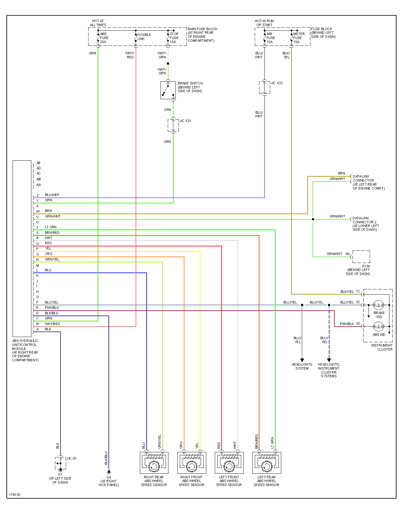

Anti-lock Braking System

[ABS - Wikipedia]](<https://en.wikipedia.org/wiki/Anti-lock_braking_system>)

Miata NB2

Bosch 0 273 004 568      0273004568

Denso 110 000 31210

MAZDA  N068 43 7A0

| pos | color | desc | type |
| --- | ----- | ---- | ---- |
| 1   | ?     | ??   |      |
| 2   |       |      |      |
| 3   |       |      |      |
| 4   |       |      |      |
| 7   |       |      |      |
| 8   |       |      |      |
| 9   |       |      |      |
| 10  |       |      |      |
| 11  |       |      |      |
| 12  |       |      |      |
| 13  |       |      |      |
| 15  |       |      |      |
| 16  |       |      |      |

Similar connector used on 110 000 41170, 27534FE040 Subaru Impreza  00-07

47660 2W500 - 2000 Nissan Pathfinder, 2001 INFINITI QX4
