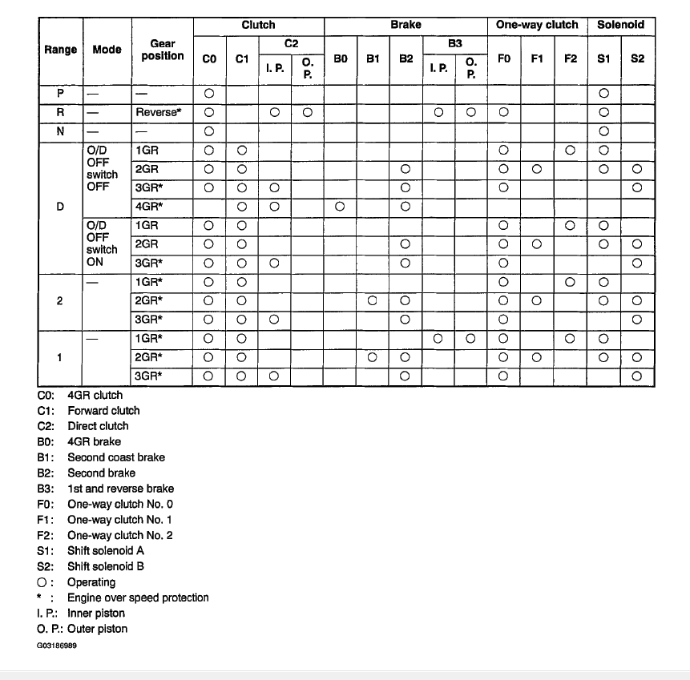

[72 pin Connector](OEM-connectors#72-pin)

See also [Mazda Miata 2001 ABS](Mazda-Miata-2001-ABS)

For engine wiring see [Mazda Miata 2002](Mazda-Miata-2002)

## Automatic Transmission

SB101 9090
SB131 9090
Aisin

03-70le
A42DE

| pos | color        | desc                     | type                             | my color |
| --- | ------------ | ------------------------ | -------------------------------- | -------- |
| A   | light green  | "1" selector             |                                  | blue     |
| B   | pink/blue    | "2" selector             | seems to be +12 in wire in 2     | white    |
| C   | yellow/black | "D" selector             | seems to be +12 in wire in Drive | orange   |
| D   | red/yellow   | "R" selector             | \+12 in wire if in reverse       | green    |
| E   | \*           | \*                       | \*                               |          |
| F   |              | "N/P" selector           |                                  |          |
| H   | \*           | \*                       | \*                               |          |
| J   | \*           | \*                       | \*                               |          |
| K   |              | O/D off switch           |                                  |          |
| L   |              | O/D off indicator        |                                  |          |
| M   | \*           | \*                       | \*                               |          |
| N   | \*           | \*                       | \*                               |          |
| O   |              | Communication with ECU   |                                  |          |
| Q   | \*           | \*                       | \*                               |          |
| R   | Lt Green/Red | \+5v volts from ECU      |                                  | red      |
| T   |              | cruise control module    |                                  |          |
| V/U | Green/Black  | TPS Sensor analog signal |                                  | green    |
| W   | red          | input speed sensor       |                                  | red      |
| Z   | white        | input speed sensor       |                                  | white    |
| AA  | \*           | \*                       | \*                               |          |
| AC  | Black/White  | Tachometer (?)           |                                  | white    |
| AD  | \*           | \*                       | \*                               |          |
| AE  | yellow       | output speed sensor      |                                  | blue     |
| AF  | orange       | output speed sensor      |                                  | orange   |
| AG  | Green/Orange | speedometer (?)          |                                  | green    |
| AH  | \*           | \*                       | \*                               |          |
| AI  | \*           | \*                       | \*                               |          |
| AJ  | \*           | \*                       | \*                               |          |
| AL  |              | Communication with ECU   |                                  |          |
| AN  | Blue         | shift solenoid B 18 Ohm  |                                  | blue     |
| AO  | Blue/Orange  | TCC solenoid             | 18 Ohm                           | orange   |
| AP  | BLK/BLU      | GND                      |                                  | black    |
| AQ  | Yellow/Green | shift solenoid A 18 Ohm  |                                  | green    |
| AR  | Blue/Red     | \+12 all times           |                                  | red      |
| AS  | Black/Yellow | \+12 running             |                                  | red      |

R(AE,AF)==600 ohm

R(W,Z)==400 ohm

## Gear diagram

