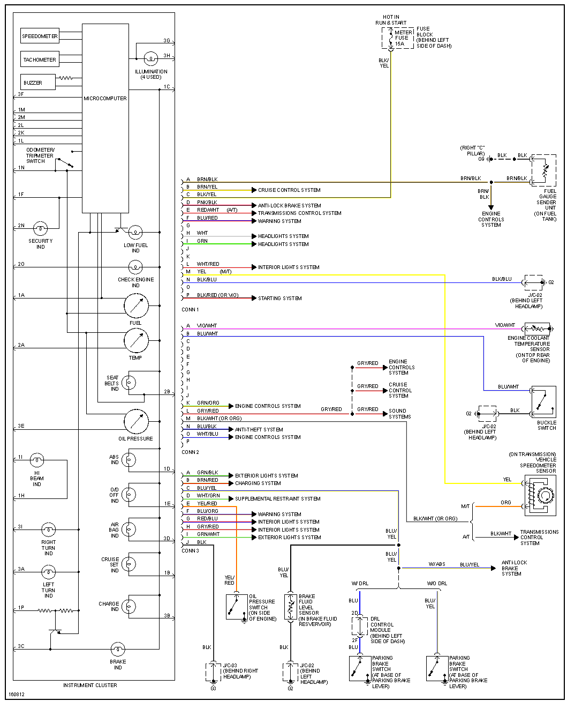
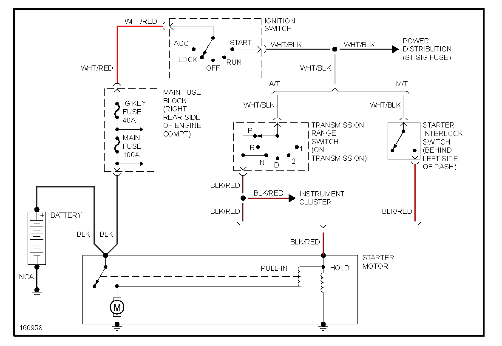

# 2002 Mazda Miata

[72 pin Connector](OEM-connectors#72-pin)

## ECU

## Gauge cluster

## Starting & power

Main relay is controlled by ignition switch (this is different from 2003 where ECU controls main relay via 3H).

Nothing on 4S (4S is ignition power source on 2003).

ECU is powered from main relay via 4AF (this is different from 2003 where ECU is powered via 4S)

Fly-back diode - stripe facing +12 - is needed between VVT 4S (power, stripe side) and VVT control 4R.

Fly-back diode - stripe facing +12 - is needed between IAC 2P and IAC control 2Q.

## Data Links

