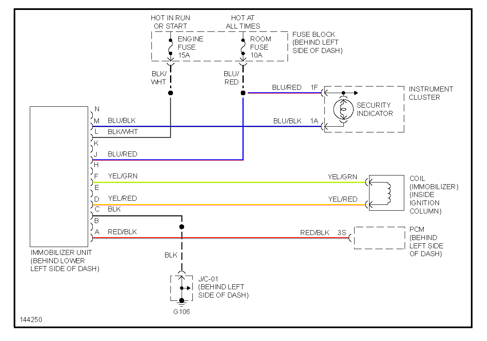
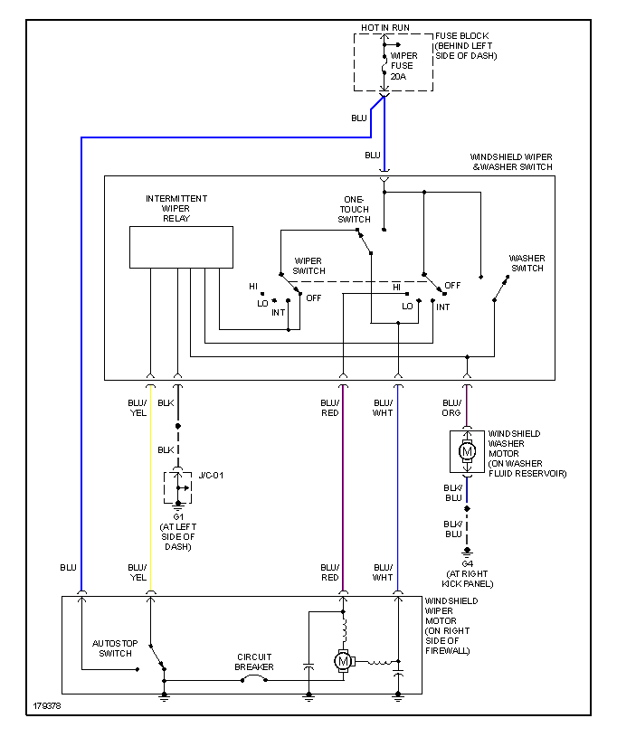
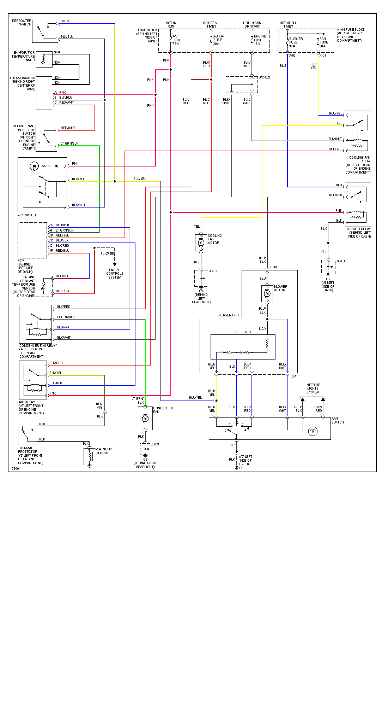

# 2003 Mazda Miata

[72 pin Connector](OEM-connectors#72-pin)

See also [Mazda Miata 2003 alt](Mazda-Miata-2003-alt)

For power see [Mazda Miata 2002 - Starting & Power](Mazda-Miata-2002#starting--power)

Coil three wire plug:

middle wire GND

pin closer to the engine is +12v

pin further away from the engine signal

[Hellen72 Interactive Pinout](https://rusefi.com/docs/pinouts/hellen/hellen72/)

| desc       | type   | rusEFI harness |
| ---------- | ------ | -------------- |
| MAP signal | analog | blue           |
| AFR signal | analog | white          |

Individual pages for printing:

## Automatic Transmission

see [Mazda Miata 2001 - Automatic Transmission](Mazda-Miata-2001#automatic-transmission)

## Immobilizer

NALDEC NC87 67 790 MAZDA MX5 EUNOS MK2 MK2.5 BURGLAR ALARM MODULE NC8767790 is not an immobilizer

US immobilizer

## Wiper Motor

## Charging

## Air Conditioning

See also [Mazda Miata 2002](Mazda-Miata-2002)

## Starting & power

In start or run ECU is powered from Engine Fuse 15A (behind left side of dash) via 4S. (This is different from 2002 - nothing on 4S in 2002)

ECU controls main relay via 3H. (This is different from 2002 - nothing on 3H in 2002)

ECU gets +12v from main relay output 4AF which is used as +12v source for VVT (4D) and IAC (2P).

Fly-back diode - stripe facing +12 - is needed between VVT 4D (power, stripe side) and VVT control 4R.

Fly-back diode - stripe facing +12 - is needed between IAC 2P (power, stripe side) and IAC control 2Q.

See [http://rusefi.com/forum/viewtopic.php?f=3&t=906&p=25018l#p25018](http://rusefi.com/forum/viewtopic.php?f=3&t=906&p=25018l#p25018)

For ignition key see [Mazda Miata 2002 - Starting & Power](Mazda-Miata-2002#starting--power)

## Misc

Two timing marks - the left one is TDC
