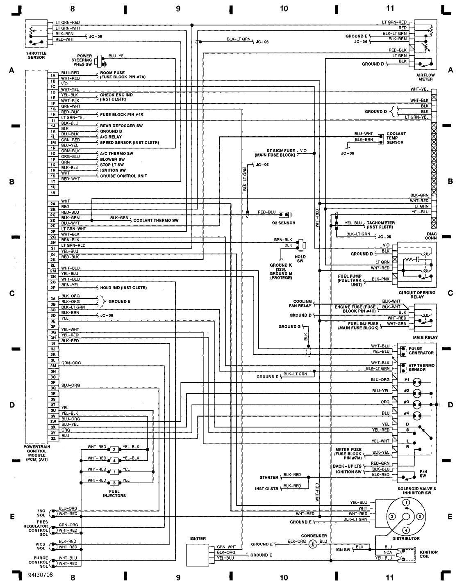
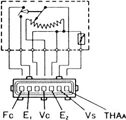

[Protege BG ECU pinout description](https://docs.google.com/spreadsheet/ccc?key=0Arl1FeMZcfisdElBTkFFWXFyR3NReENNSU51OXVxa0E)

Engine Diagram M/T

Engine Diagram A/T

[broken link](http://www.autozone.com/repairguides/Mazda-323-MX-3-626-MX-6-Millenia-Prot%C3%A9g%C3%A9-1990-1998-and-Ford-Probe-1993-1997/ELECTRONIC-ENGINE-CONTROLS/Mass-Airflow-Meter-Sensor/_/P-0996b43f80cb0f01)
