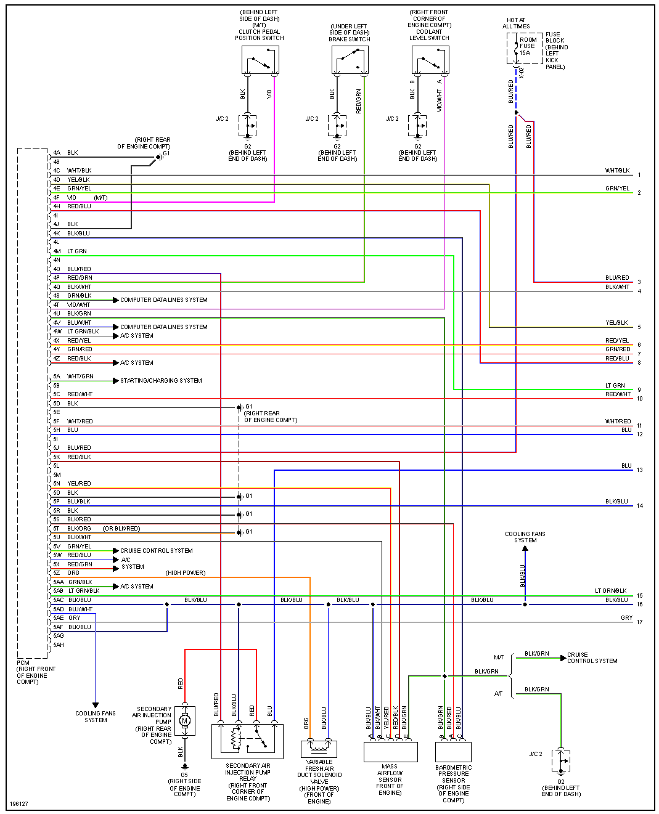
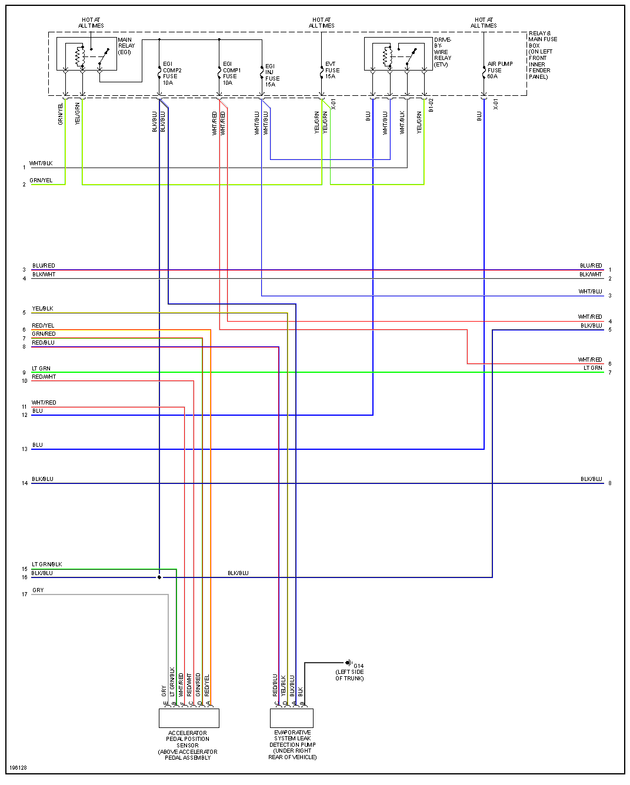
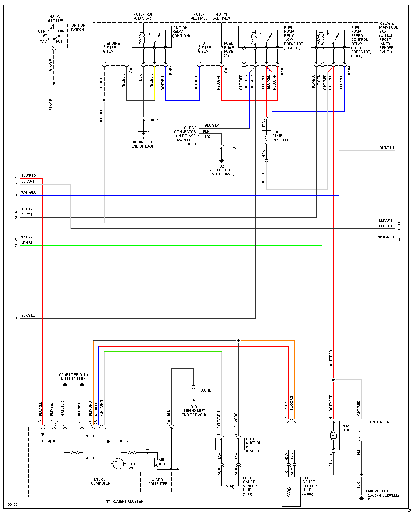
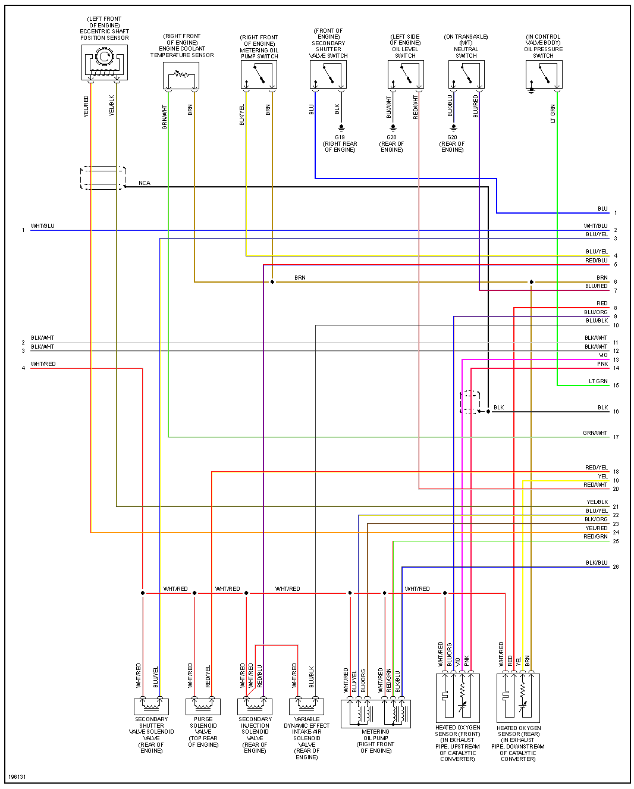
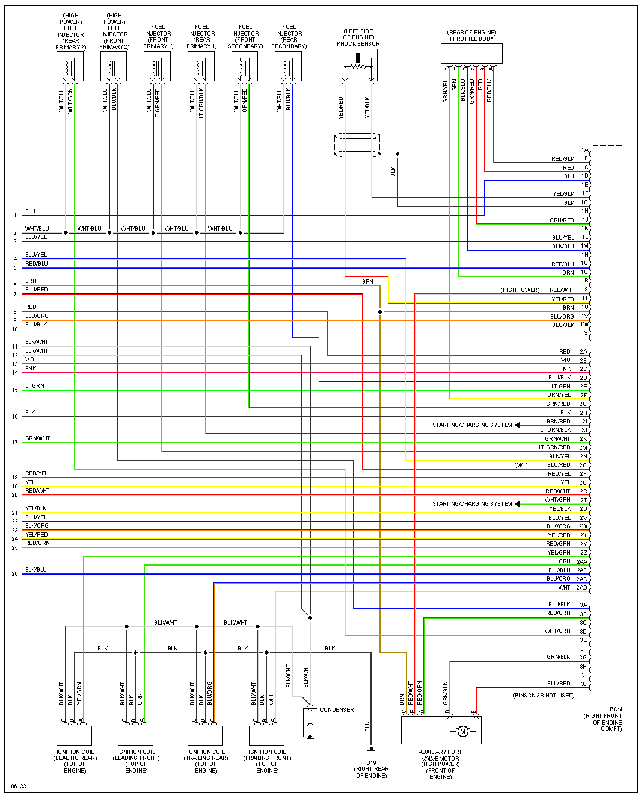

# 2004 Mazda RX8

bLue/White: CAN high

Green/Black: CAN low

Black: Ground

Black/Yellow: 12v

Blue/Red: 12v

[Reverse Engineering the RX8s instrument cluster part one](https://web.archive.org/web/20160729183040/https://www.cantanko.com/rx-8/reverse-engineering-the-rx-8s-instrument-cluster-part-one/)

[RX8 Canbus - Chamber of Understanding](https://www.chamberofunderstanding.co.uk/?s=canbus)

[Driving Real Gauges](http://www.xsimulator.net/community/threads/driving-real-gauges.3278/)

The CAN-bus IDs in the case of the RX-8 (and likely Mazda6 / MX-5)

ID 300 is turn off Steering Warning Light, minimum 0.5 sec timing.
ID 212 is abs, dsc off, traction control warning and brake warning, minimum 0.5 sec timing.
ID 420 is temp, oil pressure gauge, coolent level, battery (alternator), oil warning and check engine light, minimum 5 second timing.
ID 201 is Speed (Max 300.00 Km/h, 186mph [9C 40] and RPM (Max 16382 [FF FE], although scale goes non-linear after 10k), minimum 0.5 sec timing.
