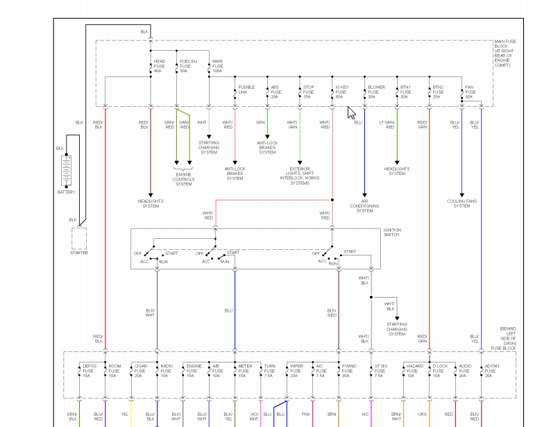

https://rusefi.com/wiki/index.php?title=Vehicle:Mazda_Miata_2002
https://rusefi.com/wiki/index.php?title=Vehicle:Mazda_Miata_2003

For remote start button three wires are needed:

RED/WHITE From battery
BLUE Start/Run switch
BHT/BLACK Starter

