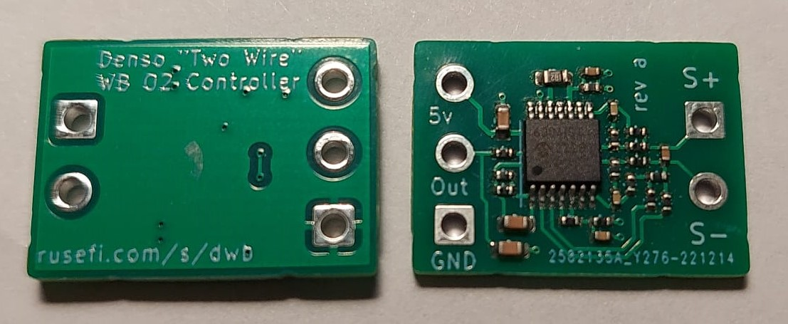

# Medium Band Oxygen Sensor

See https://github.com/mck1117/denso-wideband

See https://rusefi.com/forum/viewtopic.php?f=4&t=2468

## pinout

white wire: signal negative

blue wire: signal positive

two black: heater, does not matter which one is which one. +12v, 3A
